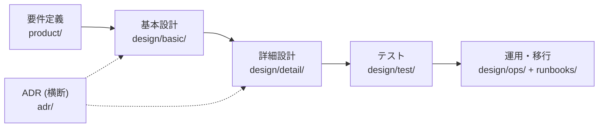

<!-- markdownlint-disable MD033 MD041 -->
<p align="center">
  
</p>

<h1 align="center">Igeta</h1>

<p align="center">
  <b>日本の設計書を、Markdown で。</b><br>
  基本設計・詳細設計を arc42 の背骨に載せ、Git と CI で検査できる設計書テンプレート集
</p>

<p align="center">
  <a href="https://github.com/SakakitaniJunya/Igeta/actions/workflows/ci.yml"></a>
  <a href="LICENSE"></a>
</p>

<!-- markdownlint-enable MD033 -->

## Igeta とは

日本の受託開発・SI の設計書は、Excel や Word で書かれ、更新されないまま実装と離れていくことが多い。Igeta は設計書を **Markdown + Git + CI** に載せ、「書いたら終わり」ではなく**機械で検査され続ける文書**にするための型 (かた) を提供する。

| 提供するもの | 中身 |
|---|---|
| **設計書テンプレート** (`templates/docs/`) | 要件定義・基本設計・詳細設計・テスト・運用・ADR など **39 種** |
| **検査スクリプト** (`src/`) | 必須節・ID 形式・上流下流の参照・索引の鮮度・図 ↔ 実装のズレを CI で落とす |
| **コード雛形** (`templates/api-*` / `web-feature`) | 図と実装を契約でつなぐ参考実装 (NestJS + Prisma + Next.js) |

## 名前の由来

**井桁 (いげた)** は「井」の字の形をした家紋。形は Markdown の見出し記号 `#` と同じ。
井戸の縁を崩れないように組んだ枠のことでもあり、「設計書が崩れないための枠組み」という意味を込めた。ロゴは家紋「丸に井桁」を朱で描いている。

## 設計思想

テンプレートと検査スクリプトは、すべて次の 11 原則から導かれている。テンプレート内の `(原則: …)` という注記はここを指す。

<!-- markdownlint-disable MD029 -->

### 構造 — 迷わず置ける

1. **章は国際標準、語彙は日本の現場**
   背骨は [arc42](https://arc42.org/overview) の 12 章。「基本設計」「詳細設計」は arc42 の章への**写像**として扱い、読み手の語彙に合わせる。章はフォルダではなく frontmatter `arc42: <1-12>` に持たせ、索引が章順に並べる。空いた章は索引に「_未作成_」として見える。
2. **置き場所が型を決める**
   `templates/docs/` は `docs/` と**同じ階層**。書きたい場所と同じパスのテンプレをコピーすれば、文書の種類 (`kind`)・ID 接頭辞・必須節が自動で決まる。宣言と置き場所が食い違えば違反。ファイル名の先頭 `NN-` は同じフォルダ内の読む順で、フォルダを開いた瞬間に順番が分かる。
3. **AS-IS と TO-BE を分ける**
   `design/` は実装前の設計 (TO-BE)、`architecture/` は稼働中の構成 (AS-IS) 専用。混ぜると「どちらが今の姿か」が誰にも分からなくなる。

### 追跡 — 変更がどこに効くか分かる

4. **すべての行に ID、すべての文書に上流と下流**
   `REQ → FN → SCR / API / TBL → CLS → TST` と ID でつなぐ。各文書は `## 関連` 節と frontmatter `depends_on` に上流・下流を最低 1 件持つ。依存グラフは自動生成される。
5. **上流から直す**
   下流 (コード・DB・画面) だけを直して上流 (要件・設計) を直さない変更は禁止。区分値 1 つでも設計書が先。
6. **生成できるものは手で書かない**
   索引・依存グラフ・API 一覧・ER 図は `<!-- AUTOGEN -->` 区間に生成する。正 (SoT) は frontmatter・OpenAPI・`schema.prisma` の 1 か所だけ。 ディレクトリ README の索引は `depends_on` の木 (親 = 上流) で出すので、一覧に足すだけでは文書を増やせない。
7. **図は実装と契約する**
   ドメインクラス図 (mermaid `classDiagram`) のクラスと実装の export を **双方向で CI 照合**する。図を実装から自動生成しないのは、生成図は「実装がそうなっている」しか言えず、**意図した設計とのズレ**を検出できないから。

### 誠実さ — 緑が嘘をつかない

8. **サイレント縮退禁止**
   検査できないものを緑にしない (exit code は 0 = 適合 / 1 = 違反 / 2 = 検査不能 の 3 値)。失敗を握りつぶさない。状態遷移表に無い遷移は例外で落とす。
9. **無いものを書かない**
   未整備の検証手段・未決の仕様は「未整備」「未決」と書く。それらしい記述で埋めない。
10. **画面は 3 状態**
    全画面に **空 / ローディング / エラー** を定義する。ハッピーパスだけの画面設計は未完成。
11. **1 文書は読み切れる長さ**
    冒頭に `> **TL;DR**` (手順書は `> **When to use**`) を必須とし、1 文書 200 行 (ADR 150 行 / 手順書・タスク 100 行) を上限にする。超えたら分割する。

<!-- markdownlint-enable MD029 -->

## 文書体系



| 日本の工程 | arc42 の章 | 置き場所 |
|---|---|---|
| 要件定義 | §1 導入と目標 / §2 制約 | `docs/product/` (機能要件は [EARS](https://alistairmavin.com/ears/) 記法) |
| 基本設計 (外部設計) | §3 コンテキスト / §4 解決戦略 / §5 上位 (画面・API・テーブル) / §7 配置 | `docs/design/basic/` |
| 詳細設計 (内部設計) | §5 下位 (ドメイン・モジュール) / §6 実行時ビュー / §8 横断概念 | `docs/design/detail/` |
| テスト設計 | §10 品質要求 | `docs/design/test/` |
| 移行・運用設計 | §7 配置ビュー | `docs/design/ops/` / `docs/runbooks/` |
| 技術判断 | §9 アーキテクチャ決定 | `docs/adr/` ([MADR](https://adr.github.io/madr/) 形式) |

39 種の一覧・ID 接頭辞・行数上限は **[文書体系ガイド](templates/docs/guides/01-document-taxonomy.md)**、採用した外部標準と採らなかった理由は **[外部標準の解説](docs/explanation/01-design-doc-standards.md)** にある。

## はじめかた

Node.js 22 以上が必要。**ファイルをコピーしない**。`init` が置くのは配線 (npm script と `.igeta-version`) だけで、検査の実体は Igeta パッケージ側に残る。

```bash
# 1. 検査配線と docs 骨格を入れる (既存ファイルは上書きしない)
npx github:SakakitaniJunya/Igeta#v0.1.1 init
npm install

# 2. 書きたい文書と同じパスの雛形を置く (templates/docs/<X> → docs/<X>)
mkdir -p docs/product
cp node_modules/igeta/templates/docs/product/01-requirements.md docs/product/

# 3. 検査する
npm run docs:template-check
npm run docs:graph
```

版の固定は `.igeta-version` (semver 1 行)。`npx igeta check` が追従遅れを検出し、`npx igeta upgrade --to <ver>` で書き換える。

## 検査

| コマンド | 検査内容 | 落ちる条件 |
|---|---|---|
| `npm run docs:template-check` | テンプレ適合 | kind 未登録 / 必須節の欠落 / `## 関連` に上流・下流が無い / ID 形式違反 / `depends_on` が実在しない / EARS 記法でない機能要件 |
| `npm run docs:check` | 索引と参照 | frontmatter スキーマ違反 / 参照切れ / 本文の相対リンク切れ / 自動生成索引が古い / 上流も下流も無い文書 (`depends_on` の木に繋がらない) / `depends_on` の循環 |
| `npm run docs:lint` | Markdown 記法 | markdownlint 違反 |
| `npm run check:domain-drift` | 図 ↔ 実装 | 図のクラスが実装に無い / 実装の export が図に無い |
| `npm run secret-scan` | 機密混入 | ローカル絶対パス / メール / トークン形式 / 禁止語リストへの一致。`--internal-ids` を付けた時だけ社内制約 ID (`C-` + 3 桁) も |
| `npm run scaffold` | (生成) | コード雛形を `apps/` へ展開。既存ファイルは上書きしない |
| `npm run test:scripts` | スクリプト自身 | 検査コードのテスト (79 件) |

いずれも `npx igeta <command>` で直接呼べる。終了コードは **0 = 適合 / 1 = 違反 / 2 = 検査不能** の 3 値。

社内制約 ID の検出は `secret-scan --internal-ids` で明示的に有効にしたときだけ走る。非公開リポジトリでは
規約 ID を本文から参照するのは正当なので既定 OFF、公開リポジトリでは漏洩なので ON にする。Igeta 自身は
公開なので `package.json` の `secret-scan` スクリプトにこのフラグを入れてある。他の規則 (ローカル絶対パス /
メール / トークン / 禁止語) は常に走り、このフラグの影響を受けない。

## ディレクトリ構成

```text
Igeta/
├── templates/              雛形置き場。パッケージに同梱され、使う人は `node_modules/igeta/templates/` から取る
│   ├── docs/               設計書の雛形 39 種。置き先 (your-repo/docs/) と同じフォルダ構成にしてある
│   ├── api-module/         バックエンド 1 コンテキスト分 (domain / application / infrastructure / presentation)
│   ├── api-shared-kernel/  バックエンド共通部品 (Result・TenantId・DomainEvent・レイヤ依存ルール)
│   └── web-feature/        フロントエンド 1 機能分 (ページ・3 状態・文言カタログ)
├── docs/                   【Igeta 自身の背景】採用した外部標準と、採らなかった理由の解説
├── src/                    CLI 本体 (TypeScript、実行時依存ゼロ)
│   ├── core/               Check ・ Violation ・ Report ・ 版比較の共通型
│   ├── checks/             検査 4 種。Check を実装し Violation を返すだけで、exit も print もしない
│   ├── generators/         コード雛形の展開
│   └── cli/                コマンド定義。出力と終了コードはここだけが決める
├── assets/                 ロゴ
└── .github/workflows/      CI
```

**`templates/docs/` と `docs/` の違い**: `templates/docs/` は**雛形** (中身は空欄と記入例)、`docs/` は **Igeta 自身の背景** (なぜこの標準にしたか)。使う人がコピーするのは `templates/docs/` だけで、文書体系ガイドと実装順序ガイドもそこに入っている (全プロジェクトが自分の `docs/guides/` に持つ文書だから)。

## 参照した標準

[arc42](https://arc42.org/overview) · [C4 model](https://c4model.com/) · [MADR](https://adr.github.io/madr/) · [EARS](https://alistairmavin.com/ears/) · [Diátaxis](https://diataxis.fr/) · [GitHub spec-kit](https://github.com/github/spec-kit) · [OpenAPI](https://learn.openapis.org/best-practices.html)

## ライセンス

[MIT](LICENSE)
