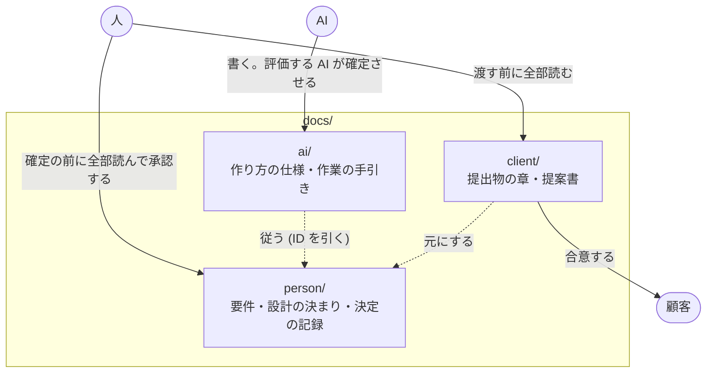
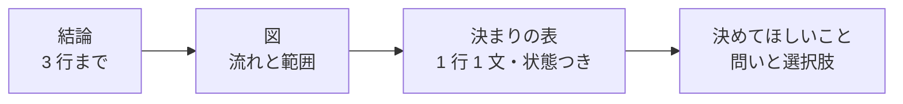
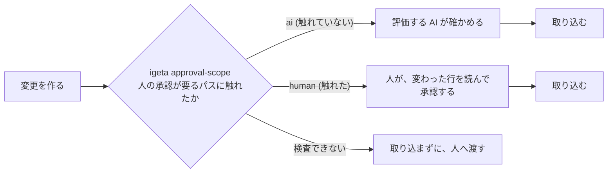

<!-- markdownlint-disable MD033 MD041 -->
<p align="center">
  
</p>

<h1 align="center">Igeta</h1>

<p align="center">
  <b>日本の設計書を、Markdown で。</b><br>
  基本設計・詳細設計を arc42 の背骨に載せ、Git と CI で検査できる設計書テンプレート集
</p>

<p align="center">
  <a href="https://github.com/SakakitaniJunya/Igeta/actions/workflows/ci.yml"></a>
  <a href="LICENSE"></a>
</p>

<!-- markdownlint-enable MD033 -->

## Igeta とは

日本の受託開発・SI の設計書は、Excel や Word で書かれ、更新されないまま実装と離れていくことが多い。Igeta は設計書を **Markdown + Git + CI** に載せ、「書いたら終わり」ではなく**機械で検査され続ける文書**にするための型 (かた) を提供する。

| 提供するもの | 中身 |
|---|---|
| **設計書テンプレート** (`templates/docs/`) | 要件定義・基本設計・詳細設計・テスト・運用・ADR など **45 種** |
| **検査スクリプト** (`src/`) | 必須節・ID 形式・上流下流の参照・索引の鮮度・図 ↔ 実装のズレを CI で落とす |
| **コード雛形** (`templates/api-*` / `web-feature`) | 図と実装を契約でつなぐ参考実装 (NestJS + Prisma + Next.js) |
| **ストアスクショの型** (`templates/store-screenshots/`) | iOS/Android アプリの提出用スクリーンショットを「状態注入で撮る → ブラウザで額装」で自動化するパイプライン |

## 名前の由来

**井桁 (いげた)** は「井」の字の形をした家紋。形は Markdown の見出し記号 `#` と同じ。
井戸の縁を崩れないように組んだ枠のことでもあり、「設計書が崩れないための枠組み」という意味を込めた。ロゴは家紋「丸に井桁」を朱で描いている。

## 設計思想

テンプレートと検査スクリプトは、すべて次の 11 原則から導かれている。テンプレート内の `(原則: …)` という注記はここを指す。

<!-- markdownlint-disable MD029 -->

### 構造 — 迷わず置ける

1. **章は国際標準、語彙は日本の現場**
   背骨は [arc42](https://arc42.org/overview) の 12 章。「基本設計」「詳細設計」は arc42 の章への**写像**として扱い、読み手の語彙に合わせる。章はフォルダではなく frontmatter `arc42: <1-12>` に持たせ、索引が章順に並べる。空いた章は索引に「_未作成_」として見える。
2. **置き場所が型を決める**
   `templates/docs/` は `docs/` と**同じ階層**。書きたい場所と同じパスのテンプレをコピーすれば、文書の種類 (`kind`)・ID 接頭辞・必須節が自動で決まる。宣言と置き場所が食い違えば違反。ファイル名の先頭 `NN-` は同じフォルダ内の読む順で、フォルダを開いた瞬間に順番が分かる。
3. **AS-IS と TO-BE を分ける**
   稼働中の構成 (AS-IS) は `as-is-overview` 専用の文書に書き、実装前の設計 (TO-BE) に混ぜない。混ぜると「どちらが今の姿か」が誰にも分からなくなる。

### 追跡 — 変更がどこに効くか分かる

4. **すべての行に ID、すべての文書に上流と下流**
   `REQ → FN → SCR / API / TBL → CLS → TST` と ID でつなぐ。各文書は `## 関連` 節と frontmatter `depends_on` に上流・下流を最低 1 件持つ。依存グラフは自動生成される。
5. **上流から直す**
   下流 (コード・DB・画面) だけを直して上流 (要件・設計) を直さない変更は禁止。区分値 1 つでも設計書が先。
6. **生成できるものは手で書かない**
   索引・依存グラフ・API 一覧・ER 図は `<!-- AUTOGEN -->` 区間に生成する。正 (SoT) は frontmatter・OpenAPI・`schema.prisma` の 1 か所だけ。 ディレクトリ README の索引は `depends_on` の木 (親 = 上流) で出すので、一覧に足すだけでは文書を増やせない。
7. **図は実装と契約する**
   ドメインクラス図 (mermaid `classDiagram`) のクラスと実装の export を **双方向で CI 照合**する。図を実装から自動生成しないのは、生成図は「実装がそうなっている」しか言えず、**意図した設計とのズレ**を検出できないから。

### 誠実さ — 緑が嘘をつかない

8. **サイレント縮退禁止**
   検査できないものを緑にしない (exit code は 0 = 適合 / 1 = 違反 / 2 = 検査不能 の 3 値)。失敗を握りつぶさない。状態遷移表に無い遷移は例外で落とす。
9. **無いものを書かない**
   未整備の検証手段・未決の仕様は「未整備」「未決」と書く。それらしい記述で埋めない。
10. **画面は 3 状態**
    全画面に **空 / ローディング / エラー** を持たせる。設計書は空とエラーの見え方を決め、ローディングの形はコードが決める。ハッピーパスだけの画面設計は未完成。
11. **1 文書は読み切れる長さ**
    冒頭に `> **TL;DR**` (手順書は `> **When to use**`) を必須とし、kind ごとの行数の上限 (人が決める文書は 100 行・要件定義書は 150 行・手順書とタスクは 100 行。文書体系ガイドに一覧) を超えたら分割する。

### 読み手 — 人の入口と機械の正本を分ける

12. **人の入口と機械の正本を分ける**
    原則 11 を守っても、文書群が数十枚に増えれば人は全部を読めない。人が確定する文書は `docs/person/` に集め、**地図 (`docs/person/design/shared/00-map.md`) と決定台帳 (`docs/person/decisions/01-decisions.md`) を人間の入口**にする。作り方の詳細は AI が読み書きする `docs/ai/` に置き、人の決めた値は `person/` の行に 1 回だけ書いて `ai/` の文書はその ID を引く。人の決定 (`DEC-nnn`) と仮置き (`OPEN-nnn`) は台帳に集め、他ファイルの ID は `<doc-id>/PREFIX-nnn` の修飾形式で参照する — ローカル採番の ID を裸で持ち出すと、どのファイルの ID か分からなくなるため。

<!-- markdownlint-enable MD029 -->

## 文書モデル — 誰が確定させるかで 3 つに分ける

docs/ を開いた人が、文書を 1 本も開かずに「自分が読んで決める文書はどれか」を分かるようにする。
分ける基準は読み手ではなく、**誰が確定させるか**。人も AI も両方の文書を読むが、確定させる人は 1 人に決まる。


```mermaid
flowchart TB
  H(["人"])
  AI(["AI"])
  K(["顧客"])
  subgraph docs["docs/"]
    P["person/<br/>要件・設計の決まり・決定の記録"]
    A["ai/<br/>作り方の仕様・作業の手引き"]
    C["client/<br/>提出物の章・提案書"]
  end
  H -->|"確定の前に全部読んで承認する"| P
  AI -->|"書く。評価する AI が確定させる"| A
  H -->|"渡す前に全部読む"| C
  C -->|"合意する"| K
  A -.->|"従う (ID を引く)"| P
  C -.->|"元にする"| P
```

| フォルダ | 確定させる人 | 書くこと | 人が開くとき |
|---|---|---|---|
| `docs/person/` | 人 | 何をするか・しないか、決まり、未決。要件は [EARS](https://alistairmavin.com/ears/) 記法、決定の記録は [MADR](https://adr.github.io/madr/) 形式 | 確定の前に全部読む。変わったら、変わった行を読む |
| `docs/ai/` | 評価する AI | どう作るか (方式・API・テーブル・ドメイン・シーケンス・テスト・タスク) と、作業の手引き | 読む必要はない (参照はしてよい) |
| `docs/client/` | 人と顧客 | 顧客と合意する内容を、業務の言葉で (提出物の章・提案書) | 渡す前に全部読む |

### 置き場所の決め方

問いは 1 つ: **「AI がこれを勝手に変えたら、事業・お金・顧客との約束・使う人の体験・法令のどれかが変わるか」**。
変わるなら `person/`、変わらないなら `ai/`、顧客に渡すものは `client/`。文書の種類 (kind) ごとの置き場所は表で決まっていて、違う場所に置くと `docs-check` が落ちる。

```text
AGENTS.md                      AI の入口 (person/ が上流、ai/ が持ち場)
docs/
├── person/
│   ├── requirements/          要件
│   ├── design/shared/         全体共通 (地図・機能一覧・解決戦略・非機能・権限・用語集 ほか)
│   ├── design/<まとまり>/     業務のまとまりごと (地図・業務フロー・画面・機能ブリーフ)
│   └── decisions/             決定台帳と、年ごとの ADR
├── ai/
│   ├── specs/                 shared/・<まとまり>/ (API・テーブル・ドメイン・シーケンス ほか)・tasks/
│   └── handbook/              how-to/・explanation/・runbooks/
└── client/                    delivery/<提出物名>/・proposals/<年>/
```

参照の向きも決まっている。破ると `docs-check` が落ちる。

- `person/` が指してよいのは `person/` だけ。`ai/` は `person/` と `ai/`。`client/` は 3 つとも
- `ai/specs/` の文書は、`depends_on` をたどると `person/` の文書に届く (人の決まりに根を持たない作り方を置かない)
- 承認済みの ADR は、`person/` の決まりの行のどれかが `ADR-NNNN` の形で引く (どの決まりにも効かない決定を残さない)

背骨は arc42 の 12 章で、章はフォルダではなく各文書の frontmatter `arc42:` が持つ。
kind 47 種の置き場所・ID の接頭辞・行数の上限は **[文書体系ガイド](templates/docs/ai/handbook/how-to/01-document-taxonomy.md)**、採用した外部標準と採らなかった理由は **[外部標準の解説](docs/explanation/01-design-doc-standards.md)** にある。
地図・決定台帳の読む順と、レビューする人の手順は **[人間レビュー層の読み方](templates/docs/ai/handbook/how-to/03-human-review.md)**、
足した理由は **[人間レビュー層を足した理由](docs/explanation/02-human-review-layer.md)** にある。

### 人の文書の書き方

人は一度に多くを保てない。読む量が増えると、読まずに承認するようになる。だから人の文書は、決める内容だけを、決まった型で短く書く。


```mermaid
flowchart LR
  T["結論<br/>3 行まで"] --> D["図<br/>流れと範囲"] --> R["決まりの表<br/>1 行 1 文・状態つき"] --> Q["決めてほしいこと<br/>問いと選択肢"]
```

決まりの表は、最初の列が ID、最後の列が `状態`。

| ID | 決まり | 状態 |
|---|---|---|
| BF-113 | 確定のときに同じ時間帯が既に埋まっていたら、予約は成立させず、別の時間帯を選んでもらう | 決定 |
| BF-114 | 利用日の前日 18 時を過ぎたキャンセルは、料金の 50% をもらう | 仮 |
| BF-115 | 無断で来なかった利用者の、次の予約の扱い | 未決 |

- `決定` は人が承認した決まり。`仮` は AI が置いた値で、人の承認を待っている。`未決` はまだ決まっていない。`廃` は使わなくなった ID (行は消さず、番号も使い直さない)
- `仮` と `未決` の行は、`docs-graph` が決定台帳 (`docs/person/decisions/01-decisions.md`) の一覧に集める。これが、人の「決めを待つ行」の一覧になる
- 検出の方法・API・テーブルの定義のような作り方は書かない。`ai/` の文書に書き、その行が `<文書の id>/BF-113` の形で決まりを引く
- 量の上限: 1 本 100 行 (要件と地図は 150 行)。まとまりごとの合計 15,000 字、全体共通 30,000 字 (超えると警告)
- 人の目に見えない書き込み (HTML コメント) は書けない。自動で作る区間は、索引の 3 種だけ

これらは `template-check` が検査する。型に合わない文書は CI で落ちる。

### 変更から承認まで


```mermaid
flowchart LR
  E["変更を作る"] --> S{"igeta approval-scope<br/>人の承認が要るパスに触れたか"}
  S -->|"ai (触れていない)"| V["評価する AI が確かめる"] --> M1["取り込む"]
  S -->|"human (触れた)"| HA["人が、変わった行を読んで承認する"] --> M2["取り込む"]
  S -->|"検査できない"| X["取り込まずに、人へ渡す"]
```

人の承認が要るパスは固定で、ファイルの中身による例外は無い (大文字と小文字は区別しない)。

| パス | 理由 |
|---|---|
| `docs/person/**`・`docs/client/**` | 人が確定させる文書 |
| `.github/**`・`CODEOWNERS`・`docs/CODEOWNERS` | 保護と CI を決めるファイル |
| `.igeta.json`・`.igeta-version` | 検査の設定と、使う Igeta の版 |
| どの階層の `AGENTS.md`・`CLAUDE.md`、`.claude/**` | AI への指示と権限 |
| `.igeta.json` の `humanPaths` | repo ごとに足す分 (例: `["src/core/**", ".mcp.json"]`) |

`igeta approval-scope` は、変更が上のパスに触れたかを、パスだけで見分ける。構成と `humanPaths` は**宛先のブランチの先端**から読むので、変更の中で設定を書き換えても、見分けは変わらない。
終了コードは `ai` = 0・`human` = 1・検査できない = 2。手元では `--base origin/<宛先>`、CI では `--ci` を付ける。

```yaml
# .github/workflows/docs.yml の例 (pull_request で動かす)
steps:
  - uses: actions/checkout@v4
    with:
      fetch-depth: 0            # 宛先との枝分かれの点を読むため
  - uses: actions/setup-node@v4
    with:
      node-version: '22'
  - run: npm ci
  - run: npm run docs:check
  - name: 文書の型を検査する (宛先で 廃 だった行を消していないかも見る)
    env:
      BASE_REF: ${{ github.base_ref }}
    run: npx igeta template-check --require-kind --require-human-review --base "origin/$BASE_REF"
  - name: 人の承認が要る変更かを表示する
    run: |
      set +e
      npx igeta approval-scope --ci
      code=$?
      if [ "$code" = "2" ]; then exit 1; fi   # 検査できないときだけ落とす
      exit 0
```

**承認の強制は GitHub の設定で行う。** Igeta のコマンドや npm scripts は門にならない (変更の作者が、門のコードや設定を書き換えて自分を通せる)。
`init` は、上のパスを人の持ち主に割り当てる `.github/CODEOWNERS` を置く。既定ブランチの保護で次の 4 つを設定し、`npx igeta doctor` で確かめる。

1. PR を必須にする
2. CODEOWNERS の持ち主のレビューを必須にする
3. 新しい push で承認を取り消す
4. 管理者にも適用し、迂回の許可を置かない (`doctor` は、この版では 1〜3 と CODEOWNERS の誤りだけを見る)

**この版が保証しないこと**:

- 変更の作者が、CI の定義や npm scripts を書き換えて検査を外すこと (作者に抜けられない門は、次の版で設計する)。PR の作者の内容を、特権のある CI (`pull_request_target`) で読む構成は勧めない
- 保護を置けない契約の repo (`doctor` が違反を出し続ける)
- AI が人と同じ GitHub アカウントで PR を作る運用 (作者は自分の PR を承認できない。AI 用のアカウントを分ける)
- 持ち主が実在し、書き込み権限を持つか。ファイルを移したときに、GitHub がどちらのパスで持ち主を決めるか
- 上の表に無い、AI への指示や実行に効くファイル (`.mcp.json`・`.devcontainer/` など。使う repo が `humanPaths` に足す)
- 人の決定を `ai/` に書いてしまう誤り (機械では見分けられない。評価する AI と人が見る)

## はじめかた

Node.js 22 以上が必要。**検査の実体と手引きはコピーしない** (Igeta パッケージ側に残り、`.igeta-version` で版を固定する)。`init` が置くのは次の 4 つ。

| 置くもの | 中身 |
|---|---|
| 検査の配線 | `.igeta-version`・npm scripts (`docs:graph`・`docs:check`・`docs:template-check`・`scaffold`)・markdownlint の設定 |
| docs の骨格 | `docs/README.md` (入口の 3 行と索引)・全体の地図・要件定義書・決定台帳 (どれも `docs/person/` の下) |
| AI の入口 | `AGENTS.md` (読む順・人の承認・手引きの場所・検査) |
| 承認の割り当て | `.github/CODEOWNERS` (人の承認が要るパスを、`--owner` の持ち主に割り当てる) |

```bash
# 1. 置く (既存のファイルは上書きしない)。--owner は、人の承認が要るパスの持ち主 (@user・@org/team・メールアドレス)
npx github:SakakitaniJunya/Igeta#v0.5.0 init --owner @your-name
npm install

# 2. 検査する (置いた直後は違反 0 件)
npm run docs:check
npm run docs:template-check

# 3. 書きたい文書と同じパスの雛形を置いて書き、索引を作り直す (templates/docs/<X> → docs/<X>)
cp node_modules/igeta/templates/docs/person/design/shared/01-function-list.md docs/person/design/shared/
npm run docs:graph
```

置いた後に、GitHub で既定ブランチの保護を設定し、`npx igeta doctor` で確かめる (上の「変更から承認まで」)。

- `AGENTS.md` と `.github/CODEOWNERS` が既にある repo では、足りない分だけを足す (CODEOWNERS は先頭に足すので、既にある割り当ては変わらない)
- `docs/` に既に文書がある repo では、`init` は何も書かずに止まる。旧い構成 (`docs/product`・`docs/design` など) の repo を 3 フォルダへ移すコマンドは 0.6.0 で入る。それまで、旧い構成の検査はいままでのまま動き、警告を 1 件出す

版の固定は `.igeta-version` (semver 1 行)。`npx igeta check` が追従遅れを検出し、`npx igeta upgrade --to <ver>` で書き換える。

## 検査

| コマンド | 検査内容 | 落ちる条件 |
|---|---|---|
| `npm run docs:template-check` | テンプレ適合 | kind 未登録 / 必須節の欠落 / `## 関連` に上流・下流が無い / ID 形式違反 / `depends_on` が実在しない / EARS 記法でない機能要件 / 行数上限超過 (`line_limit` を持つ kind のみ)。**新しい構成の `docs/person/**`・`docs/client/**` では加えて (人の文書の型)**: 決まりの表 (最後の列が `状態`) の行の最初のセルが ID の形でない・列の数が見出しと違う・状態が `決定`・`仮`・`未決`・`廃` 以外 / 型の検査が要る kind に、自分の接頭辞の決まりの行が無い / 図が要る kind に mermaid の図が無い / 100 行 (要件は 150 行) 超 / HTML コメント、決まった 3 種以外の生成区間 / `廃` の ID の使い直し。`--base <宛先>` を付けると、宛先で `廃` だった行を消した変更も違反。まとまりの合計字数の超過は警告 |
| `npm run docs:template-check -- --require-human-review` | 人間レビュー層 (既定 OFF・段階導入・**試験中**、既知の取りこぼしは人間レビュー層の手引き §7) | `kind: requirements` が地図からリンクされていない / まとまりの地図が地図からリンクされていない / `feature-brief` がまとまりの地図からリンクされていない / 決定の帰属主張に `DEC-nnn` が無いか台帳に無い / 「仮置き」に `OPEN-nnn` が無いか台帳に無い / 他ファイルの ID を修飾形式 `<doc-id>/PREFIX-nnn` で書いていない |
| `npm run docs:check` | 索引と参照 | frontmatter スキーマ違反 / 参照切れ / 本文の相対リンク切れ / 自動生成索引が古い / 上流も下流も無い文書 (`depends_on` の木に繋がらない) / `depends_on` の循環 / 決定台帳の仮置き一覧 (AUTOGEN) が古い / `docs/common/` が残っている (v3 の構成)。**新しい構成 (`docs/person`・`ai`・`client` のどれかがある repo) では加えて**: kind から導く置き場所と実際のパスの食い違い / フォルダ名のまとまりと `context` の食い違い / `docs/` 直下の 3 フォルダに属さないもの (`.igeta.json` の `nonDocPaths` を除く) / 参照の向きの違反 (`person/` が `ai/`・`client/` を指す、`ai/` が `client/` を指す) / `ai/specs/` の文書が `depends_on` をたどっても `person/` に届かない / 承認済みの ADR を、`person/` のどの決まりの行も `ADR-NNNN` で引いていない / `ai/` の文書の未決の節 / 1 フォルダ 16 本以上 / `AGENTS.md` の欠落 / `.github/CODEOWNERS` の欠落、または人の承認が要るパス (「変更から承認まで」の表。`humanPaths` に当たる、いまあるファイルを含む) に持ち主が付いていない (GitHub と同じく最後に当たる行を見る。`docs/person/*` は直下のファイルにしか当たらない)。旧い構成の repo は、移行を促す警告 1 件が出るだけ |
| `npx igeta context-boundary-check` | まとまり (context) の境界 (既定 OFF、[詳細](docs/explanation/07-context-boundaries.md)) | `context: A` の文書が `context: B` (A と違い shared でも B の `context-contract` でもない) の文書を depends_on・本文リンク・修飾 ID で直接参照している |
| `npx igeta context-size [<context>]` | まとまりの量の上限 (既定 OFF、`.igeta.json` の `contextSizeLimit` 未設定なら無制限) | 指定したまとまり (省略時は全部一覧) の「自分の文書 + 参照している隣の `context-contract`」の総行数が上限を超えている |
| `npx igeta context-files <context>` | (生成) | AI が読むべきファイル一覧を 1 行 1 パスで出す (既定は共有文書のうち `map`/`glossary`/自分の地図だけ、`--with-shared` で全部、`--json` で JSON 配列) |
| `npx igeta provenance-capture <chapter> --anchor "<a>" (--from <id>/<token> \| --no-source --reason "<r>") --by <name>` | (生成、[詳細](docs/explanation/04-provenance-and-agreement.md)) | 由来 sidecar (`<章>.provenance.json`) を作る・上書きする。上書きすると承認情報を消す |
| `npx igeta provenance-accept <chapter> (--anchor "<a>" \| --all) --by <name>` | (生成) | 別の主体が由来を承認する。`capturedBy` と同じ主体は `self-approved` で拒む |
| `npx igeta provenance-check [<chapter> ...]` | 由来の鮮度 (既定 OFF) | `pending`/`stale`/`orphan`/`orphan-content`/`self-approved`/`source-missing`/`open-stated-as-final` (`needs-recompute` は既定警告、`--strict-normalization` で違反) |
| `npx igeta provenance-coverage [<chapter> ...]` | 由来の順方向網羅 (既定 OFF) | delivery-chapter の H2 節 (「関連」除く) に由来が 1 件も無い |
| `npx igeta source-coverage` | 由来の逆方向網羅 (既定 OFF) | 正本の行定義がどの章の由来にも現れない (`clientExempt`/`.igeta.json` の `coverageExemptions` で対象外にできる) |
| `npx igeta fingerprint-rebase [<dir>]` | (生成、[詳細](docs/adr/0007-fingerprint-link-normalization.md)) | 由来と合意台帳の指紋を、保存した版で今の本文と一致したものだけ今の正規化の版へ載せ替える。承認は保つ。一致しないものは触らず `KEEP` で出す |
| `npm run docs:lint` | Markdown 記法 | markdownlint 違反 |
| `npm run check:domain-drift` | 図 ↔ 実装 | 図のクラスが実装に無い / 実装の export が図に無い |
| `npm run secret-scan` | 機密混入 | ローカル絶対パス / メール / トークン形式 / 禁止語リストへの一致。`--internal-ids` を付けた時だけ社内制約 ID (`C-` + 3 桁) も |
| `npm run scaffold` | (生成) | コード雛形を `apps/` へ展開。既存ファイルは上書きしない |
| `npm run export -- <deliverable.json>` | (生成) | 章 Markdown を先方提出用 PDF 1 冊にまとめる ([詳細](docs/explanation/06-export-deliverable.md))。`forbid` 一致 / Mermaid 描画失敗は非 0 終了 |
| `npm run docs:review-sheet -- <doc-id>/REQ-nnn...` | (生成) | 指定した修飾 ID の要件文・受入条件・関連 DEC/OPEN・下流の設計書を 1 枚の Markdown に展開。`--pr-body <file>` で PR 本文から ID を抜き出せる。`--diff <base>..<head>` は変更ファイル→タスク→FN→REQ を辿り、申告に無いが影響する REQ があるときだけ落ちる。**`--diff` は `docs/ai/specs/tasks/` のタスク行の `path` 記載に依存する**。`kind: tasks` の文書が無いか、変更ファイルが 1 件もタスクに一致しないと exit 2 (検査不能、0 件を緑にしない) |
| `npm run docs:analyze` | 整合レポート (読み取り専用) | 網羅の穴・タスクが存在しない ID を参照しているダングリング参照・未決 OPEN・曖昧語・ID のローカル採番の重複。ダングリング参照だけ落ちる |
| `npm run docs:fix-ids` | (生成・既定 dry-run) | 定義元が 1 件に一意な裸の ID 参照だけを修飾 ID に書き換える。`--write` を付けるまで書き込まない |
| `npx igeta approval-scope (--ci \| --base <ref>)` | 人の承認が要る変更か (上の「変更から承認まで」) | 変更が人の承認が要るパスに触れると `human` (終了コード 1)、触れなければ `ai` (0)。宛先が決まらない・宛先が旧い構成・merge が衝突するときは検査不能 (2) で、`ai` として扱わない |
| `npx igeta doctor` | GitHub の保護 (`gh` が要る) | 既定ブランチで、PR が必須・CODEOWNERS の持ち主のレビューが必須・新しい push で承認を取り消す・CODEOWNERS の誤りが 0 件、のどれかが欠けている。読めなければ検査不能 |
| `npx igeta agreement-check` | 顧客との合意 | 承認した版から変わった章・正本を、再合意が要るものと通知のみに分けて出す。`export --record-agreement` で提出を記録し、`agreement-approve` で承認を記録する ([詳細](docs/explanation/08-agreement-ledger.md)) |
| `npx igeta discrepancy-add <dir> --location "<path>[#<anchor>]" --category <cat>` | (生成、[詳細](docs/explanation/05-coverage-and-learning.md)) | 評価で見つかった食い違いを `<dir>/discrepancies.log.jsonl` に 1 行追記。category は閉集合の外・location のファイルが実在しないと違反 |
| `npx igeta discrepancy-report` | 食い違いの集計 (既定 OFF・手動) | category ごとの件数と事前捕捉率を出す。違反ではなく集計情報なので、ログが壊れているときだけ検査不能 |
| `npm run test:scripts` | スクリプト自身 | 検査コードのテスト |

いずれも `npx igeta <command>` で直接呼べる。終了コードは **0 = 適合 / 1 = 違反 / 2 = 検査不能** の 3 値。

`--require-human-review` を付けていない緑は「地図・決定台帳が無くても出る」緑であって、
人間レビュー層があることを意味しない。決定台帳の長期アーカイブ方針・地図の内容の陳腐化はこの検査の
対象外 (詳細は [人間レビュー層の読み方](templates/docs/ai/handbook/how-to/03-human-review.md) §7)。

社内制約 ID の検出は `secret-scan --internal-ids` で明示的に有効にしたときだけ走る。非公開リポジトリでは
規約 ID を本文から参照するのは正当なので既定 OFF、公開リポジトリでは漏洩なので ON にする。Igeta 自身は
公開なので `package.json` の `secret-scan` スクリプトにこのフラグを入れてある。他の規則 (ローカル絶対パス /
メール / トークン / 禁止語) は常に走り、このフラグの影響を受けない。

`secret-scan` は `.git` / `node_modules` / `dist` / `coverage` 配下と、パッケージマネージャの lock ファイル
(`package-lock.json` `npm-shrinkwrap.json` `pnpm-lock.yaml` `yarn.lock` `bun.lockb` `Cargo.lock` `poetry.lock` `Pipfile.lock` `composer.lock` `Gemfile.lock` `go.sum`) を走査しない。

## ディレクトリ構成

```text
Igeta/
├── templates/              雛形置き場。パッケージに同梱され、使う人は `node_modules/igeta/templates/` から取る
│   ├── docs/               設計書の雛形 45 種。置き先 (your-repo/docs/) と同じフォルダ構成にしてある (person・ai・client)
│   ├── .github/            使う人の .github/ にコピーする雛形 (PR テンプレ)
│   ├── api-module/         バックエンド 1 コンテキスト分 (domain / application / infrastructure / presentation)
│   ├── api-shared-kernel/  バックエンド共通部品 (Result・TenantId・DomainEvent・レイヤ依存ルール)
│   └── web-feature/        フロントエンド 1 機能分 (ページ・3 状態・文言カタログ)
├── docs/                   【Igeta 自身の背景】採用した外部標準と、採らなかった理由の解説
├── src/                    CLI 本体 (TypeScript、実行時依存ゼロ)
│   ├── core/               Check ・ Violation ・ Report ・ 版比較の共通型
│   ├── checks/             検査。Check を実装し Violation を返すだけで、exit も print もしない
│   ├── gate/               人の承認が要る変更かの見分け (approval-scope) と、GitHub の保護の点検 (doctor)
│   ├── generators/         コード雛形の展開・索引とレビューシートの生成・init が置くファイルの作り手
│   ├── export/             先方提出用 PDF の書き出し
│   └── cli/                コマンド定義。出力と終了コードはここだけが決める
├── assets/                 ロゴ
└── .github/workflows/      CI
```

**`templates/docs/` と `docs/` の違い**: `templates/docs/` は**雛形** (中身は空欄と記入例)、`docs/` は **Igeta 自身の背景** (なぜこの標準にしたか)。使う人がコピーするのは `templates/docs/` だけ。ただし文書体系ガイド・人間レビュー層の手引き・由来の手順 (`templates/docs/ai/handbook/how-to/`) は Igeta の版ごとに決まる手引きなので、利用 repo にはコピーせず、インストールした版のものを `AGENTS.md` と `docs/README.md` から指す。実装順序ガイド (`02-implementation-order.md`) は、着手順をプロジェクトが埋める文書なのでコピーして使う。

## 参照した標準

[arc42](https://arc42.org/overview) · [C4 model](https://c4model.com/) · [MADR](https://adr.github.io/madr/) · [EARS](https://alistairmavin.com/ears/) · [Diátaxis](https://diataxis.fr/) · [GitHub spec-kit](https://github.com/github/spec-kit) · [OpenAPI](https://learn.openapis.org/best-practices.html)

## ライセンス

[MIT](LICENSE)
