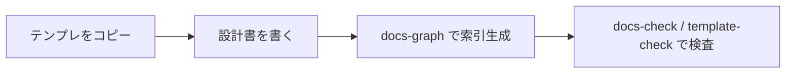

# 地図 — Igeta が何をするか・誰が使うか・主要フロー

> **TL;DR**: Igeta は日本語の設計書を Markdown テンプレと検査 CLI で運用するための道具一式。
> - 文書の種類・配置・読み手は文書体系ガイドが正典、索引・依存グラフは frontmatter から生成する
> - 重い仕組み (由来・鮮度・合意台帳) は顧客提出物 (`delivery-chapter`) だけに課す

## 関連

| 区分 | 文書 | 対応 ID |
|---|---|---|
| 上流 (depends_on) | なし (人間の入口。最上流) | — |
| 下流 | [要件定義書](./product/01-requirements.md) | — |

## 1. 何を作るか

日本語の設計書 (要件定義・基本設計・詳細設計) を Markdown で書き、arc42 の 12 章に載せて CI で検査するためのテンプレート集と CLI (`igeta`)。文書同士の依存・索引・提出物 PDF は frontmatter から機械生成する。

## 2. 誰が使うか

| 役割 | 何のために使うか |
|---|---|
| 設計書を書く開発者・AI | テンプレの配置と kind で文書の置き場所と構造を決め、`docs:check` / `template-check` で壊れを検出する |
| レビューする人 | この地図 → まとまりの地図 → `igeta review-sheet` の順で変更の範囲を把握する |

## 3. 主要フロー

## 4. やらないこと

- 実装コード本体の生成 (`igeta scaffold` が出すのは docs 骨格と検査配線まで)
- 全読み手への由来・網羅の強制 (レビューし切れない量を課さない。`delivery-chapter` だけに課す)

## 5. 詳細への入口

| 知りたいこと | 文書 |
|---|---|
| いまの要件 | [要件定義書](./product/01-requirements.md) |
| 文書の種類・配置・読み手 | [文書体系ガイド](../templates/docs/guides/01-document-taxonomy.md) |
| 採用した外部標準と理由 | [explanation/](./explanation/README.md) |
