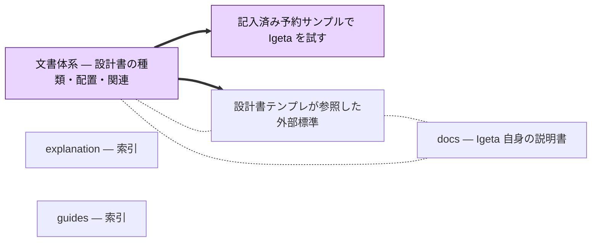

<!-- AUTOGENERATED BY scripts/generate-docs-graph.mjs — DO NOT EDIT BY HAND -->
# Docs 依存関係グラフ
> 自動生成: 2026-09-16 (UTC) / ソース: 各 `docs/**/*.md` の frontmatter
> 規約: docs/guides/01-document-taxonomy.md 参照
> 再生成: `node scripts/generate-docs-graph.mjs --write`
## 凡例
- **太矢印 `==>`**: `depends_on` (上流 → 下流、上流が変わったら下流レビュー必須)
- **点線 `-.-`**: `relates_to` (双方向、緩い結び)
- **点線矢印 `-. supersedes .->`**: 旧 → 新 (ADR の置き換え)
- ノード色は `type` を表す (standard / architecture / strategy / prd / business / adr / runbook / guide / design)
## グラフ

## ドキュメント一覧 (type 別)
### guide

- **booking-sample-guide** — [記入済み予約サンプルで Igeta を試す](guides/02-booking-sample.md)
- **document-taxonomy** — [文書体系 — 設計書の種類・配置・関連](guides/01-document-taxonomy.md)

### explanation

- **design-doc-standards** — [設計書テンプレが参照した外部標準](explanation/01-design-doc-standards.md)

## 孤立ドキュメント (誰からも参照されていない)

| ID | Type | Path |
|---|---|---|
| explanation-index | index | [`docs/explanation/README.md`](explanation/README.md) |
| guides-index | index | [`docs/guides/README.md`](guides/README.md) |

