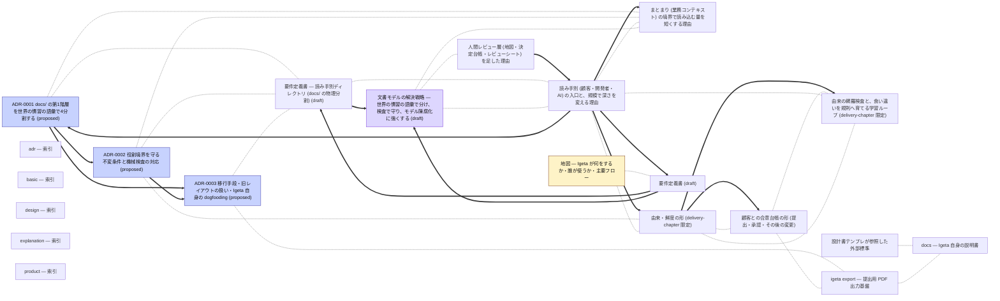

<!-- AUTOGENERATED BY scripts/generate-docs-graph.mjs — DO NOT EDIT BY HAND -->
# Docs 依存関係グラフ
> 自動生成: 2026-10-01 (UTC) / ソース: 各 `docs/**/*.md` の frontmatter
> 規約: docs/guides/01-document-taxonomy.md 参照
> 再生成: `node scripts/generate-docs-graph.mjs --write`
## 凡例
- **太矢印 `==>`**: `depends_on` (上流 → 下流、上流が変わったら下流レビュー必須)
- **点線 `-.-`**: `relates_to` (双方向、緩い結び)
- **点線矢印 `-. supersedes .->`**: 旧 → 新 (ADR の置き換え)
- ノード色は `type` を表す (standard / architecture / strategy / prd / business / adr / runbook / guide / design)
## グラフ

```mermaid
graph LR
  classDef standard fill:#fde68a,stroke:#92400e,color:#111
  classDef architecture fill:#bfdbfe,stroke:#1e3a8a,color:#111
  classDef strategy fill:#fbcfe8,stroke:#9d174d,color:#111
  classDef prd fill:#bbf7d0,stroke:#065f46,color:#111
  classDef business fill:#a7f3d0,stroke:#064e3b,color:#111
  classDef adr fill:#c7d2fe,stroke:#3730a3,color:#111
  classDef runbook fill:#fecaca,stroke:#7f1d1d,color:#111
  classDef guide fill:#e9d5ff,stroke:#581c87,color:#111
  classDef design fill:#ddd6fe,stroke:#6d28d9,color:#111
  classDef map fill:#fef3c7,stroke:#78350f,color:#111
  classDef decision_log fill:#fee2e2,stroke:#7f1d1d,color:#111
  adr-0001-document-role-directories["ADR-0001 docs/ の第1階層を世界の慣習の語彙で4分割する (proposed)"]
  class adr-0001-document-role-directories adr
  adr-0002-role-boundary-invariants["ADR-0002 役割境界を守る不変条件と機械検査の対応 (proposed)"]
  class adr-0002-role-boundary-invariants adr
  adr-0003-docs-model-migration-and-dogfooding["ADR-0003 移行手段・旧レイアウトの扱い・Igeta 自身の dogfooding (proposed)"]
  class adr-0003-docs-model-migration-and-dogfooding adr
  adr-index["adr — 索引"]
  class adr-index index
  agreement-ledger["顧客との合意台帳の形 (提出・承認・その後の変更)"]
  class agreement-ledger explanation
  audience-directories["要件定義書 — 読み手別ディレクトリ (docs/ の物理分割) (draft)"]
  class audience-directories product
  audience-layers["読み手別 (顧客・開発者・AI) の入口と、規模で深さを変える理由"]
  class audience-layers explanation
  context-boundaries["まとまり (業務コンテキスト) の境界で読み込む量を短くする理由"]
  class context-boundaries explanation
  coverage-and-learning["由来の網羅検査と、食い違いを規則へ育てる学習ループ (delivery-chapter 限定)"]
  class coverage-and-learning explanation
  design-basic-index["basic — 索引"]
  class design-basic-index index
  design-doc-standards["設計書テンプレが参照した外部標準"]
  class design-doc-standards explanation
  design-index["design — 索引"]
  class design-index index
  docs-index["docs — Igeta 自身の説明書"]
  class docs-index index
  docs-model-strategy["文書モデルの解決戦略 — 世界の慣習の語彙で分け、検査で守り、モデル陳腐化に強くする (draft)"]
  class docs-model-strategy design
  explanation-index["explanation — 索引"]
  class explanation-index index
  export-deliverable["igeta export — 提出用 PDF 出力基盤"]
  class export-deliverable explanation
  human-review-layer["人間レビュー層 (地図・決定台帳・レビューシート) を足した理由"]
  class human-review-layer explanation
  map["地図 — Igeta が何をするか・誰が使うか・主要フロー"]
  class map map
  product-index["product — 索引"]
  class product-index index
  provenance-and-agreement["由来・鮮度の形 (delivery-chapter 限定)"]
  class provenance-and-agreement explanation
  requirements["要件定義書 (draft)"]
  class requirements product
  audience-layers ==> adr-0001-document-role-directories
  adr-0001-document-role-directories ==> adr-0002-role-boundary-invariants
  adr-0001-document-role-directories ==> adr-0003-docs-model-migration-and-dogfooding
  adr-0002-role-boundary-invariants ==> adr-0003-docs-model-migration-and-dogfooding
  provenance-and-agreement ==> agreement-ledger
  requirements ==> audience-directories
  human-review-layer ==> audience-layers
  audience-layers ==> context-boundaries
  provenance-and-agreement ==> coverage-and-learning
  requirements ==> docs-model-strategy
  audience-directories ==> docs-model-strategy
  audience-layers ==> provenance-and-agreement
  audience-layers ==> requirements
  adr-0001-document-role-directories -.- audience-directories
  adr-0001-document-role-directories -.- context-boundaries
  adr-0002-role-boundary-invariants -.- audience-directories
  adr-0002-role-boundary-invariants -.- context-boundaries
  adr-0002-role-boundary-invariants -.- provenance-and-agreement
  adr-0003-docs-model-migration-and-dogfooding -.- audience-directories
  adr-0003-docs-model-migration-and-dogfooding -.- export-deliverable
  agreement-ledger -.- coverage-and-learning
  agreement-ledger -.- export-deliverable
  audience-directories -.- audience-layers
  audience-layers -.- provenance-and-agreement
  audience-layers -.- coverage-and-learning
  audience-layers -.- context-boundaries
  design-doc-standards -.- docs-index
  docs-model-strategy -.- audience-layers
  docs-model-strategy -.- context-boundaries
  docs-model-strategy -.- human-review-layer
  export-deliverable -.- docs-index
  map -.- requirements
  provenance-and-agreement -.- coverage-and-learning
  provenance-and-agreement -.- agreement-ledger
```
## ドキュメント一覧 (type 別)
### map

- **map** — [地図 — Igeta が何をするか・誰が使うか・主要フロー](00-map.md)

### adr

- **adr-0001-document-role-directories** _(proposed)_ — [ADR-0001 docs/ の第1階層を世界の慣習の語彙で4分割する](adr/0001-document-role-directories.md)
- **adr-0002-role-boundary-invariants** _(proposed)_ — [ADR-0002 役割境界を守る不変条件と機械検査の対応](adr/0002-role-boundary-invariants.md)
- **adr-0003-docs-model-migration-and-dogfooding** _(proposed)_ — [ADR-0003 移行手段・旧レイアウトの扱い・Igeta 自身の dogfooding](adr/0003-docs-model-migration-and-dogfooding.md)

### design

- **docs-model-strategy** _(draft)_ — [文書モデルの解決戦略 — 世界の慣習の語彙で分け、検査で守り、モデル陳腐化に強くする](design/basic/02-solution-strategy.md)

### explanation

- **agreement-ledger** — [顧客との合意台帳の形 (提出・承認・その後の変更)](explanation/08-agreement-ledger.md)
- **audience-layers** — [読み手別 (顧客・開発者・AI) の入口と、規模で深さを変える理由](explanation/03-audience-layers.md)
- **context-boundaries** — [まとまり (業務コンテキスト) の境界で読み込む量を短くする理由](explanation/07-context-boundaries.md)
- **coverage-and-learning** — [由来の網羅検査と、食い違いを規則へ育てる学習ループ (delivery-chapter 限定)](explanation/05-coverage-and-learning.md)
- **design-doc-standards** — [設計書テンプレが参照した外部標準](explanation/01-design-doc-standards.md)
- **export-deliverable** — [igeta export — 提出用 PDF 出力基盤](explanation/06-export-deliverable.md)
- **human-review-layer** — [人間レビュー層 (地図・決定台帳・レビューシート) を足した理由](explanation/02-human-review-layer.md)
- **provenance-and-agreement** — [由来・鮮度の形 (delivery-chapter 限定)](explanation/04-provenance-and-agreement.md)

## 孤立ドキュメント (誰からも参照されていない)

| ID | Type | Path |
|---|---|---|
| adr-index | index | [`docs/adr/README.md`](adr/README.md) |
| design-basic-index | index | [`docs/design/basic/README.md`](design/basic/README.md) |
| design-index | index | [`docs/design/README.md`](design/README.md) |
| explanation-index | index | [`docs/explanation/README.md`](explanation/README.md) |
| product-index | index | [`docs/product/README.md`](product/README.md) |

