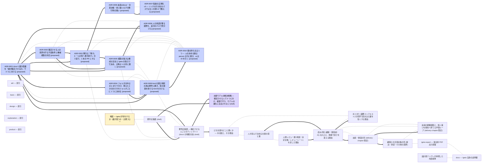

<!-- AUTOGENERATED BY scripts/generate-docs-graph.mjs — DO NOT EDIT BY HAND -->
# Docs 依存関係グラフ
> 自動生成: 2026-10-02 (UTC) / ソース: 各 `docs/**/*.md` の frontmatter
> 規約: docs/guides/01-document-taxonomy.md 参照
> 再生成: `node scripts/generate-docs-graph.mjs --write`
## 凡例
- **太矢印 `==>`**: `depends_on` (上流 → 下流、上流が変わったら下流レビュー必須)
- **点線 `-.-`**: `relates_to` (双方向、緩い結び)
- **点線矢印 `-. supersedes .->`**: 旧 → 新 (ADR の置き換え)
- ノード色は `type` を表す (standard / architecture / strategy / prd / business / adr / runbook / guide / design)
## グラフ

```mermaid
graph LR
  classDef standard fill:#fde68a,stroke:#92400e,color:#111
  classDef architecture fill:#bfdbfe,stroke:#1e3a8a,color:#111
  classDef strategy fill:#fbcfe8,stroke:#9d174d,color:#111
  classDef prd fill:#bbf7d0,stroke:#065f46,color:#111
  classDef business fill:#a7f3d0,stroke:#064e3b,color:#111
  classDef adr fill:#c7d2fe,stroke:#3730a3,color:#111
  classDef runbook fill:#fecaca,stroke:#7f1d1d,color:#111
  classDef guide fill:#e9d5ff,stroke:#581c87,color:#111
  classDef design fill:#ddd6fe,stroke:#6d28d9,color:#111
  classDef map fill:#fef3c7,stroke:#78350f,color:#111
  classDef decision_log fill:#fee2e2,stroke:#7f1d1d,color:#111
  adr-0001-document-role-directories["ADR-0001 docs/ の第1階層を「誰が確定させるか」で 3 つに分ける (proposed)"]
  class adr-0001-document-role-directories adr
  adr-0002-role-boundary-invariants["ADR-0002 確定させる人の境界を守る不変条件と機械検査の対応 (proposed)"]
  class adr-0002-role-boundary-invariants adr
  adr-0003-docs-model-migration-and-dogfooding["ADR-0003 移行は「移す」と「人の型へ書き直す」の 2 段で、1 本の PR にする (proposed)"]
  class adr-0003-docs-model-migration-and-dogfooding adr
  adr-0004-folder-internal-structure-and-growth["ADR-0004 フォルダの中はまとまりで分け、増えたときの分け方をフォルダごとに 1 つに決める (proposed)"]
  class adr-0004-folder-internal-structure-and-growth adr
  adr-0005-enforcement-rollout-and-canonical-sync["ADR-0005 検査の強さは構成の実在と Igeta の版だけで決め、正典は 1 か所に置く (proposed)"]
  class adr-0005-enforcement-rollout-and-canonical-sync adr
  adr-0006-provenance-migration-handling["ADR-0006 由来sidecar・合意台帳・食い違いログの移行時の扱い (proposed)"]
  class adr-0006-provenance-migration-handling adr
  adr-0007-fingerprint-link-normalization["ADR-0007 指紋の正規化 v3 — リンクの行き先をパスではなく文書 id で数える (proposed)"]
  class adr-0007-fingerprint-link-normalization adr
  adr-0008-human-approval-scope["ADR-0008 人の承認が要る変更を、差分のパスで見分ける (proposed)"]
  class adr-0008-human-approval-scope adr
  adr-0009-kind-placement["ADR-0009 kind の置き場所の表は要件に置き、型の検査を掛ける kind を分ける (proposed)"]
  class adr-0009-kind-placement adr
  adr-0010-value-ownership["ADR-0010 値の持ち主は 1 つ — 人の決める値は person の行に置き、ai は ID を引く (proposed)"]
  class adr-0010-value-ownership adr
  adr-index["adr — 索引"]
  class adr-index index
  agreement-ledger["顧客との合意台帳の形 (提出・承認・その後の変更)"]
  class agreement-ledger explanation
  audience-directories["要件定義書 — 確定させる人ごとのディレクトリ (docs/ の物理分割) (draft)"]
  class audience-directories product
  audience-layers["読み手別 (顧客・開発者・AI) の入口と、規模で深さを変える理由"]
  class audience-layers explanation
  context-boundaries["まとまり (業務コンテキスト) の境界で読み込む量を短くする理由"]
  class context-boundaries explanation
  coverage-and-learning["由来の網羅検査と、食い違いを規則へ育てる学習ループ (delivery-chapter 限定)"]
  class coverage-and-learning explanation
  design-basic-index["basic — 索引"]
  class design-basic-index index
  design-doc-standards["設計書テンプレが参照した外部標準"]
  class design-doc-standards explanation
  design-index["design — 索引"]
  class design-index index
  docs-index["docs — Igeta 自身の説明書"]
  class docs-index index
  docs-model-strategy["文書モデルの解決戦略 — 確定させる人で 3 つに分け、検査で守り、モデルの進化に左右されない (draft)"]
  class docs-model-strategy design
  explanation-index["explanation — 索引"]
  class explanation-index index
  export-deliverable["igeta export — 提出用 PDF 出力基盤"]
  class export-deliverable explanation
  folder-placement["どの文書をどこに置くか — 木の図と、その理由"]
  class folder-placement explanation
  human-review-layer["人間レビュー層 (地図・決定台帳・レビューシート) を足した理由"]
  class human-review-layer explanation
  map["地図 — Igeta が何をするか・誰が使うか・主要フロー"]
  class map map
  product-index["product — 索引"]
  class product-index index
  provenance-and-agreement["由来・鮮度の形 (delivery-chapter 限定)"]
  class provenance-and-agreement explanation
  reader-granularity["人が読んで決める文書の型と量"]
  class reader-granularity explanation
  requirements["要件定義書 (draft)"]
  class requirements product
  audience-directories ==> adr-0001-document-role-directories
  adr-0001-document-role-directories ==> adr-0002-role-boundary-invariants
  adr-0001-document-role-directories ==> adr-0003-docs-model-migration-and-dogfooding
  adr-0002-role-boundary-invariants ==> adr-0003-docs-model-migration-and-dogfooding
  adr-0001-document-role-directories ==> adr-0004-folder-internal-structure-and-growth
  adr-0001-document-role-directories ==> adr-0005-enforcement-rollout-and-canonical-sync
  adr-0002-role-boundary-invariants ==> adr-0005-enforcement-rollout-and-canonical-sync
  adr-0003-docs-model-migration-and-dogfooding ==> adr-0005-enforcement-rollout-and-canonical-sync
  adr-0003-docs-model-migration-and-dogfooding ==> adr-0006-provenance-migration-handling
  adr-0006-provenance-migration-handling ==> adr-0007-fingerprint-link-normalization
  adr-0001-document-role-directories ==> adr-0008-human-approval-scope
  adr-0005-enforcement-rollout-and-canonical-sync ==> adr-0008-human-approval-scope
  adr-0001-document-role-directories ==> adr-0009-kind-placement
  adr-0004-folder-internal-structure-and-growth ==> adr-0009-kind-placement
  adr-0009-kind-placement ==> adr-0010-value-ownership
  provenance-and-agreement ==> agreement-ledger
  requirements ==> audience-directories
  human-review-layer ==> audience-layers
  audience-layers ==> context-boundaries
  provenance-and-agreement ==> coverage-and-learning
  requirements ==> docs-model-strategy
  audience-directories ==> docs-model-strategy
  audience-directories ==> folder-placement
  audience-layers ==> provenance-and-agreement
  audience-layers ==> reader-granularity
  adr-0001-document-role-directories -.- adr-0009-kind-placement
  adr-0001-document-role-directories -.- adr-0010-value-ownership
  adr-0002-role-boundary-invariants -.- adr-0009-kind-placement
  adr-0002-role-boundary-invariants -.- adr-0010-value-ownership
  adr-0003-docs-model-migration-and-dogfooding -.- audience-directories
  adr-0003-docs-model-migration-and-dogfooding -.- adr-0010-value-ownership
  adr-0004-folder-internal-structure-and-growth -.- adr-0009-kind-placement
  adr-0005-enforcement-rollout-and-canonical-sync -.- audience-directories
  adr-0005-enforcement-rollout-and-canonical-sync -.- adr-0009-kind-placement
  adr-0005-enforcement-rollout-and-canonical-sync -.- adr-0010-value-ownership
  adr-0006-provenance-migration-handling -.- adr-0007-fingerprint-link-normalization
  adr-0008-human-approval-scope -.- adr-0002-role-boundary-invariants
  adr-0009-kind-placement -.- adr-0010-value-ownership
  adr-0009-kind-placement -.- audience-directories
  agreement-ledger -.- coverage-and-learning
  agreement-ledger -.- export-deliverable
  audience-layers -.- provenance-and-agreement
  audience-layers -.- coverage-and-learning
  audience-layers -.- context-boundaries
  design-doc-standards -.- docs-index
  export-deliverable -.- docs-index
  folder-placement -.- reader-granularity
  folder-placement -.- context-boundaries
  map -.- requirements
  provenance-and-agreement -.- coverage-and-learning
  provenance-and-agreement -.- agreement-ledger
  reader-granularity -.- human-review-layer
```
## ドキュメント一覧 (type 別)
### map

- **map** — [地図 — Igeta が何をするか・誰が使うか・主要フロー](00-map.md)

### adr

- **adr-0001-document-role-directories** _(proposed)_ — [ADR-0001 docs/ の第1階層を「誰が確定させるか」で 3 つに分ける](adr/0001-document-role-directories.md)
- **adr-0002-role-boundary-invariants** _(proposed)_ — [ADR-0002 確定させる人の境界を守る不変条件と機械検査の対応](adr/0002-role-boundary-invariants.md)
- **adr-0003-docs-model-migration-and-dogfooding** _(proposed)_ — [ADR-0003 移行は「移す」と「人の型へ書き直す」の 2 段で、1 本の PR にする](adr/0003-docs-model-migration-and-dogfooding.md)
- **adr-0004-folder-internal-structure-and-growth** _(proposed)_ — [ADR-0004 フォルダの中はまとまりで分け、増えたときの分け方をフォルダごとに 1 つに決める](adr/0004-folder-internal-structure-and-growth.md)
- **adr-0005-enforcement-rollout-and-canonical-sync** _(proposed)_ — [ADR-0005 検査の強さは構成の実在と Igeta の版だけで決め、正典は 1 か所に置く](adr/0005-enforcement-rollout-and-canonical-sync.md)
- **adr-0006-provenance-migration-handling** _(proposed)_ — [ADR-0006 由来sidecar・合意台帳・食い違いログの移行時の扱い](adr/0006-provenance-migration-handling.md)
- **adr-0007-fingerprint-link-normalization** _(proposed)_ — [ADR-0007 指紋の正規化 v3 — リンクの行き先をパスではなく文書 id で数える](adr/0007-fingerprint-link-normalization.md)
- **adr-0008-human-approval-scope** _(proposed)_ — [ADR-0008 人の承認が要る変更を、差分のパスで見分ける](adr/0008-human-approval-scope.md)
- **adr-0009-kind-placement** _(proposed)_ — [ADR-0009 kind の置き場所の表は要件に置き、型の検査を掛ける kind を分ける](adr/0009-kind-placement.md)
- **adr-0010-value-ownership** _(proposed)_ — [ADR-0010 値の持ち主は 1 つ — 人の決める値は person の行に置き、ai は ID を引く](adr/0010-value-ownership.md)

### design

- **docs-model-strategy** _(draft)_ — [文書モデルの解決戦略 — 確定させる人で 3 つに分け、検査で守り、モデルの進化に左右されない](design/basic/02-solution-strategy.md)

### explanation

- **agreement-ledger** — [顧客との合意台帳の形 (提出・承認・その後の変更)](explanation/08-agreement-ledger.md)
- **audience-layers** — [読み手別 (顧客・開発者・AI) の入口と、規模で深さを変える理由](explanation/03-audience-layers.md)
- **context-boundaries** — [まとまり (業務コンテキスト) の境界で読み込む量を短くする理由](explanation/07-context-boundaries.md)
- **coverage-and-learning** — [由来の網羅検査と、食い違いを規則へ育てる学習ループ (delivery-chapter 限定)](explanation/05-coverage-and-learning.md)
- **design-doc-standards** — [設計書テンプレが参照した外部標準](explanation/01-design-doc-standards.md)
- **export-deliverable** — [igeta export — 提出用 PDF 出力基盤](explanation/06-export-deliverable.md)
- **folder-placement** — [どの文書をどこに置くか — 木の図と、その理由](explanation/10-folder-placement.md)
- **human-review-layer** — [人間レビュー層 (地図・決定台帳・レビューシート) を足した理由](explanation/02-human-review-layer.md)
- **provenance-and-agreement** — [由来・鮮度の形 (delivery-chapter 限定)](explanation/04-provenance-and-agreement.md)
- **reader-granularity** — [人が読んで決める文書の型と量](explanation/09-reader-granularity.md)

## 孤立ドキュメント (誰からも参照されていない)

| ID | Type | Path |
|---|---|---|
| adr-index | index | [`docs/adr/README.md`](adr/README.md) |
| design-basic-index | index | [`docs/design/basic/README.md`](design/basic/README.md) |
| design-index | index | [`docs/design/README.md`](design/README.md) |
| explanation-index | index | [`docs/explanation/README.md`](explanation/README.md) |
| product-index | index | [`docs/product/README.md`](product/README.md) |

