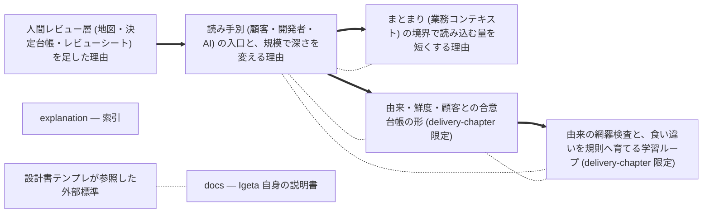

<!-- AUTOGENERATED BY scripts/generate-docs-graph.mjs — DO NOT EDIT BY HAND -->
# Docs 依存関係グラフ
> 自動生成: 2026-09-29 (UTC) / ソース: 各 `docs/**/*.md` の frontmatter
> 規約: docs/guides/01-document-taxonomy.md 参照
> 再生成: `node scripts/generate-docs-graph.mjs --write`
## 凡例
- **太矢印 `==>`**: `depends_on` (上流 → 下流、上流が変わったら下流レビュー必須)
- **点線 `-.-`**: `relates_to` (双方向、緩い結び)
- **点線矢印 `-. supersedes .->`**: 旧 → 新 (ADR の置き換え)
- ノード色は `type` を表す (standard / architecture / strategy / prd / business / adr / runbook / guide / design)
## グラフ

```mermaid
graph LR
  classDef standard fill:#fde68a,stroke:#92400e,color:#111
  classDef architecture fill:#bfdbfe,stroke:#1e3a8a,color:#111
  classDef strategy fill:#fbcfe8,stroke:#9d174d,color:#111
  classDef prd fill:#bbf7d0,stroke:#065f46,color:#111
  classDef business fill:#a7f3d0,stroke:#064e3b,color:#111
  classDef adr fill:#c7d2fe,stroke:#3730a3,color:#111
  classDef runbook fill:#fecaca,stroke:#7f1d1d,color:#111
  classDef guide fill:#e9d5ff,stroke:#581c87,color:#111
  classDef design fill:#ddd6fe,stroke:#6d28d9,color:#111
  classDef map fill:#fef3c7,stroke:#78350f,color:#111
  classDef decision_log fill:#fee2e2,stroke:#7f1d1d,color:#111
  audience-layers["読み手別 (顧客・開発者・AI) の入口と、規模で深さを変える理由"]
  class audience-layers explanation
  context-boundaries["まとまり (業務コンテキスト) の境界で読み込む量を短くする理由"]
  class context-boundaries explanation
  coverage-and-learning["由来の網羅検査と、食い違いを規則へ育てる学習ループ (delivery-chapter 限定)"]
  class coverage-and-learning explanation
  design-doc-standards["設計書テンプレが参照した外部標準"]
  class design-doc-standards explanation
  docs-index["docs — Igeta 自身の説明書"]
  class docs-index index
  explanation-index["explanation — 索引"]
  class explanation-index index
  human-review-layer["人間レビュー層 (地図・決定台帳・レビューシート) を足した理由"]
  class human-review-layer explanation
  provenance-and-agreement["由来・鮮度・顧客との合意台帳の形 (delivery-chapter 限定)"]
  class provenance-and-agreement explanation
  human-review-layer ==> audience-layers
  audience-layers ==> context-boundaries
  provenance-and-agreement ==> coverage-and-learning
  audience-layers ==> provenance-and-agreement
  audience-layers -.- provenance-and-agreement
  audience-layers -.- coverage-and-learning
  audience-layers -.- context-boundaries
  design-doc-standards -.- docs-index
  provenance-and-agreement -.- coverage-and-learning
```
## ドキュメント一覧 (type 別)
### explanation

- **audience-layers** — [読み手別 (顧客・開発者・AI) の入口と、規模で深さを変える理由](explanation/03-audience-layers.md)
- **context-boundaries** — [まとまり (業務コンテキスト) の境界で読み込む量を短くする理由](explanation/07-context-boundaries.md)
- **coverage-and-learning** — [由来の網羅検査と、食い違いを規則へ育てる学習ループ (delivery-chapter 限定)](explanation/05-coverage-and-learning.md)
- **design-doc-standards** — [設計書テンプレが参照した外部標準](explanation/01-design-doc-standards.md)
- **human-review-layer** — [人間レビュー層 (地図・決定台帳・レビューシート) を足した理由](explanation/02-human-review-layer.md)
- **provenance-and-agreement** — [由来・鮮度・顧客との合意台帳の形 (delivery-chapter 限定)](explanation/04-provenance-and-agreement.md)

## 孤立ドキュメント (誰からも参照されていない)

| ID | Type | Path |
|---|---|---|
| explanation-index | index | [`docs/explanation/README.md`](explanation/README.md) |

