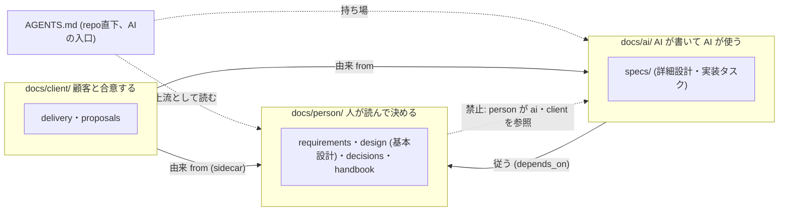

# 文書モデルの解決戦略 — 承認者で 3 つに分け、検査で守り、モデル陳腐化に強くする

> **TL;DR**: Igeta の文書モデルは「コードから導けないものだけ手で書く」「人が決める文書と AI が作る文書を
> 置き場所で分ける」「品質の門は決定的な機械検査」の 3 本柱。採用した構造は ADR-0001〜0008
> (`docs/person`・`ai`・`client` + repo 直下 `AGENTS.md`)。
> 本書は「なぜこの構造で AI 駆動開発がモデルの進化に関係なく回るか」を品質目標単位でつなぐ
> - 決定の正典は ADR。本書は「どの決定がどの目標に効くか」の対応表
> - 人の文書の型と量は [人が読んで決める文書の型と量](../../explanation/09-reader-granularity.md)、内部構造は
>   [どの文書をどこに置くか](../../explanation/10-folder-placement.md) に分ける

## 関連

| 区分 | 文書 | 対応 |
|---|---|---|
| 上流 | [要件定義書](../../product/01-requirements.md) / [要件定義書 — 読み手別ディレクトリ](../../product/02-audience-directories.md) | REQ-1xx/2xx |
| 下流 | ADR-0001〜0008 / [粒度](../../explanation/09-reader-granularity.md) / [置き場所](../../explanation/10-folder-placement.md) / [文書体系ガイド](../../../templates/docs/guides/01-document-taxonomy.md) | — |

## 0. 設計書とは何か (前提)

コードや OpenAPI・`schema.prisma` から機械的に導けることは手で書かない。設計書が持つのはコード・契約には存在しない
4 つだけ: **意図**・**決定**・**境界の約束**・**人との合意**。どれにも当たらない記述は書かない。

## 1. 技術選定の要約 (文書モデルの要素選定)

| ID | 領域 | 採用 | 理由 | 決定元 ADR |
|---|---|---|---|---|
| SS-001 | docs/ 第 1 階層の軸 | 承認者 3 つ (`person`/`ai`/`client`、全小文字) | 置き場所がそのまま承認の要否になる。「`ai/` は人が読まなくてよい」と言える | ADR-0001 |
| SS-002 | 人の文書の型と量 | 結論 → 図 → 決まりの表。1 本 100 行、1 まとまり 15,000 字 | 人が全部読んで決められる量を検査で保つ (実測: 3 本 15,366 字 → 1 枚 1,961 字) | ADR-0002 |
| SS-003 | 内部構造・肥大化対策 | まとまり (`context`) ごとのフォルダ。日付記録 (adr/proposal) は年。1 フォルダ 15 本で違反 | フォルダが読む単位になる。実測 (ADR 35 本等) に基づく | ADR-0004 |
| SS-004 | 移行・後方互換 | dry-run→適用コマンド、レイアウト検出で強制切替 | 既存2消費repoを無警告で赤くしない。ただし実repoへは適用する | ADR-0003/0005 |

## 2. 分割方針 (docs/ の軸と依存方向)

arc42 の章は今回の軸と直交する属性のまま変えない。`context` はフィールドに加えてフォルダにもする (ADR-0004)。

| ID | 論点 | 決め | 破ってはいけない線 |
|---|---|---|---|
| SS-101 | docs/ 第 1 階層 | `person`/`ai`/`client` の 3 分割 (承認者) | 「両方が読む」置き場所を作らない |
| SS-102 | 第 2 階層以下 | まとまりごとのフォルダ (ADR-0004、木の正本は [置き場所](../../explanation/10-folder-placement.md) §1) | 木に無い場所に文書を置かない |
| SS-103 | 依存の向き | `ai` → `person`、`client` → `person`・`ai` | `person` から `ai`・`client` への参照を作らない |
| SS-104 | AI の入口 | フォルダではなく repo 直下 `AGENTS.md` | `docs/` 配下へ移さない |

## 3. 品質目標の達成手段 (モデル非依存)

| ID | 品質目標 | 弱いモデルでも回る条件 | 強いモデルが出ても無駄にならない条件 |
|---|---|---|---|
| SS-201 | 人が読むものが分かる | フォルダ名を見るだけで承認者が分かる | 置き場所という構造情報は常に正しい (`RoleBoundaryCheck`)。詳細設計が要らなくなっても `person/` は残る |
| SS-202 | 人も AI も読みきれる | 人の文書は量の上限を検査 (`PersonFormCheck`)。AI は `context-files` で範囲を絞る | 上流 (人の決定) が短いほど、どのモデルでも取り違えが減る |
| SS-203 | 品質の門 | テンプレの穴埋め性 | 検査は正規表現・SHA256・文字列一致のみ |

## 4. 主要な設計判断 (ADR 一覧)

| ADR | 決定 | 本書との関係 |
|---|---|---|
| ADR-0001 | 第 1 階層 = 承認者 3 つ | SS-001/101/104 |
| ADR-0002 | 不変条件 11 件と検査の対応 | SS-002/103/201-203 |
| ADR-0003 | 移行コマンド・適用範囲 | SS-004 |
| ADR-0004 | 内部構造・肥大化対策 | SS-003 |
| ADR-0005 | ルール化・既定切替 | SS-004 |
| ADR-0006/0007 | 提出物の付属ファイルの移行、指紋の正規化 v3 | SS-004 |
| ADR-0008 | 人の承認が要る変更を差分のパスで見分ける | SS-001 |

## 5. 参入障壁 (moat)・組織的な決定

| 写せる | 写せない |
|---|---|
| フォルダ名・検査コードそのもの | `Role.ts` に積む実際の誤判定の修正履歴、食い違い学習ループの実測ログ |
| ADR の書式 | 「どの kind をどちらに倒すか」の判断。複数回の実案件評価の反省から来ている |

既存 explanation 8 本の遡及 ADR 化はスコープ外 (ADR-0003)。本書・ADR 群の確定後、文書体系ガイド §2・§3 の改訂と
`igeta docs-migrate` の実装が後続タスクになる。
