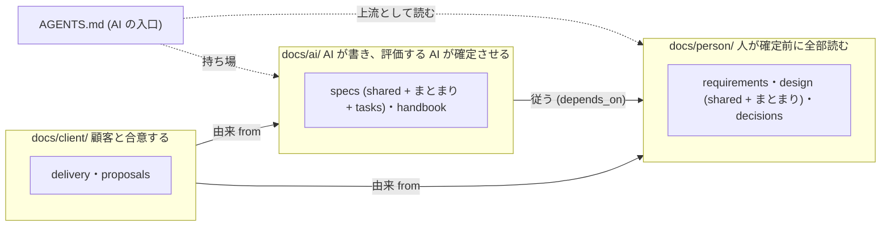

# 文書モデルの解決戦略 — 確定させる人で 3 つに分け、検査で守り、モデルの進化に左右されない

> **TL;DR**: Igeta の文書モデルは 3 本柱。「コードから導けないものだけ手で書く」「人が決める文書と AI が作る文書を
> 置き場所で分け、人の文書は全部読める型と量に保つ」「品質の門は決定的な機械検査」。構造は ADR-0001〜0008
> (`docs/person`・`ai`・`client` + repo 直下の `AGENTS.md`)。本書は、どの決定がどの品質目標に効くかをつなぐ

## 関連

| 区分 | 文書 | 対応 |
|---|---|---|
| 上流 | [要件定義書](../../product/01-requirements.md) / [要件定義書 — 確定させる人ごとのディレクトリ](../../product/02-audience-directories.md) | REQ-1xx/2xx |
| 下流 | ADR-0001〜0010 | — |

## 0. 設計書とは何か (前提)

コードや OpenAPI・`schema.prisma` から機械的に導けることは手で書かない。設計書が持つのは、コードと契約には
存在しない 4 つだけ: **意図**・**決定**・**境界の約束**・**人との合意**。どれにも当たらない記述は書かない。

## 1. 技術選定の要約 (文書モデルの要素)

| ID | 領域 | 採用 | 理由 | 決定元 ADR |
|---|---|---|---|---|
| SS-001 | docs/ の第 1 階層 | 確定させる人で 3 つ (`person`/`ai`/`client`、小文字) | 置き場所がそのまま承認の要否になる。「両方が読む」場所を作らない | ADR-0001 |
| SS-002 | 人の文書の型と量 | 結論 → 図 → 決まりの表 (状態つき)。1 本 100 行、まとまりの合計に上限 | 人が全部読んで決められる。実測で本文が元の 26% になった | ADR-0002 |
| SS-003 | 中の構造 | まとまりごとのフォルダ。日付の記録は年。1 フォルダ 15 本で違反 | フォルダが読む単位になる。実測 (16〜35 本の平置き) に基づく | ADR-0004 |
| SS-004 | 移行とルール化 | 「移す」と「書き直す」の 2 段を 1 本の PR で。強さは構成の実在と版だけで決める | 半端な状態を残さない。設定で迂回できない | ADR-0003/0005 |
| SS-005 | 承認の強制 | 差分のパスで人の承認の要否を決める | 主体に依存しない決定的な判定 | ADR-0008 |
| SS-006 | 置き場所と値の持ち主 | kind 47 種の置き場所の表。人の決める値は person の行に 1 回だけ置き、ai は ID を引く | 決めの本体を人の承認の下に 1 か所だけ置く | ADR-0009/0010 |

## 2. 分割方針 (docs/ の軸と依存の向き)

| ID | 論点 | 決め | 破ってはいけない線 |
|---|---|---|---|
| SS-101 | 第 1 階層 | `person`/`ai`/`client` の 3 分割 | 「両方が読む」置き場所を作らない |
| SS-102 | 第 2 階層以下 | まとまりごとのフォルダ。kind ごとの置き場所は ADR-0009 | ADR-0009 の表に無い場所に文書を置かない |
| SS-103 | 依存の向き | `ai` → `person`、`client` → `person`・`ai` | `person` から `ai`・`client` を指さない (`relates_to` も含む) |
| SS-104 | AI の入口 | repo 直下の `AGENTS.md` | `docs/` の中に入口を作らない |

## 3. 品質目標の達成手段 (モデルの進化に左右されない)

| ID | 品質目標 | 弱いモデルでも回る条件 | 強いモデルが出ても無駄にならない条件 |
|---|---|---|---|
| SS-201 | 人が読むものが分かる | フォルダ名だけで、確定させる人が分かる | 詳細設計が要らなくなっても、人の決定 (`person/`) は残る |
| SS-202 | 人も AI も読みきれる | 人の文書は型と量を検査する。AI は `context-files` で範囲を絞る | 上流 (人の決定) が短いほど、どのモデルでも取り違えが減る |
| SS-203 | 品質の門 | 雛形の穴埋めで書ける | 検査は正規表現・SHA256・文字列一致・件数だけ。モデルの巧拙に判定が依存しない |

## 4. 主要な設計判断 (ADR 一覧)

ADR の一覧は生成索引 ([docs/adr/README.md](../../adr/README.md)) が出す。本書は §1 の「決定元 ADR」の列で引く。

## 5. 参入障壁と組織的な決定

| 写せる | 写せない |
|---|---|
| フォルダ名・検査のコード (公開) | 「どの kind のどの節を人に倒すか」の判断。実案件の評価の反省から積む |
| ADR の書式 | 食い違いの学習ループの実測ログ (05) と、`Role.ts` に積む誤判定の修正の履歴 |

本書と ADR 群が確定した後の作業: 文書体系ガイドの改訂、雛形の再編 (ADR-0010)、
新設の検査と `igeta docs-migrate` の実装、Igeta 自身の移行 (ADR-0003)。
