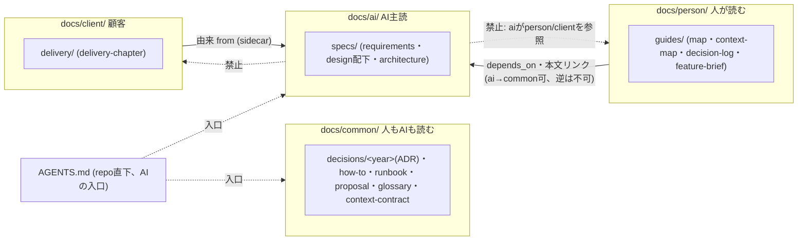

# 文書モデルの解決戦略 — 読み手4つに分け、検査で守り、モデル陳腐化に強くする

> **TL;DR**: Igeta の文書モデルは「コードから導けないものだけ手で書く」「読み手は置き場所で分かる」
> 「品質の門は決定的な機械検査」の 3 本柱。採用した構造は ADR-0001〜0005
> (`docs/common`・`ai`・`person`・`client` + repo 直下 `AGENTS.md`)。
> 本書は「なぜこの構造で AI 駆動開発がモデルの進化に関係なく回るか」を品質目標単位でつなぐ
> - 決定の正典は ADR。本書は「どの決定がどの目標に効くか」の対応表
> - 粒度の詳細は [人とAIと顧客で、なぜ・どう書き分けるか](../../explanation/09-reader-granularity.md)、内部構造は
>   [どの文書をどこに置くか](../../explanation/10-folder-placement.md) に分ける

## 関連

| 区分 | 文書 | 対応 |
|---|---|---|
| 上流 | [要件定義書](../../product/01-requirements.md) / [要件定義書 — 読み手別ディレクトリ](../../product/02-audience-directories.md) | REQ-1xx/2xx |
| 下流 | ADR-0001〜0005 / [粒度](../../explanation/09-reader-granularity.md) / [置き場所](../../explanation/10-folder-placement.md) / [文書体系ガイド](../../../templates/docs/guides/01-document-taxonomy.md) | — |

## 0. 設計書とは何か (前提)

コードや OpenAPI・`schema.prisma` から機械的に導けることは手で書かない。設計書が持つのはコード・契約には存在しない
4 つだけ: **意図**・**決定**・**境界の約束**・**人との合意**。どれにも当たらない記述は書かない。

## 1. 技術選定の要約 (文書モデルの要素選定)

| ID | 領域 | 採用 | 理由 | 決定元 ADR |
|---|---|---|---|---|
| SS-001 | docs/ 第 1 階層の軸 | 読み手4つ (`common`/`ai`/`person`/`client`、全小文字) | CEO 原文に最短で答える。読む前に読み手が分かる | ADR-0001 |
| SS-002 | 第 2 階層 | 世界の慣習語彙 (`decisions`=MADR、`specs`=spec-kit/OpenSpec、`guides`) | 独自語を避け学習コストを下げる | ADR-0001 |
| SS-003 | 内部構造・肥大化対策 | 日付記録(adr/proposal)は年、他は`context`、1フォルダ15本で違反 | 実測 (ADR35本等) に基づく | ADR-0004 |
| SS-004 | 移行・後方互換 | dry-run→適用コマンド、レイアウト検出で強制切替 | 既存2消費repoを無警告で赤くしない。ただし実repoへは適用する | ADR-0003/0005 |

## 2. 分割方針 (docs/ の軸と依存方向)

arc42 の章・`context` は今回の軸と直交する属性のまま変えない。読み手は**新しい第3の軸**で既存2軸と競合しない。

| ID | 論点 | 決め | 破ってはいけない線 |
|---|---|---|---|
| SS-101 | docs/ 第 1 階層 | `common`/`ai`/`person`/`client` の 4 分割 | 読み手の直書き以外の名前にしない |
| SS-102 | 第 2 階層以下 | 既存 kind 別サブフォルダをそのまま、+内部構造 (ADR-0004) | kind 別構成自体は変えない |
| SS-103 | 依存の向き | どの区分も `common` に依存可。`person`/`client` は `ai` に依存可。`ai` は不可 | `ai`→`person`/`client` の参照を作らない |
| SS-104 | AI の入口 | フォルダではなく repo 直下 `AGENTS.md` | `guides/` 配下へ移さない |

## 3. 品質目標の達成手段 (モデル非依存)

| ID | 品質目標 | 弱いモデルでも回る条件 | 強いモデルが出ても無駄にならない条件 |
|---|---|---|---|
| SS-201 | 即判別 (CEO 原文) | フォルダ名を見るだけで読み手が分かる | 置き場所という構造情報は常に正しい (`RoleBoundaryCheck`) |
| SS-202 | 1 タスクで読み切れる | 行数上限 + `context-files` で範囲を絞る | 読む量は品質とは別軸 (詳細は [粒度](../../explanation/09-reader-granularity.md)) |
| SS-203 | 品質の門 | テンプレの穴埋め性 | 検査は正規表現・SHA256・文字列一致のみ |

## 4. 主要な設計判断 (ADR 一覧)

| ADR | 決定 | 本書との関係 |
|---|---|---|
| ADR-0001 | 第 1 階層=読み手4つ、第 2 階層=慣習語彙 | SS-101/102/104 |
| ADR-0002 | 不変条件9件と検査の対応 | SS-002/201-203 |
| ADR-0003 | 移行コマンド・適用範囲 | SS-004 |
| ADR-0004 | 内部構造・肥大化対策 | SS-003 |
| ADR-0005 | ルール化・既定切替 | SS-004 |

## 5. 参入障壁 (moat)・組織的な決定

| 写せる | 写せない |
|---|---|
| フォルダ名・検査コードそのもの | `Role.ts` に積む実際の誤判定の修正履歴、食い違い学習ループの実測ログ |
| ADR の書式 | 「どの kind をどちらに倒すか」の判断。複数回の実案件評価の反省から来ている |

既存 explanation 8 本の遡及 ADR 化はスコープ外 (ADR-0003)。本書・ADR 群の確定後、文書体系ガイド §2・§3 の改訂と
`igeta docs-migrate` の実装が後続タスクになる。
