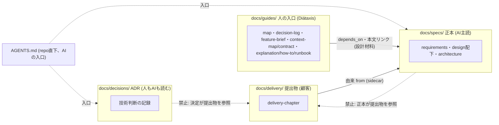

# 文書モデルの解決戦略 — 世界の慣習の語彙で分け、検査で守り、モデル陳腐化に強くする

> **TL;DR**: Igeta の文書モデルは「コードから導けないものだけ手で書く」「読み手は置き場所で分かる」
> 「品質の門は決定的な機械検査」の 3 本柱。採用した構造は ADR-0001〜0003
> (`docs/specs`・`decisions`・`guides`・`delivery` + repo 直下 `AGENTS.md`)。
> 本書は「なぜこの構造で AI 駆動開発がモデルの進化に関係なく回るか」を品質目標単位でつなぐ
> - 決定の正典は ADR。本書は「どの決定がどの目標に効くか」の対応表
> - ここに書いていない構造を実装で増やさない

## 関連

| 区分 | 文書 | 対応 |
|---|---|---|
| 上流 | [要件定義書](../../product/01-requirements.md) / [要件定義書 — 読み手別ディレクトリ](../../product/02-audience-directories.md) | REQ-1xx/2xx |
| 下流 | ADR-0001 / ADR-0002 / ADR-0003 / [文書体系ガイド](../../../templates/docs/guides/01-document-taxonomy.md) | — |

## 0. 設計書とは何か (前提)

コードや OpenAPI・`schema.prisma` から機械的に導けることは手で書かない — 既存の `AUTOGEN` 区間 (API 一覧・
テーブル列・索引・依存グラフ) がすでにこの線を引いている。設計書が持つのはコード・契約には存在しない 4 つだけ:
**意図** (なぜこの形か)・**決定** (どの案を採り、どれを捨てたか)・**境界の約束** (他のまとまり・顧客に見せてよい面)・
**人との合意** (承認・受入条件)。どれにも当たらない記述 (実装の言い換え・自明な説明) は書かない。
ADR-0001/0002/0003 もこの 4 つだけを書いた。

## 1. 技術選定の要約 (文書モデルの要素選定)

| ID | 領域 | 採用 | 理由 | 決定元 ADR |
|---|---|---|---|---|
| SS-001 | docs/ 第 1 階層の軸 | 世界の慣習の語彙 (`specs`/`decisions`/`guides`/`delivery`) | 独自語より学習コストが低く、読み手の数・名称が変わってもフォルダ名を書き換えずに済む | ADR-0001 |
| SS-002 | 不変条件の実装先 | 既存検査 1 本の拡張 + 新設 3 本のみ | 検査の無い条件は採らない。既存を壊さない | ADR-0002 |
| SS-003 | 移行・後方互換 | dry-run コマンド + 人手適用、レイアウト検出で opt-in | 既存 2 消費 repo を無警告で赤くしない | ADR-0003 |

## 2. 分割方針 (docs/ の軸と依存方向)

arc42 の章・`context` (業務のまとまり) は今回の軸と直交する属性のまま変えない (章は frontmatter `arc42:`、
まとまりは frontmatter `context:` — 文書体系ガイド §0・`context-boundaries` §2 の決定を維持。この区分は
**新しい第 3 の軸**であり、既存 2 軸と競合しない)。

| ID | 論点 | 決め | 破ってはいけない線 |
|---|---|---|---|
| SS-101 | docs/ 第 1 階層 | `specs`/`decisions`/`guides`/`delivery` の 4 分割 | ADR を `specs`/`guides` に同居させない (ADR-0001 却下案) |
| SS-102 | 第 2 階層以下 | 既存 kind 別サブフォルダをそのまま 1 段深く | kind 別構成自体は変えない |
| SS-103 | 依存の向き | guides↔specs は双方向可、delivery→specs のみ可 | specs/decisions→delivery の参照を作らない |
| SS-104 | AI の入口 | フォルダではなく repo 直下 `AGENTS.md` | `AGENTS.md` を `guides/` 配下へ移さない (agents.md 慣習は repo 直下が前提) |

## 3. 品質目標の達成手段 (モデル非依存)

| ID | 品質目標 | 弱いモデルでも回る条件 | 強いモデルが出ても無駄にならない条件 |
|---|---|---|---|
| SS-201 | 即判別 (CEO 原文) | フォルダ名を見るだけで区分が分かる。kind の知識が要らない | 生成の巧拙に関係なく、置き場所という構造情報は常に正しい (`RoleBoundaryCheck` が保証) |
| SS-202 | 1 タスクで読み切れる | 行数上限 (150/200) + `context-files` で範囲を機械的に絞る | 強いモデルでも「読む量」は品質とは別軸 (由来切れ・虚偽報告は量を減らしても起きる) |
| SS-203 | 品質の門 | テンプレの穴埋め性 (節見出し固定) で何を書くべきか迷わない | 検査は正規表現・SHA256・文字列一致のみ。モデルの巧拙に判定が依存しない |

## 4. 主要な設計判断 (ADR 一覧)

| ADR | 決定 | 本書との関係 |
|---|---|---|
| ADR-0001 | docs/ 第 1 階層を世界の慣習の語彙で 4 分割にする | SS-101/102/104 |
| ADR-0002 | 不変条件 8 件と検査の対応 | SS-002/201-203 |
| ADR-0003 | 移行手段・旧レイアウト・dogfooding | SS-003 |

## 5. 参入障壁 (moat)・組織的な決定

| 写せる | 写せない |
|---|---|
| フォルダ名・検査コードそのもの (構造は半日で模倣できる) | `Role.ts` に積む実際の誤判定の修正履歴、由来の食い違い学習ループと同じ型の実測ログ |
| ADR の書式 | 「どの kind をどちらに倒すか」の判断 — 複数回の実案件評価 (人間レビュー層・読み手別の入口 各 §1 の実例) の反省から来ている |

既存 explanation 8 本の遡及 ADR 化 (director 診断 1 の積み残し) はスコープ外とする決定を ADR-0003 の Decision 2 に
明記した。本書・ADR 群の確定後、文書体系ガイド §2 (フォルダ木)・§3 (配置の決定理由表) の改訂と、
`igeta docs-migrate` の実装が後続タスクになる。
