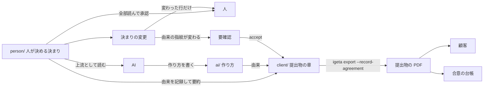

# 読み手別 (顧客・開発者・AI) の入口と、規模で深さを変える理由

> **TL;DR**: 読み手は**人 (発注側・開発者)・AI・顧客** の 3 種。人は**確定する前に `person/` の文書を全部読んで決める**。
> AI は `person/` の決まりを上流として読み、作り方を `ai/` に書く。顧客は**提出物の PDF だけ**を読む。
> 置き場所は「確定させる人」で分ける (ADR-0001 v4)。**重い仕組み (由来・鮮度・網羅・合意台帳) は提出物の章
> (kind `delivery-chapter`) だけに課す**。
> - 本書の §3・§5 は 2026-10-02 に ADR-0001 v4 へ合わせて改めた (旧: 「AI が正本を読み、開発者は地図だけを読む」)
> - **規模で深さを変える**: 小さい変更に文書を足さない、を決まりとして書く (§4)

## 関連

| 区分 | 文書 | 対応 ID |
|---|---|---|
| 上流 (depends_on) | [人間レビュー層](./02-human-review-layer.md) | — |
| 下流 | [由来・鮮度・合意台帳](./04-provenance-and-agreement.md) / [網羅・学習](./05-coverage-and-learning.md) / [まとまりの境界](./07-context-boundaries.md) | — |

## 1. 背景 (実例。ある受託案件)

| # | 実例 | 何が起きたか |
|---|---|---|
| 1 | 量 | AI が読み書きする設計一式は 77 本・約 8,400 行。顧客向け 10 章 (約 650 行) を AI が要約した |
| 2 | 由来切れ | 顧客向けの章から正本へ辿れるのは文書単位の `depends_on` だけ。正本を直しても自動では変わらない |
| 3 | 評価の後追い | 食い違いが評価 3 ラウンドで 4 件、図の構文誤り 2 件は PDF 描画失敗で初めて見つかった |
| 4 | 開発者の入口が無い | 地図・決定台帳・機能ブリーフに相当する入口が無く、「決定」143 行・「仮置き」84 行が散在 |
| 5 | 規模 | 機能 35 件・機能要件 14 件・業務コンテキスト 6〜7 |

## 2. 採らなかった案

| 案 | 採らなかった理由 |
|---|---|
| 由来・鮮度・網羅・合意台帳を **全読み手** (AI/開発者/顧客) に課す (前回案) | 仕様駆動開発への主な批判は「AI が作る Markdown が多すぎて人間がレビューし切れない」— Böckeler, *Understanding Spec-Driven-Development: Kiro, spec-kit, and Tessl*, martinfowler.com, 2025-10-15 (<https://martinfowler.com/articles/exploring-gen-ai/sdd-3-tools.html>: 「spec-kit created a LOT of markdown files for me to review... I'd rather review code」) / Zaninotto, *Spec-Driven Development: The Waterfall Strikes Back*, marmelab.com, 2025-11-12 (<https://marmelab.com/blog/2025/11/12/spec-driven-development-waterfall-strikes-back.html>: 「SDD produces too much text... Developers spend most of their time reading long Markdown files」)。由来・網羅を全読み手に課すと同じ失敗を機構として埋め込む |
| `audience` フィールドを新設して kind と併用する | 提出物の章 (kind `delivery-chapter`) が既にその区別を担っている。区別のためのフィールドを 2 つ持つ必要が無い (Simplicity First) |
| kind を読み手の数だけ増やす | kind は置き場所と 1 対 1 で登録が 2 か所要る。既存 kind (`map`/`decision-log`/`feature-brief`/`delivery-chapter`) の組み合わせで足りる |
| 顧客向けの章を正本にする | 正本を 2 つ持つと「どちらを直すか」で食い違いが起きる (人間レビュー層 §2 と同じ結論) |

## 3. 読み手 3 種

| 読み手 | 読む目的 | 読むもの | 量の上限 | 書かないもの | 検査 |
|---|---|---|---|---|---|
| **人** (発注側・開発者) | 決める・承認する | `person/` の自分のまとまりと全体共通を、確定前に全部。変わったら変わった行だけ (`review-sheet --diff`) | ADR-0002 の条件 7・8 | 作り方の詳細、`ai/` の ID | `PersonFormCheck` (ADR-0002) |
| **AI** | 実装する | `context-files` が返す範囲 (`person/` の要件・全体共通・自分のまとまり + `ai/specs/` の全体共通・自分のまとまり + 隣の約束) | `context-files` の範囲だけ | 顧客向けの言い回し、他のまとまりの内部 | 既存 `template-check` + `context-boundary-check` |
| **顧客** (非エンジニア) | 合意・検収 | **提出物の章 (`delivery-chapter`) を束ねた PDF** (`igeta export`) | PDF 1 冊 (章の目安は [別紙](./04-provenance-and-agreement.md)) | 社内 ID・「仮」・未決の生記述 | 由来・鮮度・網羅・合意台帳 — この読み手だけに課す |

kind ごとの置き場所 (47 種) は要件定義書 02 §7 が正本。人が決める kind (要件・業務の決まり・
画面・品質・権限・データの扱いなど) は `person/`、作り方の kind と手引きは `ai/`、提出物と提案書は `client/`。

## 4. 規模で深さを変える

| 規模 | 目安 | 足す文書 |
|---|---|---|
| 小 | 影響する REQ ID が 1〜2 件、既存の 1 文書内で収まる | 無し。既存文書を直接直し `review-sheet` でレビューする |
| 中 | 影響する REQ ID が 3 件以上、または複数ファイルに跨る | `feature-brief` 1 枚 (対象の機能だけ) |
| 大 | 新しい業務コンテキストを作る、または複数コンテキストに跨る | まとまりの地図の新設・更新 + 全体地図の更新 ([別紙](./07-context-boundaries.md)) |

BMad Method (<https://github.com/bmad-code-org/BMAD-METHOD>: 「Small changes go straight to build. Complex work
gets the depth it needs.」) と OpenSpec (<https://github.com/Fission-AI/OpenSpec>: 変更ごとに `proposal.md` 1 枚
だけを読む) の型を採る。

## 5. 全体の地図

## 6. 段階導入・既定の強さ

| 論点 | 決定 | 理由 |
|---|---|---|
| 重い仕組みの対象 | `delivery-chapter` だけ | §2 の外部批判どおり、レビューし切れない量を全読み手に強いない |
| `feature-brief` の義務化 | しない (人が要ると判断した機能だけ) | §4 の「規模で深さを変える」と矛盾する義務化を避ける |
| 検査の強さ | 由来・網羅・合意台帳は別コマンド (既定 CI に無い)。境界検査は [別紙](./07-context-boundaries.md) で別途 opt-in | 人間レビュー層 §4 の教訓 (段階導入) を踏襲 |

## 7. 確定した前提

- frontmatter パーサが 2 系統のままなのは今回も統一しない (既存 debt)
- 決定 ID は 3 桁の形式を標準のまま。`DEC-\d{3}` が日付入り ID に部分一致する誤検出は前提修正として直す ([別紙](./04-provenance-and-agreement.md))
- 再合意の判定粒度は kind + 節の単位まで ([別紙](./04-provenance-and-agreement.md))

## 8. 下流の TODO

- `templates/docs/ai/handbook/how-to/03-human-review.md` の読む順を、§3 の「地図 → まとまりの地図 → review-sheet」の 2 段に合わせて直す (本設計では文面は変えない。次の実装の対象)

## 9. 残った論点

- 由来・鮮度・合意台帳・網羅検査・学習ループは [別紙 1](./04-provenance-and-agreement.md)/[別紙 2](./05-coverage-and-learning.md)、まとまりの境界は [別紙 3](./07-context-boundaries.md) に分離した
