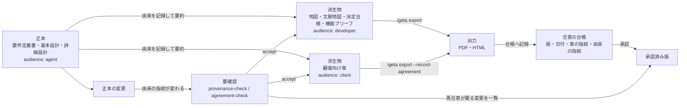

# 読み手別 (顧客・開発者・AI) の設計書の層を足した理由

> **TL;DR**: 人間レビュー層 (地図・決定台帳・機能ブリーフ) は「開発者」の読み方だった。**顧客向けの章**を
> 3 つ目の読み手として並べ、**frontmatter の `audience`** で 3 種を宣言する。正本は 1 つのまま
> (要件定義書・基本設計・詳細設計 = agent 用)。開発者用・顧客用はそこからの**由来つき**派生物。
> - 採らなかった案: kind を読み手の数だけ増やす / 正規表現で読み手を推測する / 顧客用を正本にする (§2)
> - 由来・鮮度・合意台帳・網羅検査・学習ループの仕組みは [別紙 1](./04-provenance-and-agreement.md) /
>   [別紙 2](./05-coverage-and-learning.md)。既定は全部 OFF (§7)

## 関連

| 区分 | 文書 | 対応 ID |
|---|---|---|
| 上流 (depends_on) | [人間レビュー層](./02-human-review-layer.md) | — |
| 下流 | [由来・鮮度・合意台帳](./04-provenance-and-agreement.md) / [網羅・学習](./05-coverage-and-learning.md) / `templates/docs/client/__chapter__.md` | — |

## 1. 背景 (実例。ある受託案件)

| # | 実例 | 何が起きたか |
|---|---|---|
| 1 | 量と読み手 | AI が読み書きする設計一式は 77 本・約 8,400 行。顧客向け 10 章 (約 650 行、PDF 25 ページ) を AI が手で要約した。読み手ごとの入口の違いが仕組みとして無かった |
| 2 | 由来切れ | 顧客向けの章から正本へ辿れるのは文書単位の `depends_on` だけ。表の 1 行がどの機能・要件から来たかは書かれておらず、正本を直しても顧客向けは自動では変わらない |
| 3 | 評価の後追い | 正本との食い違いが評価 3 ラウンドで 4 件見つかった。評価者が「問題なし」とした図の構文誤り 2 件は、PDF 出力が描画失敗で止まって初めて見つかった (評価が捕まえられなかった) |
| 4 | 開発者の入口が無い | 地図・決定台帳・機能ブリーフに相当する入口がその案件には無かった。「決定」143 行・30 ファイル超、「仮置き」84 行が散在し、未決 ID は 0 件 |
| 5 | 規模 | 機能 35 件・機能要件 14 件・業務コンテキスト 6〜7 |

## 2. 採らなかった案

| 案 | 採らなかった理由 |
|---|---|
| 読み手ごとに kind を増やす (`client-requirements` 等) | kind は置き場所と 1 対 1 で、登録が 2 か所 (`ARC42_BY_KIND`/`NON_ARC42_KINDS`) に要る。読み手 × kind の組み合わせで増やすと登録が爆発する。既存の kind はそのまま、`audience` を横に足すだけにする |
| 正規表現・キーワードで読み手を推測する | 推測は誤分類を黙って起こす。明示の宣言 + 既定値は kind の解決と同じ型で一貫する |
| 顧客用の章を正本にする | 実例 2 の由来切れを固定化する。正本を 2 つ持つと「どちらを直すか」で必ず食い違いが起きる (人間レビュー層 §2 と同じ結論) |
| 顧客向け PDF 出力時にだけ由来を都度計算する | 実例 3 の「評価の後追い」を再発させる。版が固定されず、accept の記録も残らない |

## 3. 読み手 3 種

| 読み手 | 目的 | 入口 | 1 回に読む上限 | 書かないもの | 誰が書くか | 検査 |
|---|---|---|---|---|---|---|
| **agent** (AI) | 実装・詳細な要件理解 | 要件定義書・基本設計・詳細設計 (既存 kind) | 修飾 ID で辿った関連ファイルのみ (`review-sheet`)。既存の 1 文書 150〜200 行上限は変えない | 顧客向けの言い回し・社内限定の背景 | AI (人がレビュー) | 既存 `template-check` (kind 構造・EARS・ID) |
| **developer** (人) | 何を作るか理解・コードレビュー | 全体地図 → 文脈ごとの地図 → 決定台帳 → 機能ブリーフ 1 枚 (§4) | 150 行 (全体地図) + 150 行 (文脈の地図) + 台帳 (決定数に比例) + 150 行 (ブリーフ 1 枚) | 要件文・受入条件 (二重化しない) | AI が起こし人が直す | 既存 `template-check --require-human-review` |
| **client** (顧客) | 合意・検収 | 顧客向け章 (新設 kind: `client-chapter`) | 章 1 枚 150 行。束ねて PDF 25〜50 ページ | 社内 ID・「仮置き」・未決の生記述・社内規約名 | AI が機能ブリーフ + 業務フローから起こし、人 (裁く側) が承認 | 新設 `template-check --require-audience-layers` + 既存 `secret-scan` + 由来・網羅の検査 ([別紙 1](./04-provenance-and-agreement.md)/[別紙 2](./05-coverage-and-learning.md)) |

## 4. 開発者の入口を 2 段にする (機能 300 件対応)

機能が 35→300 件に増えると、地図 1 枚から機能ブリーフ 300 枚を直接選ばせられない (§6 の規模の試算)。**全体地図 → 業務コンテキストごとの地図 → 機能ブリーフ**の 2 段にする。

| 論点 | 決定 |
|---|---|
| kind | 新設 `context-map` (1 業務コンテキスト = 1 枚)。テンプレは既存 `map` と同じ型 |
| 置き場所 | `docs/<context>/00-map.md` |
| 上限 | `line_limit: 150` (既存 `map`/`feature-brief` と同じ) |
| `depends_on` 既定値 | `[map]` (全体地図)。配下の `feature-brief` 側の `depends_on` 既定値は、自分の属する `context-map` の id にする (map 直結ではなくなる。§8 前提修正の対象をこれに変更) |
| 検査 | 既存の①「地図の網羅」検査 (`kind: requirements` を全部リンクしているか) を 1 段再帰的に適用するだけ。新設コマンドは無い: 全体地図 → 存在する全 `context-map` へのリンクを確認 / 各 `context-map` → 配下の全 `feature-brief` へのリンクを確認 |

## 5. 全体の地図

## 6. kind ごとの audience 既定値

既存文書は無記入なら既定値で解釈し、既存案件を赤くしない (declare すれば常に宣言が優先)。

| audience 既定値 | 対象 kind |
|---|---|
| **agent** (無記入時の既定) | `requirements` / `function-list` / `solution-strategy` / `domain-*` / `module-spec` / `screen-spec` / `api-spec` / `table-spec` / `business-flow` / `sequence-spec` / `state-machine` / `job` / `infra-design` / `crosscutting` / `code-definitions` / `messages` / `permission-matrix` / `i18n` / `data-management` / `secrets-management` / `nonfunctional` / `test-plan` / `test-spec` / `risks-tech-debt` / `glossary` / `as-is-overview` / `external-integration` / `operations` / `migration-plan` / `adr` |
| **developer** | `map` / `context-map` (新設) / `decision-log` / `feature-brief` / `tasks` |
| **client** | `client-chapter` (新設) |
| 対象外 (双方が読む解説・手引き) | `explanation` / `guide` / `runbook` / `proposal` / `document-taxonomy` / `human-review` / `index` |

## 7. 段階導入・既定の強さ

| 論点 | 決定 | 理由 |
|---|---|---|
| `audience` の読み取り | 常時 (opt-in 不要)。frontmatter に書けば既存値を上書きするだけで、書かなければ表 6 の既定値になる | 値を読むだけなら既存文書に影響しない。危険なのは「検査で落とす」方だけ |
| 検査の強さ | `template-check --require-audience-layers` (既定 OFF) 1 本に、audience の値検証・`client-chapter`/`context-map` の構造検査をまとめる。由来・網羅・合意台帳は別コマンド (既定で CI に入らない) | 人間レビュー層 §4 の教訓 (フラグは機能単位で 1 本) を踏襲。書き込み系操作を含む機能は検査フラグと別種にする |
| 実装着手前の前提修正 | `feature-brief` が `ROOT_KINDS` に無く既定 `depends_on: []` のまま (PR #12 由来の既存ギャップ) を先に直す。既定値は §4 の `context-map` の id にする | 機能ブリーフが 35→300 枚に増える前提で階層検査が壊れたままだと、`client-chapter`/`context-map` も同じ穴を継承する |

## 8. 確定した前提 (director 決定)

- frontmatter パーサが 2 系統 (`core/Frontmatter.ts` / `DocGraphCheck.ts` 自前実装) のままなのは、**今回は統一しない**。新設チェックは `core/Frontmatter.ts` だけを使い、`DocGraphCheck` 側は触らない (統一は別イシューとして残す、既存 debt)
- 決定 ID は **3 桁の形式を標準のまま**とする。ただし `DEC-\d{3}` が日付入り ID (`DEC-YYYYMMDD-NN`) に部分一致して誤検出する不具合は前提修正として直す (詳細・適用手順は [別紙 1](./04-provenance-and-agreement.md) §8/§10)
- 再合意の判定粒度は **kind + 節の単位まで** (列単位は持たない。詳細は [別紙 1](./04-provenance-and-agreement.md) §4)

## 9. 残った論点

- 由来・鮮度・合意台帳の形、CLI、規模の試算、参入障壁、段階導入の順、限界、適用手順は [別紙 1](./04-provenance-and-agreement.md) に分離した
- 由来の網羅検査 (順方向・逆方向) と、食い違いを規則へ育てる学習ループは [別紙 2](./05-coverage-and-learning.md) に分離した
