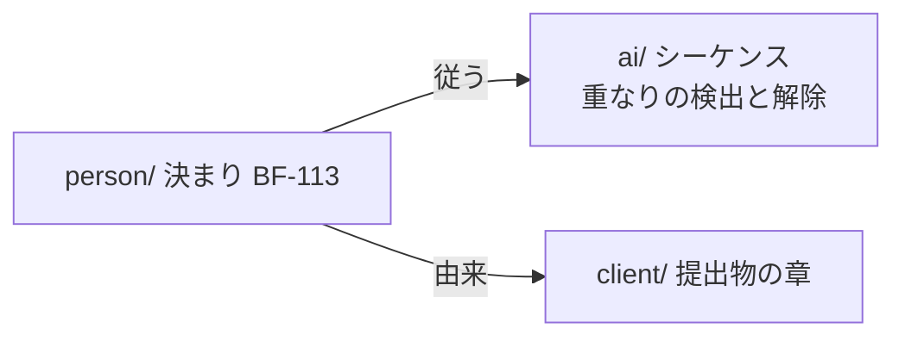

# 人が読んで決める文書の型と量

> **TL;DR**: `person/` の文書は、確定する前に人が全部読んで承認する。変わったら、変わった行を人が読んで承認する。
> そのために型を「結論 → 図 → 決まりの表 → 決めてほしいこと」に揃え、作り方の詳細と `ai/` の ID を書かない。
> 実測では、業務フロー 3 本を ID を変えずに書き直すと、本文が元の 26% (12,656 字 → 3,323 字) になった。
> 1 本の行数は違反、まとまりごとの合計字数は実測がそろうまで警告で始める

## 関連

| 区分 | 文書 | 対応 ID |
|---|---|---|
| 上流 (depends_on) | [読み手別の入口](./03-audience-layers.md) | — |
| 下流 | [どの文書をどこに置くか](./10-folder-placement.md) / [雛形の組み直し](./11-template-realignment.md) / ADR-0002 (`PersonFormCheck`) | — |

## 1. なぜ人と AI で書き方を分けるのか

人は一度に保てる量が小さい。全文を同じ重さで読むのではなく、結論と図をつかみ、決める項目を 1 つずつ判断する。
読む量が増えると、読まずに承認するようになる。だから人の文書は、決める内容だけを短く書く。

AI は作業のたびに記憶なしで読む。読んだ量に比例して費用がかかり、無関係な記述が多いほど取り違えが増える。
だから AI にとっても、上流 (人の決定) は短いほうがよい。作り方の詳細は、必要なまとまりの分だけ `ai/` から読む。

1 本に決定と作り方が混ざると両方が困る。人は決める項目を探せず、AI はどれが人の決定か分からない。

## 2. 3 つのフォルダの違い

| 項目 | `person/` | `ai/` | `client/` |
|---|---|---|---|
| 確定させる人 | 人 | 評価する AI (人の承認は要らない) | 人と顧客 |
| 書く内容 | 何をするか、しないか、決まり、未決 | どう作るか、作業の手引き | 合意する内容を業務の言葉で |
| 1 文書の単位 | 人が 1 回で判断するひとかたまり (業務 1 つ、画面群 1 つ) | 変更の単位 1 つ (API 1 つ、表 1 つ、集約 1 つ) | 章 1 つ |
| 書き方 | 結論 → 図 → 決まりの表 (1 行 1 文、業務の言葉) | ID 付きの行と表、曖昧語なし | 社内 ID なし |
| 人が読むか | 確定前に全部読む | 決めるために読む必要はない (参照はしてよい) | 渡す前に全部読む |

## 3. `person/` の文書の型

1. **結論** (TL;DR): 3 行まで。ID を書かない
2. **図**: 下の表の kind は 1 枚以上
3. **決まりの表**: 行頭が自分の ID の行は、すべて `状態` の列を持つ。値は `決定`・`仮`・`未決`・`廃` のどれか
4. **決めてほしいこと**: `| 問い | 対象 ID | 選択肢 | 決まらないと止まること |`
5. **関連**: 上流は文書を書く。下流の欄は「(生成索引が出す)」と書き、`ai/` の文書を指さない

| 図が要る kind | 図の中身 |
|---|---|
| `map` / `context-map` | 範囲と、まとまり同士のつながり |
| `business-flow` | 業務の流れ (例外の分かれ道を含む) |
| `screen-spec` | 画面の流れ |
| `solution-strategy` / `as-is-overview` | 構成の全体 (C4 の L1・L2) |

`仮` は AI が置いた値で、人の承認待ち。`廃` は使わなくなった ID で、番号を再利用しない。
`仮` と `未決` の行は、決定台帳が 1 か所に集めて一覧にする。これが人の決める待ち行列になる。

## 4. 人がいつ何を読むか

| いつ | 読むもの | 量 |
|---|---|---|
| まとまりを最初に承認する | そのまとまりの `person/design/<まとまり>/` と全体共通 (要件 + `design/shared/`) の全部 | §6 の合計の上限まで |
| 決まりが変わる | 変わった行だけ (`review-sheet --diff` が並べる) | 変更の量だけ |
| 決定の記録 (ADR) が出る | その 1 本の全部 | 1 本 100 行まで |
| 仮・未決を片づける | 決定台帳の一覧 | 一覧の件数だけ |

承認済みの ADR を後から読み返す必要はない。ADR の決定は、`person/` の要件か設計の行に反映し、
その行から ADR の番号を引く (ADR-0002 条件 12)。いまの決まりは、いつも設計の文書だけで分かる。

## 5. 実例 — 書き直す前と後 (題材は架空)

決まりの表の 1 行を、ID を変えずに書き直す。

```text
前: | BF-113 | 確定時に同じ時間帯の会議室が埋まっている | 予約 API のトランザクションで重なりを検出 |
    予約は成立しない。利用者に別の時間帯を選んでもらう | 409 を返し、仮押さえを解除する。再試行しない | 確定 |
後: | BF-113 | 確定のときに同じ時間帯が既に埋まっていたら、予約は成立させず、別の時間帯を選んでもらう | 決定 |
```

前の行の「検出の方法」と「システムの扱い」は作り方なので、`ai/` のシーケンスの行に移す。その行は BF-113 を引く。
人が決めるのは後の 1 文だけ。



ある受託案件の業務フロー 3 本で、同じ書き直しを測った。

| | 前 (3 本) | 後 (3 本、ID は 30 個のまま) |
|---|---|---|
| 行数 / 全字数 | 281 行 / 15,366 字 | 162 行 / 4,496 字 |
| 本文の字数 (§6 の数え方) | 12,656 字 | 3,323 字 (26%。1 本ごとでは 22〜41%) |
| 読む時間の目安 (500 字/分) | 約 25 分 | 約 7 分 |

## 6. 量の上限

**数え方**: 本文の字数 = frontmatter・コードフェンス (Mermaid を含む)・HTML コメントを除いた文字数。表は含む。

| 上限 | 値 | 強さ | 根拠 |
|---|---|---|---|
| 「いまの決まり」1 本 | 100 行 (`requirements` は 150 行) | 違反 | 実例の 3 本は 51〜56 行。要件は全体の範囲を 1 本で持つ |
| 1 まとまりの合計 | 15,000 字 | 警告 | 下の見込み |
| 全体共通の合計 (要件 + `design/shared/`) | 30,000 字 | 警告 | 下の見込み |
| ADR 1 本 | 100 行 | 違反 (既存) | 1 本ずつ承認する |

**見込み**: 同じ案件で、人の側になる文書を同じ比 (26〜41%) で縮めると、いちばん大きいまとまりは
約 9,800〜15,400 字、全体共通は約 21,500〜33,900 字になる。上限はその間にある。比は 3 本の実測を
当てはめた見込みで、測った値ではない。だから合計の 2 つは警告で始め、次のメジャー版で違反に上げる
(版で決まり、設定では変えられない。ADR-0005)。上げる前に次を測る。

| 測るもの | 方法 |
|---|---|
| kind ごとの字数 | 2 つの利用 repo の全まとまりを書き直し、kind 別の中央値・上位 10%・最大を出す |
| 決める文書を読む速さ | 2〜3 人 × 3 本で、承認までの時間と、仕込んだ誤りを見つけた割合 |
| 1 回の承認で変わる行数 | PR ごとの変更行数の分布 |

## 7. 検査との対応

| 決まり | 検査 | 新設 / 既存 |
|---|---|---|
| `person/` の文書は `ai/` を指さない (`depends_on`・`relates_to`・本文リンク・修飾 ID) | `DocGraphCheck` 拡張 | 既存拡張 |
| 行頭が ID の行は `状態` を持つ。決まりの表が 1 つも無い文書は違反 | `PersonFormCheck` | 新設 |
| 図が要る kind に図がある | `PersonFormCheck` | 新設 |
| 1 本の行数、まとまりと全体共通の合計字数 | `PersonFormCheck` | 新設 |
| `廃` の ID を、別の行で使い直さない | `PersonFormCheck` | 新設 |
| `ai/` の行に金額・率・期限らしい語があり、`person/` の ID を引いていない | `review-sheet` の一覧 | 既存拡張 (門ではない) |
| 言葉の分かりやすさ、業務の言葉で書けているか | — | 機械では見ない。人が承認のときに見る |

## 8. 限界

- 合計の上限は見込みから置いた。§6 の測定が済むまで、超えても CI は止まらない
- 人の決定を `ai/` に書いてしまう誤りは、機械では見分けられない。§7 の一覧で気づくだけ
- 読む時間の換算 (500 字/分) は目安で、測った読む速さではない
