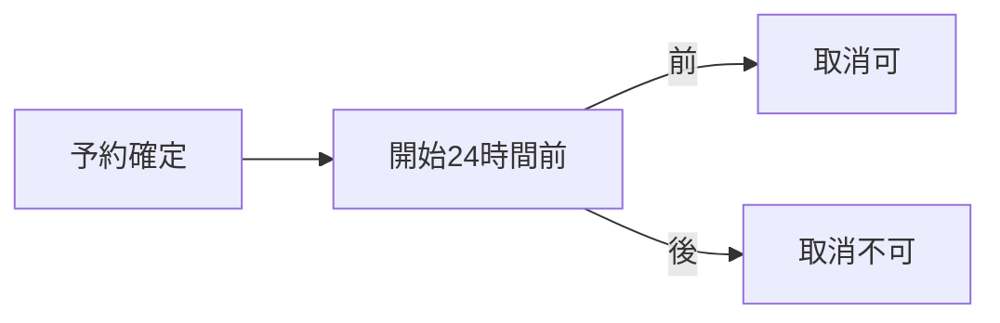

# 人と AI と顧客で、なぜ・どう書き分けるか

> **TL;DR**: AI・人・顧客・共通は「読む目的」「1 回に読む単位」「書き方」が違う。違いは一般の仕組みから来る (§1)。
> 読み手×6項目の表 (§2)、同じ事実を3粒度で書いた実例 (§3)、違反の検出手段 (§4)、要約が古くなる問題への
> 軽い手当て (§5) をこの1枚に置く。置き場所・増え方の決め方は [どの文書をどこに置くか](./10-folder-placement.md) へ分けた

## 関連

| 区分 | 文書 | 対応 ID |
|---|---|---|
| 上流 (depends_on) | [読み手別の入口](./03-audience-layers.md) | — |
| 下流 | [どの文書をどこに置くか](./10-folder-placement.md) / `src/checks/`(粒度違反の検出) | — |

## 1. なぜ粒度が違うのか (一般の仕組みから)

AI は作業のたびに**記憶を持たず全文を毎回読む**。読める量に上限があり、読んだ量に比例して費用がかかる。
無関係な記述が多いほど取り違えが増える。同じ事実が 2 か所にあれば、どちらが正しいか機械は判断できない —
だから AI 向けは ID 付きの短い事実 1 か所主義になる。人は**一度に保てる量が小さく**、全文ではなく拾い読みと
差分で判断する。結論と図が先にあれば速く、理由は後から読める — だから人向けは「結論→図→理由」になる。
顧客は社外の合意者で、社内の文書管理事情 (ID・まとまり・検査) を知る必要が無い — だから顧客向けは業務の言葉だけになる。

## 2. 読み手 × 6 項目

| 項目 | AI (`ai/`) | 人・開発者 (`person/`) | 顧客 (`client/`) | 共通 (`common/`) |
|---|---|---|---|---|
| 読む目的 | 実装する | 判断する・レビューする | 合意する | 両方の前提をそろえる |
| 読む単位 | `context-files` が返す束 (自分の `specs` + `common`) | 1 つの問いに答える 1 枚 (地図→まとまりの地図→レビューシート) | PDF 1 冊の中の 1 章 | ADR 1 本、または `how-to` 1 枚 |
| 1 文書の単位 | 変更の単位 1 つ (画面 1・API 資源 1・テーブル 1・ドメイン集約 1) | 問い 1 つ (「何を作るか」「何を決めたか」) | 業務トピック 1 つ (章 1) | 決定 1 つ、手順 1 つ |
| 量の上限 | 150/200 行 (既存) + `contextSizeLimit` (**未整備**。Igeta 自身の dogfooding 後に実測) | 150 行 (`map`/`context-map`、既存) | 章 1 枚の目安 (**未整備**。由来設計 04 側で実測する) | 150 行 (ADR)・100 行 (`how-to`/`runbook`、既存) |
| 書き方 | ID 付きの行・表・EARS 形式・曖昧語なし・1 事実は 1 か所 | 結論→図→理由。文章と図、ID は補助 | 社内 ID なし・業務の言葉 | MADR 形式 (Decision Drivers→Decision→Confirmation)。曖昧語を避ける |
| 文書の中の構成 | 関連→本文 (節は kind 固定、§2 以降は ID 付き表) | TL;DR→関連→図→本文 (結論を先頭に) | 表紙→本文 (由来は社内のみ、提出物に出さない) | TL;DR→関連→Context→Decision→Confirmation (ADR 既存テンプレ) |

既存テンプレの必須節 (TL;DR・関連) は全 kind 共通の最低線。上表はその上に乗る読み手別の作法であり、新しい
テンプレ必須節は増やさない。

## 3. 同じ事実を 3 粒度で書いた実例 (一般的な題材、案件名なし)

題材: 「予約の取り消し期限」

| 読み手 | 書き方 | 実例 |
|---|---|---|
| AI (`ai/specs/`) | ID 付き EARS 1 行 + 関連 ID | `REQ-114`: 予約開始時刻の 24 時間前を過ぎたとき、システムは取り消しを拒否しなければならない (関連: `BF-003`) |
| 人 (`person/guides/`) | 結論 1 文 + 小さな図 (下の Mermaid) | 「予約は開始 24 時間前まで取り消せる」 |
| 顧客 (`client/delivery/`) | 業務の言葉 1 文、社内 ID なし | 「ご予約の変更・取消は、ご利用開始の前日まで承っております」 |

人向けの図 (実際に描く):

3 つは同じ事実の言い換えであり、正本は AI 向けの 1 本 (`REQ-114`)。

## 4. 粒度の違反と検出手段

| 違反 | 検出手段 | 既存/新設/レビューのみ |
|---|---|---|
| AI 向け文書に ID の無い要件文 | `checkEars`(requirements)・`checkIds`(他 kind の id_prefix) | 既存 |
| 人向け文書に TL;DR が無い | `opener` 正規表現チェック | 既存 |
| 人向け `map`/`context-map` に図が無い | `MermaidCheck` 拡張 (対象 kind 限定、既定 OFF) | 新設 |
| 顧客向けに社内 ID が出ている | `forbid` スキャン (export) / `secret-scan --internal-ids` | 既存 |
| 1 文書が単位 2 つ分 | 行数上限超過で代用 (専用検査は置かない) | 既存で代用 |
| 文章の分かりやすさ・曖昧さ | — | 機械では見ない、レビューで見る |

## 5. 要約が古くなる問題と `review-sheet` の「要確認」

正本は `ai/` の 1 つ。`person/`・`client/` は要約で正本ではない。`client/` は由来の指紋 (04) を課す (既存)。
`person/` には同じ重さを課さない (レビューし切れない量を全読み手に課さない)。ただし「レビューに委ねる」だけでは
守らせ方が無いため、軽い手当てを 1 つ足す: **`review-sheet --diff` が、上流 (`depends_on` 先) が変更されたのに
自分 (`person/` の文書) が変更されていない組を「要確認」として列挙する** (非 blocking、終了コードは変えない)。
採用理由: 既存の diff 探索機構 (変更ファイル→タスク→FN→REQ) を 1 方向増やすだけで新規サブシステムが要らない。
これは門ではなく補助であることを明記する。

## 6. 限界・未整備の数値

- `contextSizeLimit`・提出物の章の目安行数は実測ゼロの推定。Igeta 自身の dogfooding (ADR-0003) で最初の実測を取る
- `MermaidCheck` 拡張 (図の有無) は既定 OFF。段階導入の判断が要る
- 文章そのものの分かりやすさ・曖昧さは機械で判定しない (レビューの領域として明記するに留める)
