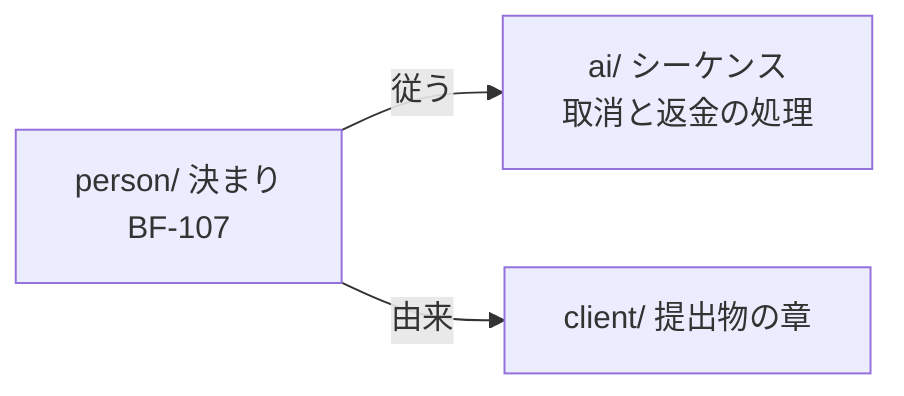

# 人が読んで決める文書の型と量

> **TL;DR**: `person/` の文書は、人が全部読んで決められる型と量で書く。型は「結論 → 図 → 決まりの表 →
> 決めてほしいこと」。作り方の詳細と `ai/` 側の ID は書かない。量は 1 本 100 行、1 まとまり 15,000 字まで。
> 実測では、業務フロー 3 本 (281 行・15,366 字) が 1 枚 (69 行・1,961 字、13%) になった。
> AI は `person/` を上流として読み、`ai/` に作り方を書く。人は `ai/` を読まない

## 関連

| 区分 | 文書 | 対応 ID |
|---|---|---|
| 上流 (depends_on) | [読み手別の入口](./03-audience-layers.md) | — |
| 下流 | [どの文書をどこに置くか](./10-folder-placement.md) / ADR-0001 / ADR-0002 (`PersonFormCheck`) | — |

## 1. なぜ人と AI で書き方を分けるのか

人は一度に保てる量が小さい。全文を読むのではなく、結論と図をつかみ、決める項目を 1 つずつ判断する。
読む量が増えると、読まずに承認するようになる。だから人向けは、決める内容だけを短く書く。

AI は作業のたびに記憶なしで読む。読んだ量に比例して費用がかかり、無関係な記述が多いほど取り違えが増える。
だから AI にも、上流 (人の決定) は短いほうがよい。作り方の詳細は、必要なまとまりの分だけ `ai/` から読む。

混ぜると両方が困る。1 本に決定と作り方が混ざると、人は決める項目を探せず、AI は決定がどれか分からない。

## 2. 3 つのフォルダの違い

| 項目 | `person/` | `ai/` | `client/` |
|---|---|---|---|
| 何のために読むか | 決める・承認する | 実装する | 合意する |
| 書く内容 | 何をするか、何をしないか、決まり、未決 | どう作るか (処理・データ構造・手順) | 合意する内容を業務の言葉で |
| 1 文書の単位 | 人が 1 回で判断するひとかたまり (業務 1 つ、画面群 1 つ) | 変更の単位 1 つ (API 1 つ、表 1 つ、集約 1 つ) | 章 1 つ |
| 書き方 | 結論 → 図 → 決まりの表 (1 行 1 文) | ID 付きの行と表、曖昧語なし | 社内 ID なし |
| 量の上限 | 1 本 100 行、1 まとまり 15,000 字 | 既存の行数上限と `contextSizeLimit` | 提出物の章の上限 (04) |
| 承認する人 | 人 | 評価する AI | 人と顧客 |

## 3. `person/` の「いまの決まり」の型

対象は、要件・基本設計・地図にあたる kind ([置き場所](./10-folder-placement.md) §3 の「いまの決まり」)。

1. **結論** (TL;DR): 3 行まで。ID を書かない
2. **図**: 流れか構成を 1 枚以上
3. **決まりの表**: `| ID | 決まり | 状態 |`。決まりは業務の言葉で 1 行 1 文。状態は `決定`・`仮`・`未決` のどれか
4. **決めてほしいこと**: `| ID | 問い | 選択肢 | 決まらないと止まること |`
5. **関連**: 上流だけを書く。下流は生成索引が出す (人の文書は下流を指さない)

`仮` は AI が仮に置いた値で、人の承認待ち。`仮` と `未決` の行は、生成索引が 1 か所に集めて一覧にする。
これが、人が決める待ち行列になる。

## 4. 実例 — 同じ業務を分け直す前と後

実案件の業務フロー 3 本 (予約・キャンセル・カート) を、上の型で 1 枚に分け直して測った。

| | 分け直す前 (3 本) | 分け直した後 (1 枚) |
|---|---|---|
| 行数 / 字数 / 読む時間 (500 字/分) | 281 行 / 15,366 字 / 約 30 分 | 69 行 / 1,961 字 / 約 4 分 |
| 決まり・未決の数 | 3 本に散在 | 決まり 14、決めてほしいこと 5 |
| コードの識別子 / 他文書の ID 参照 | 27 個 / 77 個 | 2 個 / 0 個 |

前と後の 1 行を並べる (題材は一般化した)。

```text
前: | BF-113 | 決済後、確定時に在庫が足りない | 注文 webhook / 突き合わせ Job のトランザクション |
    レンタルの予約だけが成立しない … | 予約を取消待ちで作り、commit 後に orderCancel … | 確定 |
後: | BF-107 | 決済の後で道具が足りないと分かったら、レンタル分だけを取り消して返金する。ツアーは残す | 決定 |
```

前の行の「検知方法」「システムの扱い」は作り方なので、`ai/` のシーケンスに置く。人が決めるのは後の 1 文だけ。



## 5. 量の上限と、その根拠

| 上限 | 値 | 根拠 |
|---|---|---|
| 「いまの決まり」1 本 | 100 行 | 実例の 1 枚が 69 行。業務 3 つ分をまとめても収まった |
| 1 まとまり (`context`) の合計 | 15,000 字 (約 30 分) | 実例は業務フロー 3 本分で 1,961 字。業務フロー 7 本と画面・地図を足しても収まる見込み |
| 全体共通 (`shared`) の合計 | 30,000 字 (約 60 分) | 未整備。実測が無い。最初の実案件の分け直しで測り、この行を改訂する |
| 決定の記録 (ADR) 1 本 | 100 行 (既存) | 決めたその時に 1 本を読んで承認する。合計には上限を置かない |

人が読む単位は「自分のまとまり + 全体共通」。合計で約 90 分に収まることを検査で守る。

## 6. 検査との対応

| 決まり | 検査 | 新設 / 既存 |
|---|---|---|
| `person/` の文書は `ai/` へリンクしない、`ai/` 側の kind の ID を書かない | `PersonFormCheck` | 新設 |
| 「いまの決まり」は 1 本 100 行、1 まとまり 15,000 字、全体共通 30,000 字まで | `PersonFormCheck` | 新設 |
| 決まりの表の各行に状態 (`決定`/`仮`/`未決`) がある | `PersonFormCheck` | 新設 |
| 流れ・画面・地図・構成の kind に図が 1 枚以上ある | `PersonFormCheck` | 新設 |
| `ai/` の文書は `depends_on` を辿ると `person/` の文書に届く | `DocGraphCheck` 拡張 | 既存拡張 |
| 人の決まりが変わったとき、その ID を引く `ai/` の文書を一覧にする | `review-sheet --diff` の「要追随」欄 | 既存拡張 (門ではなく補助) |
| 言葉の分かりやすさ、業務の言葉で書けているか | — | 機械では見ない。人が承認のときに見る |

## 7. 限界

- 上限の数値は実案件 1 件・業務フロー 3 本の実測から置いた。画面・構成・データの分け直しはまだ測っていない
- コードの識別子 (バッククォート) の数は検査で落とさない。技術の選定を決める文書では要るため。数は `review-sheet` に出す
- 「要追随」は一覧を出すだけで、`ai/` の文書を実際に直したかは評価する AI が見る
