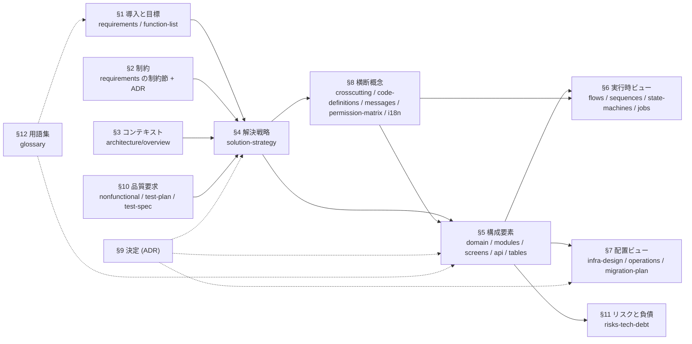

# 文書体系 — 設計書の種類・配置・関連

> **When to use**: 設計書を書く前に読む。`templates/docs/` は **`docs/` と同じ階層**なので、置きたい場所と同じパスのテンプレをコピーすれば `kind` ・ID 接頭辞・必須節が自動で決まる。

## 関連

| 区分 | 文書 | 対応 ID |
|---|---|---|
| 上流 | [Igeta の設計思想](../../README.md#設計思想) | — |
| 下流 | `templates/docs/**` / `scripts/check-doc-template.mjs` / 全設計書 | 全接頭辞 |
| 参考 | [設計書テンプレが参照した外部標準](../explanation/01-design-doc-standards.md) (MADR / spec-kit / EARS / Diátaxis / arc42 / C4 / OpenAPI) | — |

## 1. 章の関連図 (arc42)

実線 = 上流→下流 (`depends_on` の向き)。破線 = 横断的に効く。**下流だけを直して上流を直さない更新は禁止**。文書単位の依存グラフは [dependencies.md](../dependencies.md) が自動生成し、章の日本語解説は [設計書の外部標準 §3](../explanation/01-design-doc-standards.md) にある。

## 2. 種類一覧

| フォルダ (工程) | kind | 何を書くか | arc42 | パス (`templates/docs/` = `docs/`) | ID 接頭辞 | 上限 |
|---|---|---|---|---|---|---|
| `product/` 要件定義 | `requirements` | 何を作るか。機能要件 (EARS 記法) と品質目標の要約、制約、ステークホルダー。全設計書の上流 | §1 | `product/01-requirements.md` | REQ | 200 |
| `design/basic/` 基本設計 | `function-list` | 機能の一覧と、各機能が要件・画面・API・テストのどれに対応するかの対応表 | §1 | `design/basic/01-function-list.md` | FN | 200 |
| `design/basic/` 基本設計 | `solution-strategy` | 技術選定・最上位の分割・品質目標の達成手段を短く。以後の設計の前提 | §4 | `design/basic/02-solution-strategy.md` | SS | 200 |
| `design/basic/` 基本設計 | `nonfunctional` | 性能・可用性・セキュリティなどの品質要求を測定可能な数値で | §10 | `design/basic/03-nonfunctional.md` | NFR | 200 |
| `design/basic/` 基本設計 | `crosscutting` | 認証・エラー形式・ログ・冪等性・テナント隔離など、全構成要素に効く方針 | §8 | `design/basic/04-crosscutting.md` | XC | 200 |
| `design/basic/` 基本設計 | `code-definitions` | 区分値 (状態・種別) の定義。DB・コード・画面表示の対応 | §8 | `design/basic/05-code-definitions.md` | CD | 200 |
| `design/basic/` 基本設計 | `messages` | エラーメッセージ・通知テンプレートの一覧と管理方針 | §8 | `design/basic/06-messages.md` | MSG | 200 |
| `design/basic/` 基本設計 | `permission-matrix` | ロール × 操作 × データ範囲の権限表 | §8 | `design/basic/07-permission-matrix.md` | PRM | 200 |
| `design/basic/` 基本設計 | `infra-design` | 実行環境の構成図 (C4 / ネットワーク / IAM / データフロー)・設定値・Secret・環境分離・費用 | §7 | `design/basic/08-infra-design.md` | INF | 200 |
| `design/basic/` 基本設計 | `i18n` | 対応ロケール・文言カタログ・日付/通貨などロケール依存の振る舞い・翻訳フロー | §8 | `design/basic/09-i18n.md` | I18N | 200 |
| `design/basic/` 基本設計 | `business-flow` | 業務の流れ (アクター・手順・分岐・例外)。1 業務 1 ファイル | §6 | `design/basic/flows/__flow__.md` | BF | 200 |
| `design/basic/` 基本設計 | `screen-spec` | 画面の一覧・項目・遷移・3 状態 (空 / ローディング / エラー)。画面グループごと | §5 | `design/basic/screens/__screen-group__.md` | SCR | 200 |
| `design/basic/` 基本設計 | `api-spec` | API の一覧・認可条件・エラー・外部 IF。一覧は OpenAPI から生成 | §5 | `design/basic/api/__resource__.md` | API | 200 |
| `design/basic/` 基本設計 | `table-spec` | テーブル一覧・列定義 (`schema.prisma` から生成)・RLS / EXCLUDE などの制約 | §5 | `design/basic/tables/__context__.md` | TBL | 200 |
| `design/detail/` 詳細設計 | `domain-overview` | ドメインモデル総論。コンテキストの一覧と関係、全体に効く不変条件 | §5 | `design/detail/domain/01-overview.md` | — | 200 |
| `design/detail/` 詳細設計 | `aggregate-map` | 集約の境界と責務、集約をまたぐ参照のルール | §5 | `design/detail/domain/02-aggregate-map.md` | — | 200 |
| `design/detail/` 詳細設計 | `domain-model` | コンテキストごとのクラス図。class 名は実装の export と CI で双方向照合 (200 行を超える context は `__context__-<側面>.md` に分割し、同じ `code_root` で束ねる) | §5 | `design/detail/domain/__context__.md` | class 名 | 200 |
| `design/detail/` 詳細設計 | `sequence-spec` | ユースケースごとのシーケンス図と、失敗時の扱い | §6 | `design/detail/sequences/__use-case__.md` | SEQ | 200 |
| `design/detail/` 詳細設計 | `state-machine` | 集約の状態遷移表。表に無い遷移は起こしてはいけない遷移 | §6 | `design/detail/state-machines/__aggregate__.md` | STM | 200 |
| `design/detail/` 詳細設計 | `module-spec` | コンテキスト (module) の公開面・依存・差し替え可能な port | §5 | `design/detail/modules/__context__.md` | MOD | 200 |
| `design/detail/` 詳細設計 | `job` | バッチ・定期ジョブの起動条件・冪等性・失敗時の通知と再実行 | §6 | `design/detail/jobs/__job__.md` | JOB | 200 |
| `design/test/` テスト | `test-plan` | テストの種類・範囲・環境・合格基準 | §10 | `design/test/01-test-plan.md` | TSP | 200 |
| `design/test/` テスト | `test-spec` | 機能ごとのテストケース。1 ケース 1 判定 | §10 | `design/test/specs/__feature__.md` | TST | 200 |
| `design/ops/` 運用・移行 | `operations` | 監視・アラート・バックアップ・障害対応の方針 | §7 | `design/ops/01-operations.md` | OPS | 200 |
| `design/ops/` 運用・移行 | `migration-plan` | データ移行とリリース手順、切戻し | §7 | `design/ops/02-migration-plan.md` | MIG | 200 |
| `design/` 横断 | `risks-tech-debt` | リスクと技術的負債の優先順位と低減策 (台帳の SoT は課題管理ツール) | §11 | `design/01-risks-tech-debt.md` | RSK | 200 |
| `design/tasks/` 実装タスク | `tasks` | 機能ごとの実装タスク分解 (spec-kit の行形式) | — | `design/tasks/__feature__.md` | T (`T001`) | 100 |
| `adr/` 技術判断 | `adr` | 重要・高コストな構築決定と根拠 (MADR 形式)。append-only、変更は supersede | §9 | `adr/NNNN-__slug__.md` | ファイル名の 4 桁 | 150 |
| `architecture/` 現行構成 (AS-IS) | `as-is-overview` | 稼働中の構成 (C4 L1 / L2) と外部システムとの契約。稼働後に起こす | §3 | `architecture/01-overview.md` | ARC | 200 |
| `architecture/` 現行構成 (AS-IS) | `glossary` | ユビキタス言語。業務用語 ↔ コード識別子 | §12 | `architecture/02-glossary.md` | — | 200 |
| `proposal/` 対外提案 | `proposal` | 顧客に提出する提案書 (背景〜設計〜代替案を 1 枚で)。accepted → ADR へ昇格 | — | `proposal/__slug__.md` | — | 200 |
| `guides/` 手引き | `guide` | how-to。手順を 100 行以内で | — | `guides/__slug__.md` | — | 100 |
| `guides/` 手引き | `tutorial` | 学習者向け。テンプレ無し・kind 予約のみ。`guides/__slug__.md` を「学習目標 / 前提 / ステップ / 到達確認」で流用 | — | (`guides/__slug__.md`) | — | 100 |
| `explanation/` 背景 | `explanation` | 決定の材料になる調査・背景。決定そのものは `adr/` に書く | — | `explanation/__slug__.md` | — | 200 |
| `runbooks/` 手順書 | `runbook` | 障害・運用シナリオごとの手順。1 手順 1 コマンド、期待結果つき | — | `runbooks/__scenario__.md` | RUN | 100 |

**必須**: frontmatter に `kind` / `arc42` (章を持つ kind のみ。kind の既定と食い違えば違反) / `depends_on` / `relates_to`、本文冒頭に `> **TL;DR**` (how-to は `> **When to use**`)、`## 関連` 節 (上流・下流を各 1 件以上、表でも箇条書きでも可)、テンプレの `(任意)` でない H2 節すべて。検査は `node scripts/check-doc-template.mjs --require-kind` (要件定義の REQ-1xx は EARS の義務形「〜なければならない」を必須とする)。API 一覧 §1 とテーブル定義 §1/§3 は `<!-- AUTOGEN:* -->` 区間で**手書き禁止**、生成器は OpenAPI 定義を置いた時点で各プロジェクトが用意し、ER 図と列定義は `schema.prisma` + prisma-erd-generator から生成する。`kind` は frontmatter が優先で、無ければ**置き場所から決まる**。両方あって食い違えば違反。

## 3. 配置の決定理由

**`architecture/` は AS-IS 専用、`design/` は TO-BE 専用**を前提に置き場所を決める。

| 論点 | 決定 | 理由 |
|---|---|---|
| 要件定義の置き場 | `docs/product/` | 要件定義 =「何を作るか」。設計 (どう作るか) と置き場所を分ける |
| 実装前の設計書 | `docs/design/basic/` と `docs/design/detail/` | 実装前は全部 TO-BE。AS-IS は稼働後に `architecture/01-overview.md` へ起こす |
| 画面 / API / テーブル / シーケンス / モジュール / テスト仕様 | **最初からサブフォルダ**に切る | 件数が伸びる前提の文書群。後からフォルダへ移すと `depends_on` と README 索引が同時に壊れる。1 本目から `flows/` `screens/` `api/` `tables/` `sequences/` `modules/` `test/specs/` に入れる |
| テスト・運用 | `docs/design/test/` と `docs/design/ops/` | 「本数が少ないうちは flat」にしない。移動コストを後払いしているだけで、閾値を跨いだ瞬間に参照が壊れる |
| 運用手順書 | 設計は `design/ops/01-operations.md`、手順は `docs/runbooks/<scenario>.md` (100 行以下) | 方針と手順を同じ文書に混ぜると 100 行に収まらない |
| `docs/proposal/` | 独立させる | 対外提案書は設計 Doc と性格が違う。`design/` に混ぜると顧客提出物が設計変更で動く |
