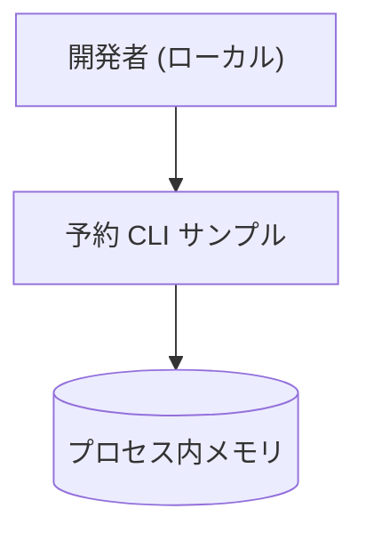
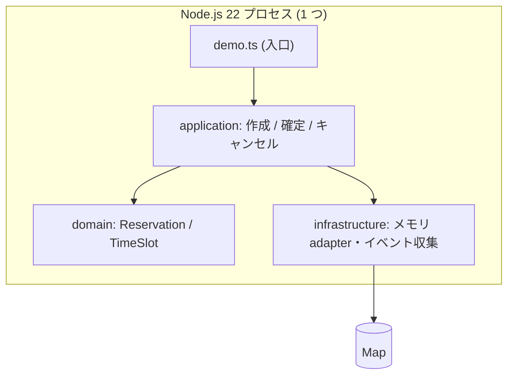

# 予約 CLI サンプルの稼働構成 (AS-IS)

> **TL;DR**: いま動いているのは、ローカルの Node.js プロセス 1 つと、その中のメモリ保存だけ。
> - 本書は **AS-IS 専用**。これから作る構成は `design/` に書く
> - 実測日は 2026-09-16。`npm run sample:booking` と `npm run sample:check` の実行結果に基づく

## 関連

| 区分 | 文書 | 対応 ID |
|---|---|---|
| 上流 (depends_on) | [ADR-0001 保存先をメモリに限定する](../adr/0001-in-memory-persistence.md) | adr-0001 |
| 下流 | [インフラ設計](../design/basic/08-infra-design.md) / [Runbook 検査が失敗したとき](../runbooks/01-check-failure.md) | INF-* / RUN-* |

## 1. 稼働中の構成

| ID | 構成要素 | 実体 (パス / コマンド) | 実測日 |
|---|---|---|---|
| ARC-001 | 予約 CLI | `examples/booking/demo.ts` を `npm run sample:booking` で実行 | 2026-09-16 |
| ARC-002 | 業務ロジック | `examples/booking/src/modules/booking/` (domain / application / infrastructure) | 2026-09-16 |
| ARC-003 | 共有カーネル | `examples/booking/src/shared/kernel/` (Result・TenantId・エラーカタログ・配信ポート) | 2026-09-16 |
| ARC-004 | 保存先 | プロセス内 Map。`InMemoryReservationRepository` / `InMemoryTimeSlotRepository` | 2026-09-16 |
| ARC-005 | 検査 | `npm run sample:check` (索引・テンプレ適合・型・テスト・図↔実装・レイヤ依存) | 2026-09-16 |

## 2. 構成図

### 2.1 System Context (C4 L1)

### 2.2 Container (C4 L2)

## 3. 外部システムと契約

| ID | 相手 | 種別 | 渡すもの | 受け取るもの | 経路・認証 | 契約の所在 |
|---|---|---|---|---|---|---|
| ARC-101 | ローカル開発者 | 利用者 | テナント ID・予約 ID・枠 ID (コード内の固定値) | 標準出力のログ | シェル実行。認証なし | 本サンプルの[要件定義](../product/01-requirements.md) |

外部システムはこれ以外に無い。HTTP・DB・メッセージングとは接続していない (ADR-0001)。

## 4. TO-BE との差分

画面・HTTP・DB・認証は未着手。TO-BE を書く場所は `design/` 側で、現時点では[リスクと技術的負債](../design/01-risks-tech-debt.md)に残している。
