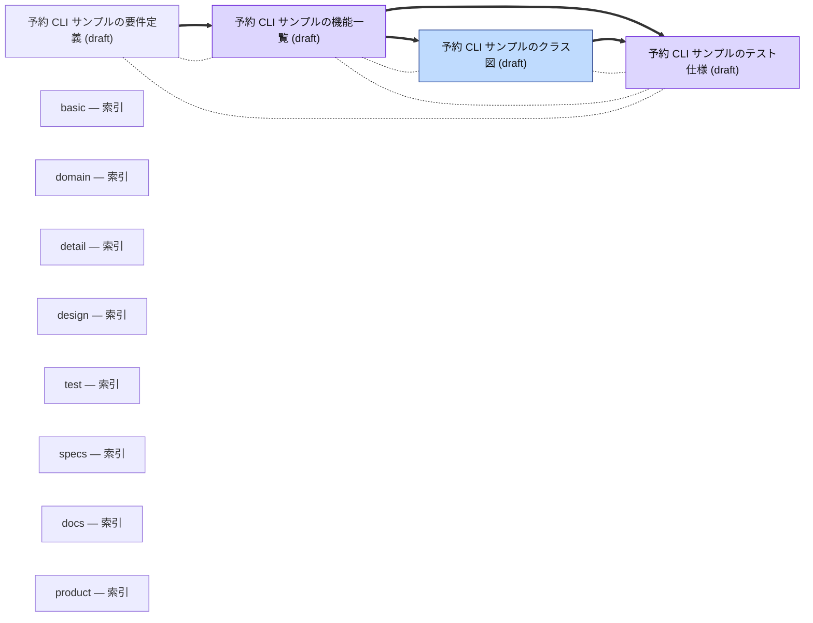

<!-- AUTOGENERATED BY scripts/generate-docs-graph.mjs — DO NOT EDIT BY HAND -->
# Docs 依存関係グラフ
> 自動生成: 2026-09-16 (UTC) / ソース: 各 `docs/**/*.md` の frontmatter
> 規約: docs/guides/01-document-taxonomy.md 参照
> 再生成: `node scripts/generate-docs-graph.mjs --write`
## 凡例
- **太矢印 `==>`**: `depends_on` (上流 → 下流、上流が変わったら下流レビュー必須)
- **点線 `-.-`**: `relates_to` (双方向、緩い結び)
- **点線矢印 `-. supersedes .->`**: 旧 → 新 (ADR の置き換え)
- ノード色は `type` を表す (standard / architecture / strategy / prd / business / adr / runbook / guide / design)
## グラフ

## ドキュメント一覧 (type 別)
### architecture

- **booking-domain** _(draft)_ — [予約 CLI サンプルのクラス図](design/detail/domain/01-booking.md)

### design

- **booking-functions** _(draft)_ — [予約 CLI サンプルの機能一覧](design/basic/01-function-list.md)
- **booking-tests** _(draft)_ — [予約 CLI サンプルのテスト仕様](design/test/specs/01-booking.md)

## 孤立ドキュメント (誰からも参照されていない)

| ID | Type | Path |
|---|---|---|
| design-basic-index | index | [`docs/design/basic/README.md`](design/basic/README.md) |
| design-detail-domain-index | index | [`docs/design/detail/domain/README.md`](design/detail/domain/README.md) |
| design-detail-index | index | [`docs/design/detail/README.md`](design/detail/README.md) |
| design-index | index | [`docs/design/README.md`](design/README.md) |
| design-test-index | index | [`docs/design/test/README.md`](design/test/README.md) |
| design-test-specs-index | index | [`docs/design/test/specs/README.md`](design/test/specs/README.md) |
| docs-index | index | [`docs/README.md`](README.md) |
| product-index | index | [`docs/product/README.md`](product/README.md) |

