<!-- AUTOGENERATED BY scripts/generate-docs-graph.mjs — DO NOT EDIT BY HAND -->
# Docs 依存関係グラフ
> 自動生成: 2026-09-16 (UTC) / ソース: 各 `docs/**/*.md` の frontmatter
> 規約: docs/guides/01-document-taxonomy.md 参照
> 再生成: `node scripts/generate-docs-graph.mjs --write`
## 凡例
- **太矢印 `==>`**: `depends_on` (上流 → 下流、上流が変わったら下流レビュー必須)
- **点線 `-.-`**: `relates_to` (双方向、緩い結び)
- **点線矢印 `-. supersedes .->`**: 旧 → 新 (ADR の置き換え)
- ノード色は `type` を表す (standard / architecture / strategy / prd / business / adr / runbook / guide / design)
## グラフ

```mermaid
graph LR
  classDef standard fill:#fde68a,stroke:#92400e,color:#111
  classDef architecture fill:#bfdbfe,stroke:#1e3a8a,color:#111
  classDef strategy fill:#fbcfe8,stroke:#9d174d,color:#111
  classDef prd fill:#bbf7d0,stroke:#065f46,color:#111
  classDef business fill:#a7f3d0,stroke:#064e3b,color:#111
  classDef adr fill:#c7d2fe,stroke:#3730a3,color:#111
  classDef runbook fill:#fecaca,stroke:#7f1d1d,color:#111
  classDef guide fill:#e9d5ff,stroke:#581c87,color:#111
  classDef design fill:#ddd6fe,stroke:#6d28d9,color:#111
  adr-0001-in-memory-persistence["ADR-0001 保存先をプロセス内メモリに限定する (accepted)"]
  class adr-0001-in-memory-persistence adr
  adr-0002-capacity-on-confirmation["ADR-0002 枠の定員は確定時に消費する (accepted)"]
  class adr-0002-capacity-on-confirmation adr
  adr-index["adr — 索引"]
  class adr-index index
  architecture-index["architecture — 索引"]
  class architecture-index index
  booking-domain["予約 CLI サンプルのクラス図 (draft)"]
  class booking-domain architecture
  booking-functions["予約 CLI サンプルの機能一覧 (draft)"]
  class booking-functions design
  booking-requirements["予約 CLI サンプルの要件定義 (draft)"]
  class booking-requirements product
  booking-tests["予約 CLI サンプルのテスト仕様 (draft)"]
  class booking-tests design
  design-basic-index["basic — 索引"]
  class design-basic-index index
  design-detail-domain-index["domain — 索引"]
  class design-detail-domain-index index
  design-detail-index["detail — 索引"]
  class design-detail-index index
  design-detail-modules-index["modules — 索引"]
  class design-detail-modules-index index
  design-detail-sequences-index["sequences — 索引"]
  class design-detail-sequences-index index
  design-detail-state-machines-index["state-machines — 索引"]
  class design-detail-state-machines-index index
  design-index["design — 索引"]
  class design-index index
  design-tasks-index["tasks — 索引"]
  class design-tasks-index index
  design-test-index["test — 索引"]
  class design-test-index index
  design-test-specs-index["specs — 索引"]
  class design-test-specs-index index
  docs-index["docs — 索引"]
  class docs-index index
  product-index["product — 索引"]
  class product-index index
  runbooks-index["runbooks — 索引"]
  class runbooks-index index
  sample-aggregate-map["予約 CLI サンプルの集約マップ (draft)"]
  class sample-aggregate-map architecture
  sample-architecture-overview["予約 CLI サンプルの稼働構成 (AS-IS)"]
  class sample-architecture-overview architecture
  sample-code-definitions["予約 CLI サンプルの区分値定義 (draft)"]
  class sample-code-definitions design
  sample-crosscutting["予約 CLI サンプルの横断概念 (draft)"]
  class sample-crosscutting design
  sample-domain-overview["予約 CLI サンプルのドメイン総論 (draft)"]
  class sample-domain-overview architecture
  sample-glossary["予約 CLI サンプルの用語集"]
  class sample-glossary architecture
  sample-infra-design["予約 CLI サンプルの実行環境設計 (draft)"]
  class sample-infra-design design
  sample-messages["予約 CLI サンプルのメッセージ定義 (draft)"]
  class sample-messages design
  sample-module-booking["予約 CLI サンプルのモジュール仕様 (draft)"]
  class sample-module-booking architecture
  sample-nonfunctional["予約 CLI サンプルの非機能要件 (draft)"]
  class sample-nonfunctional design
  sample-risks["予約 CLI サンプルのリスクと技術的負債 (draft)"]
  class sample-risks design
  sample-runbook-check-failure["Runbook — サンプルの検査が失敗したとき"]
  class sample-runbook-check-failure runbook
  sample-sequences-booking["予約 CLI サンプルのシーケンス仕様 (draft)"]
  class sample-sequences-booking architecture
  sample-solution-strategy["予約 CLI サンプルの解決戦略 (draft)"]
  class sample-solution-strategy design
  sample-state-machine-reservation["状態遷移 — 予約 (draft)"]
  class sample-state-machine-reservation design
  sample-tasks-confirm["実装タスク — 予約の確定とキャンセル (draft)"]
  class sample-tasks-confirm design
  sample-test-plan["予約 CLI サンプルのテスト計画 (draft)"]
  class sample-test-plan design
  adr-0001-in-memory-persistence ==> adr-0002-capacity-on-confirmation
  sample-aggregate-map ==> booking-domain
  booking-requirements ==> booking-functions
  booking-functions ==> booking-tests
  booking-domain ==> booking-tests
  sample-domain-overview ==> sample-aggregate-map
  adr-0001-in-memory-persistence ==> sample-architecture-overview
  booking-domain ==> sample-code-definitions
  sample-nonfunctional ==> sample-crosscutting
  booking-requirements ==> sample-domain-overview
  sample-nonfunctional ==> sample-infra-design
  sample-crosscutting ==> sample-messages
  booking-domain ==> sample-module-booking
  sample-sequences-booking ==> sample-module-booking
  booking-requirements ==> sample-nonfunctional
  sample-solution-strategy ==> sample-risks
  sample-infra-design ==> sample-runbook-check-failure
  booking-domain ==> sample-sequences-booking
  booking-requirements ==> sample-solution-strategy
  sample-nonfunctional ==> sample-solution-strategy
  sample-aggregate-map ==> sample-state-machine-reservation
  booking-functions ==> sample-tasks-confirm
  sample-nonfunctional ==> sample-test-plan
  booking-functions ==> sample-test-plan
  adr-0001-in-memory-persistence -.- booking-requirements
  adr-0001-in-memory-persistence -.- sample-solution-strategy
  adr-0001-in-memory-persistence -.- sample-risks
  adr-0002-capacity-on-confirmation -.- sample-aggregate-map
  adr-0002-capacity-on-confirmation -.- sample-state-machine-reservation
  adr-0002-capacity-on-confirmation -.- booking-functions
  booking-domain -.- booking-tests
  booking-domain -.- sample-code-definitions
  booking-functions -.- booking-domain
  booking-functions -.- booking-tests
  booking-functions -.- sample-sequences-booking
  booking-requirements -.- booking-functions
  booking-requirements -.- booking-tests
  booking-requirements -.- sample-glossary
  booking-tests -.- sample-test-plan
  booking-tests -.- sample-messages
  sample-aggregate-map -.- booking-domain
  sample-aggregate-map -.- sample-sequences-booking
  sample-architecture-overview -.- sample-infra-design
  sample-architecture-overview -.- sample-runbook-check-failure
  sample-code-definitions -.- sample-state-machine-reservation
  sample-code-definitions -.- sample-messages
  sample-crosscutting -.- sample-messages
  sample-crosscutting -.- sample-code-definitions
  sample-crosscutting -.- sample-module-booking
  sample-domain-overview -.- sample-glossary
  sample-domain-overview -.- sample-aggregate-map
  sample-infra-design -.- sample-runbook-check-failure
  sample-module-booking -.- sample-test-plan
  sample-nonfunctional -.- sample-test-plan
  sample-nonfunctional -.- sample-infra-design
  sample-risks -.- sample-nonfunctional
  sample-risks -.- sample-aggregate-map
  sample-runbook-check-failure -.- sample-test-plan
  sample-runbook-check-failure -.- booking-tests
  sample-sequences-booking -.- sample-module-booking
  sample-sequences-booking -.- booking-tests
  sample-sequences-booking -.- sample-state-machine-reservation
  sample-solution-strategy -.- sample-infra-design
  sample-solution-strategy -.- sample-crosscutting
  sample-state-machine-reservation -.- booking-tests
  sample-state-machine-reservation -.- sample-messages
  sample-tasks-confirm -.- sample-sequences-booking
  sample-tasks-confirm -.- booking-tests
```

## ドキュメント一覧 (type 別)
### architecture

- **booking-domain** _(draft)_ — [予約 CLI サンプルのクラス図](design/detail/domain/03-booking.md)
- **sample-aggregate-map** _(draft)_ — [予約 CLI サンプルの集約マップ](design/detail/domain/02-aggregate-map.md)
- **sample-architecture-overview** — [予約 CLI サンプルの稼働構成 (AS-IS)](architecture/01-overview.md)
- **sample-domain-overview** _(draft)_ — [予約 CLI サンプルのドメイン総論](design/detail/domain/01-overview.md)
- **sample-glossary** — [予約 CLI サンプルの用語集](architecture/02-glossary.md)
- **sample-module-booking** _(draft)_ — [予約 CLI サンプルのモジュール仕様](design/detail/modules/01-booking.md)
- **sample-sequences-booking** _(draft)_ — [予約 CLI サンプルのシーケンス仕様](design/detail/sequences/01-booking.md)

### adr

- **adr-0001-in-memory-persistence** _(accepted)_ — [ADR-0001 保存先をプロセス内メモリに限定する](adr/0001-in-memory-persistence.md)
- **adr-0002-capacity-on-confirmation** _(accepted)_ — [ADR-0002 枠の定員は確定時に消費する](adr/0002-capacity-on-confirmation.md)

### design

- **booking-functions** _(draft)_ — [予約 CLI サンプルの機能一覧](design/basic/01-function-list.md)
- **booking-tests** _(draft)_ — [予約 CLI サンプルのテスト仕様](design/test/specs/01-booking.md)
- **sample-code-definitions** _(draft)_ — [予約 CLI サンプルの区分値定義](design/basic/05-code-definitions.md)
- **sample-crosscutting** _(draft)_ — [予約 CLI サンプルの横断概念](design/basic/04-crosscutting.md)
- **sample-infra-design** _(draft)_ — [予約 CLI サンプルの実行環境設計](design/basic/08-infra-design.md)
- **sample-messages** _(draft)_ — [予約 CLI サンプルのメッセージ定義](design/basic/06-messages.md)
- **sample-nonfunctional** _(draft)_ — [予約 CLI サンプルの非機能要件](design/basic/03-nonfunctional.md)
- **sample-risks** _(draft)_ — [予約 CLI サンプルのリスクと技術的負債](design/01-risks-tech-debt.md)
- **sample-solution-strategy** _(draft)_ — [予約 CLI サンプルの解決戦略](design/basic/02-solution-strategy.md)
- **sample-state-machine-reservation** _(draft)_ — [状態遷移 — 予約](design/detail/state-machines/01-reservation.md)
- **sample-tasks-confirm** _(draft)_ — [実装タスク — 予約の確定とキャンセル](design/tasks/01-confirm-reservation.md)
- **sample-test-plan** _(draft)_ — [予約 CLI サンプルのテスト計画](design/test/01-test-plan.md)

### runbook

- **sample-runbook-check-failure** — [Runbook — サンプルの検査が失敗したとき](runbooks/01-check-failure.md)

## 孤立ドキュメント (誰からも参照されていない)

| ID | Type | Path |
|---|---|---|
| adr-index | index | [`docs/adr/README.md`](adr/README.md) |
| architecture-index | index | [`docs/architecture/README.md`](architecture/README.md) |
| design-basic-index | index | [`docs/design/basic/README.md`](design/basic/README.md) |
| design-detail-domain-index | index | [`docs/design/detail/domain/README.md`](design/detail/domain/README.md) |
| design-detail-index | index | [`docs/design/detail/README.md`](design/detail/README.md) |
| design-detail-modules-index | index | [`docs/design/detail/modules/README.md`](design/detail/modules/README.md) |
| design-detail-sequences-index | index | [`docs/design/detail/sequences/README.md`](design/detail/sequences/README.md) |
| design-detail-state-machines-index | index | [`docs/design/detail/state-machines/README.md`](design/detail/state-machines/README.md) |
| design-index | index | [`docs/design/README.md`](design/README.md) |
| design-tasks-index | index | [`docs/design/tasks/README.md`](design/tasks/README.md) |
| design-test-index | index | [`docs/design/test/README.md`](design/test/README.md) |
| design-test-specs-index | index | [`docs/design/test/specs/README.md`](design/test/specs/README.md) |
| docs-index | index | [`docs/README.md`](README.md) |
| product-index | index | [`docs/product/README.md`](product/README.md) |
| runbooks-index | index | [`docs/runbooks/README.md`](runbooks/README.md) |

