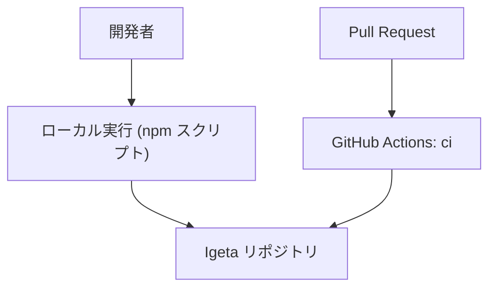
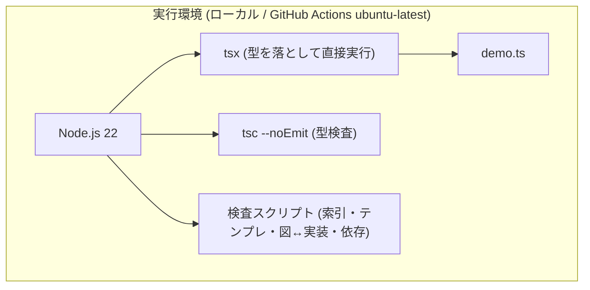

# 予約 CLI サンプルの実行環境設計

> **TL;DR**: 実行環境はローカルの Node.js 22 と GitHub Actions の 2 つだけで、どちらも同じ npm スクリプトを呼ぶ。
> - 設定値は**コマンドに貼れる粒度**で書く
> - クラウドリソースを持たないため、費用は CI の実行時間だけ

## 関連

| 区分 | 文書 | 対応 ID |
|---|---|---|
| 上流 (depends_on) | [非機能要件](03-nonfunctional.md) | NFR-001 / NFR-301 |
| 下流 | [稼働構成 (AS-IS)](../../architecture/01-overview.md) / [Runbook 検査が失敗したとき](../../runbooks/01-check-failure.md) | ARC-001 / RUN-001 |

## 1. 構成図

### 1.1 System Context (C4 L1)

### 1.2 Container / Deployment 図 (C4 L2)

デプロイ先は無い。成果物を配布せず、リポジトリ上のコードをその場で実行する。

## 2. サービス設定値

| ID | リソース | 設定 | 値 | 根拠 |
|---|---|---|---|---|
| INF-001 | Node.js | engines / CI の node-version | `>=22` / `22` | `--test` と型の前提を固定する |
| INF-002 | tsconfig | `strict` / `noEmit` / paths | true / true / `@/* → ./src/*` | 型で不変条件の一部を落とす。成果物を作らない |
| INF-003 | npm script | `sample:check` | 索引 → 型 → テスト → 図↔実装 → 依存の順に実行 | 早く落ちる検査を前に置く |
| INF-004 | GitHub Actions | ジョブ `check` の手順 | `npm ci` → 自己テスト → 記法 → 索引 → テンプレ適合 → `sample:check` → `sample:booking` | 文書とコードを同じジョブで守る |

## 3. Secret / 環境変数

| ID | 名前 | 保管先 | 参照方法 | ローテーション |
|---|---|---|---|---|
| INF-101 | なし | — | — | — |

認証情報・接続文字列を持たない。サンプルが外部サービスへ接続しないため (ADR-0001)。

## 4. 環境分離

| ID | 環境 | 実行基盤 | データ | アクセス制限 |
|---|---|---|---|---|
| INF-201 | ローカル | 開発者の端末 | プロセス内メモリ。終了で消える | 端末の利用者のみ |
| INF-202 | CI | GitHub Actions `ubuntu-latest` | 同上 (ジョブ終了で消える) | リポジトリの権限に従う |

本番環境は無い。

## 5. 費用

| ID | 項目 | 月額 | 算出根拠 | 変動要因 |
|---|---|---|---|---|
| INF-301 | GitHub Actions の実行 | ¥0 | 公開リポジトリの Actions は無料。実行時間は未計測 | 非公開化した場合は実行時間に応じた課金 |
| INF-302 | クラウドリソース | ¥0 | 該当リソースなし | DB や実行基盤を採用した時点で再計算 |
