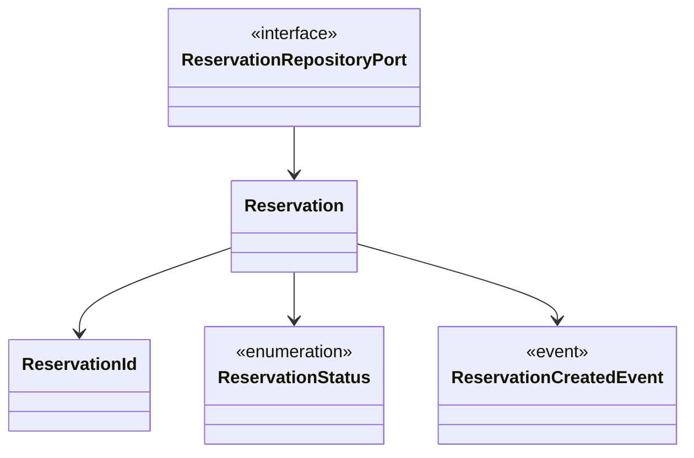

# booking — 学習用の予約集約

> **TL;DR**: 予約の ID・状態・イベントを集約に閉じ、保存先を repository port で差し替える。

## 関連

| 区分 | 文書 | 対応 ID |
|---|---|---|
| 上流 (depends_on) | [機能一覧](../../basic/01-function-list.md) | FN-001〜005 |
| 下流 | [テスト仕様](../../test/specs/01-booking.md) / [実装](../../../../src/modules/booking/domain/reservation.ts) | TST-201〜207 / Reservation |

## 1. クラス図

## 2. 不変条件

| # | 不変条件 | 強制する主体 | 違反時 |
|---|---|---|---|
| 1 | 予約 ID は小文字英数字・ハイフンの 8〜64 文字、先頭は英数字 | ReservationId.create | RESERVATION_ID_INVALID |
| 2 | draft → confirmed/cancelled、confirmed → cancelled のみ許可 | Reservation.transitionTo | RESERVATION_TRANSITION_FORBIDDEN。状態は不変 |
| 3 | 保存先と予約のテナントは一致 | メモリ adapter の save | TENANT_MISMATCH |
| 4 | 取得後の変更は save するまで保存内容に反映しない | メモリ adapter のコピー | TST-207 で検証 |

## 3. クラス ↔ ファイル対応表

| 種別 | 配置 (code_root 相対) | クラス |
|---|---|---|
| 集約 | `domain/reservation.ts` | Reservation |
| 値オブジェクト | `domain/value-objects/reservation-id.ts` | ReservationId |
| 列挙 | `domain/reservation.ts` | ReservationStatus |
| イベント | `domain/events/reservation-created.event.ts` | ReservationCreatedEvent |
| port | `domain/ports/reservation.repository.port.ts` | ReservationRepositoryPort |

## 4. 差し替え可能点

ReservationRepositoryPort にメモリ adapter を注入する。DB adapter を作る場合も use case は変更不要。
現時点で DB adapter の動作検証は未整備。共有カーネルは `src/shared/kernel/` に置く。

## 5. 他コンテキストとの関係

他の業務コンテキストはこのサンプルにはない。TenantId と Result は共有カーネルに依存する。
作成イベントは集約から取り出せるが、use case での配信は未実装。

## 6. 未決事項

| # | 論点 | 現在の扱い | 確定する条件 |
|---|---|---|---|
| 1 | 実サービスの予約状態・重複作成・DB 境界 | 学習用の状態のみ。同一テナント・ID の save は更新 | 実案件の要件定義時 |
