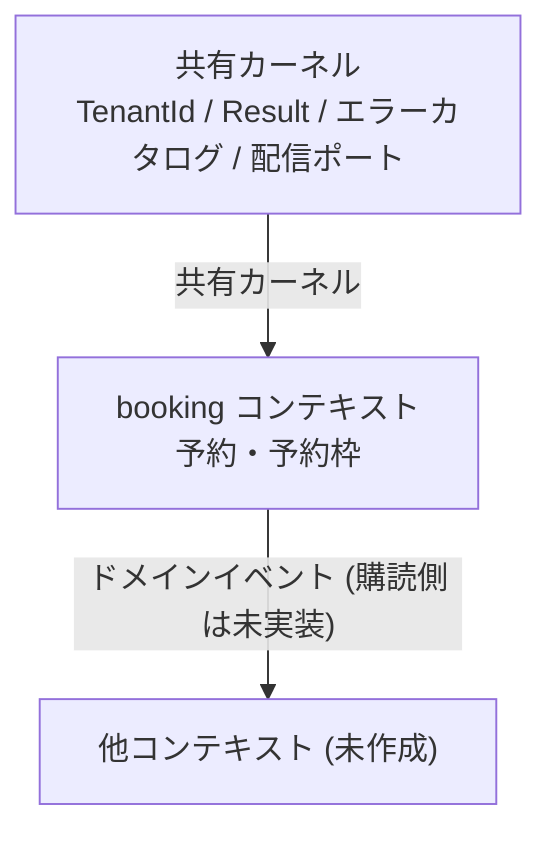

# 予約 CLI サンプルのドメイン総論

> **TL;DR**: 業務コンテキストは booking 1 つだけで、テナント・結果型・エラーカタログを共有カーネルに置く。
> - 上流コンテキストは無く、共有カーネルが `TenantId` / `Result` / エラーカタログ / 配信ポートを提供する
> - コンテキストを増やす場合の公開面はドメインイベントだけ。集約を直接参照させない

## 関連

| 区分 | 文書 | 対応 ID |
|---|---|---|
| 上流 (depends_on) | [要件定義](../../../product/01-requirements.md) | REQ-101〜107 |
| 下流 | [集約マップ](02-aggregate-map.md) / [クラス図](03-booking.md) / [状態遷移](../state-machines/01-reservation.md) | class 名 / STM-101 |

## 1. コンテキストマップ

矢印の元が提供側。booking は共有カーネルにのみ依存し、外へはイベントの形でしか出ない。

## 2. 図の規約

- クラス図は mermaid `classDiagram` で描き、`class` 宣言の名前を実装の `export` 名と一致させる (`npm run sample:drift` が双方向で照合する)。
- 列挙は TypeScript の enum ではなく union type で表し、図では `<<enumeration>>` を付ける。
- ポートは `<<interface>>`、イベントは `<<event>>` を付ける。
- 共有カーネルの型 (`TenantId` など) は図に描かない。照合対象は `code_root` 配下の `domain/` に限るため、描くと実装に無いクラスとして落ちる。
- 1 つのクラス図ファイルに複数の `classDiagram` ブロックを置いてよい。集約ごとに分けると読みやすい。

## 3. 集約横断の論点

定員を守るのは予約枠の集約だが、定員を消費する契機は予約の確定である。
この横断の扱いは [ADR-0002](../../../adr/0002-capacity-on-confirmation.md) で決め、詳細は[集約マップ](02-aggregate-map.md)に書いている。

## 4. 未確定分岐

| # | 論点 | 選択肢 | 変更コストが高い方向 | 確認先 |
|---|---|---|---|---|
| 1 | 予約と枠を 1 集約にまとめるか | 別集約 (現在) / 1 集約 | 1 集約へ寄せる方 (枠の更新が全予約と競合する) | 実案件の同時予約数 |
| 2 | 予約の所有者 (利用者) を持つか | 持たない (現在) / 利用者集約を追加 | 後から追加する方 (予約 ID の意味が変わる) | 実案件の要件定義 |
| 3 | 枠の時間帯を型で持つか | ID の文字列のみ (現在) / 開始終了時刻を持つ | 時刻を持つ方 (重複判定と時間帯の正規化が必要) | 実案件の枠管理方法 |
