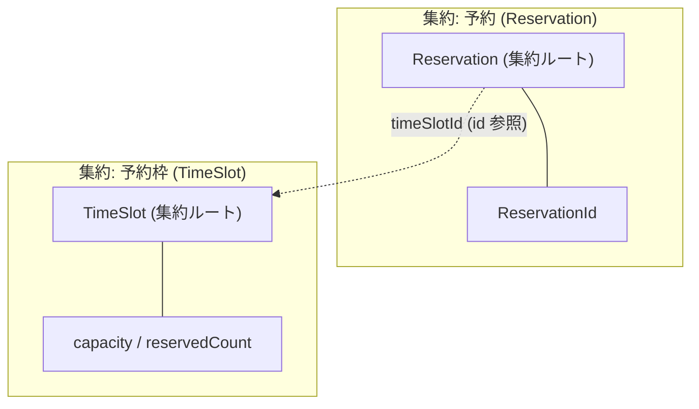

# 予約 CLI サンプルの集約マップ

> **TL;DR**: 予約と予約枠を別集約に切り、枠の消費は確定の use case が 2 集約を順に保存して実現する。
> - 集約をまたぐ参照は **id 参照のみ**。実体参照を張らない
> - 1 トランザクションで守るのは 1 集約。またぐ整合の現状は順次保存で、限界を明記する

## 関連

| 区分 | 文書 | 対応 ID |
|---|---|---|
| 上流 (depends_on) | [ドメイン総論](01-overview.md) | class 名 |
| 下流 | [クラス図](03-booking.md) / [シーケンス](../sequences/01-booking.md) | Reservation / TimeSlot / SEQ-002 |

## 1. 集約と境界

## 2. 集約の責務と不変条件

| 集約 | 守る不変条件 | 保持しないもの |
|---|---|---|
| Reservation | 状態は遷移表にある遷移でしか変わらない。ID とテナントは生成後に変わらない | 枠の定員・残数。枠の実体参照 |
| TimeSlot | 予約済み件数は 0 以上で定員以下。定員は 1 以上の整数 | 予約の一覧・予約の状態 |

## 3. 集約をまたぐ整合

確定は「枠を 1 件消費する」と「予約を確定にする」の 2 つを同時に成立させる必要がある。
現在の実装は `ConfirmReservationUseCase` が枠 → 予約の順に保存する。どちらかが失敗した場合は保存しない。

メモリ adapter にトランザクションが無いため、枠の保存後に予約の保存が失敗すると枠だけが減った状態が残りうる。
この限界は[リスクと技術的負債](../../01-risks-tech-debt.md) RSK-101 に負債として記録し、DB 採用時にトランザクション境界を引くこととした。

キャンセルは逆順で、予約を取得した時点の状態が confirmed のときだけ枠を返す。
判定を「キャンセル後の状態」ではなく「キャンセル前の状態」で行う点が実装の要所で、TST-211 が両方の経路を検証する。
