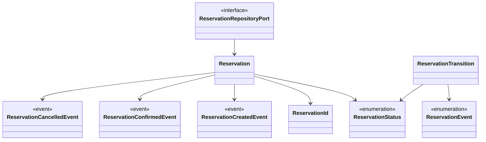
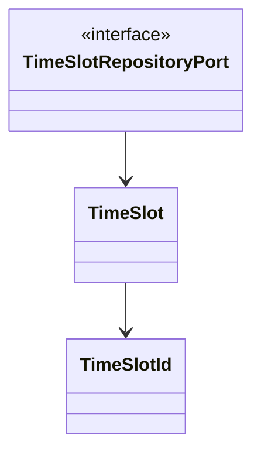

# booking — 学習用の予約集約

> **TL;DR**: 予約の状態と予約枠の定員をそれぞれの集約に閉じ、保存とイベント配信を port で差し替える。
> - 集約は 2 つ。予約は枠を id で参照し、枠は予約を知らない
> - 図の class 名と実装の export 名は `npm run sample:drift` が双方向で照合する

## 関連

| 区分 | 文書 | 対応 ID |
|---|---|---|
| 上流 (depends_on) | [集約マップ](02-aggregate-map.md) / [機能一覧](../../basic/01-function-list.md) | class 名 / FN-001〜007 |
| 下流 | [テスト仕様](../../test/specs/01-booking.md) / [実装](../../../../src/modules/booking/domain/reservation.ts) | TST-201〜215 / Reservation |

## 1. クラス図

### 1.1 予約集約

### 1.2 予約枠集約

予約は枠を `timeSlotId` で参照する。図に線を引かないのは、実体参照を持たないことを図でも示すため (集約をまたぐ参照は id のみ)。

## 2. 不変条件

| # | 不変条件 | 強制する主体 | 違反時 |
|---|---|---|---|
| 1 | 予約 ID・枠 ID は小文字英数字とハイフンの 8〜64 文字、先頭は英数字 | ReservationId.create / TimeSlotId.create | RESERVATION_ID_INVALID / TIME_SLOT_ID_INVALID |
| 2 | 状態は遷移表にある遷移でしか変わらない | Reservation.confirm / cancel | RESERVATION_TRANSITION_FORBIDDEN。状態は変わらない |
| 3 | 予約済み件数は 0 以上で定員以下 | TimeSlot.reserve / release / restore | TIME_SLOT_SOLD_OUT / TIME_SLOT_NOT_RESERVED / TIME_SLOT_CAPACITY_INVALID |
| 4 | 定員は 1 以上の整数 | TimeSlot.create / restore | TIME_SLOT_CAPACITY_INVALID |
| 5 | 保存先と集約のテナントは一致 | メモリ adapter の save | TENANT_MISMATCH |
| 6 | 取得後の変更は save するまで保存内容に反映しない | メモリ adapter が値だけを保存する | TST-207 で検証 |

残数 (`remaining`) は定員と予約済み件数からの導出値で、保存しない。満席を状態として持たないのも同じ理由による。

## 3. クラス ↔ ファイル対応表

| 種別 | 配置 (code_root 相対) | クラス |
|---|---|---|
| 集約 | `domain/reservation.ts` | Reservation |
| 集約 | `domain/time-slot.ts` | TimeSlot |
| 値オブジェクト | `domain/value-objects/reservation-id.ts` | ReservationId |
| 値オブジェクト | `domain/value-objects/time-slot-id.ts` | TimeSlotId |
| 列挙 | `domain/reservation.ts` | ReservationStatus / ReservationEvent |
| 遷移表の行 | `domain/reservation.ts` | ReservationTransition |
| イベント | `domain/events/*.event.ts` | ReservationCreatedEvent / ReservationConfirmedEvent / ReservationCancelledEvent |
| port | `domain/ports/*.repository.port.ts` | ReservationRepositoryPort / TimeSlotRepositoryPort |

遷移表そのもの (`RESERVATION_TRANSITIONS`) は定数で、クラスではないため図には現れない。
表の内容は[状態遷移](../state-machines/01-reservation.md)が正典で、TST-214 が突き合わせる。

## 4. 差し替え可能点

| port | 既定 adapter | 差し替えたときに変わらないもの |
|---|---|---|
| ReservationRepositoryPort | InMemoryReservationRepository | use case・集約の実装 |
| TimeSlotRepositoryPort | InMemoryTimeSlotRepository | 同上 |
| EventPublisherPort (共有カーネル) | InMemoryEventPublisher | 同上 |

DB adapter の動作検証は未整備。共有カーネルは `src/shared/kernel/` に置く。

## 5. 他コンテキストとの関係

他の業務コンテキストはこのサンプルにはない。TenantId・Result・エラーカタログ・配信ポートは共有カーネルに依存する。
コンテキスト外へ出るのはイベント 3 種だけで、購読側は未実装 (`InMemoryEventPublisher` が収集するのみ)。

## 6. 未決事項

| # | 論点 | 現在の扱い | 確定する条件 |
|---|---|---|---|
| 1 | 同一テナント・同一 ID の再作成 | 上書き保存になる (重複作成を拒否しない) | 実案件の冪等性要件を決めたとき |
| 2 | 枠の時間帯・重複判定 | 枠は ID のみ。開始終了時刻を持たない | 実案件の枠管理方法を決めたとき |
| 3 | 2 集約の保存の原子性 | 順次保存。失敗時の補償は無い | DB adapter を採用したとき (RSK-101) |
