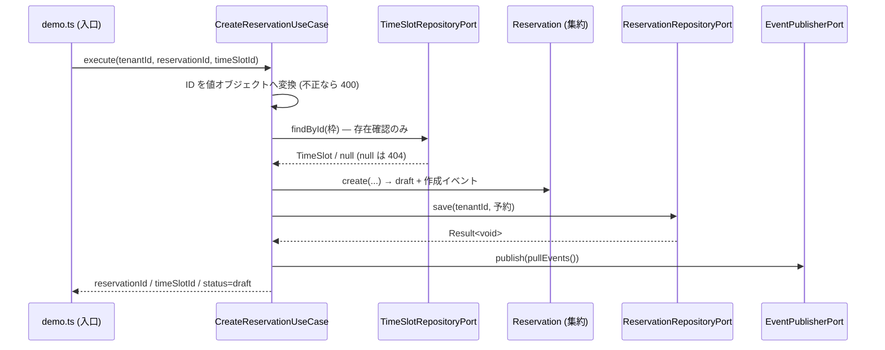
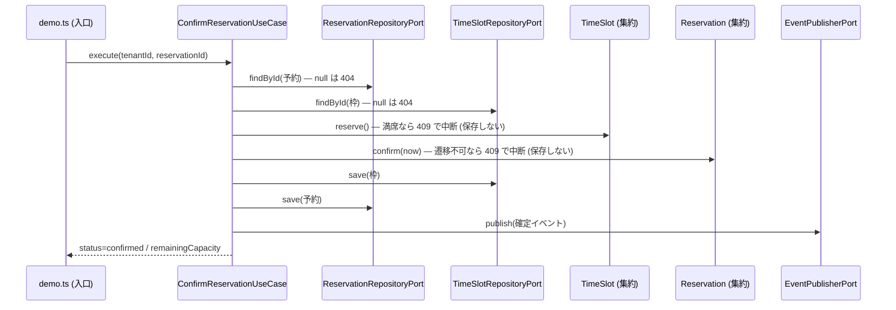
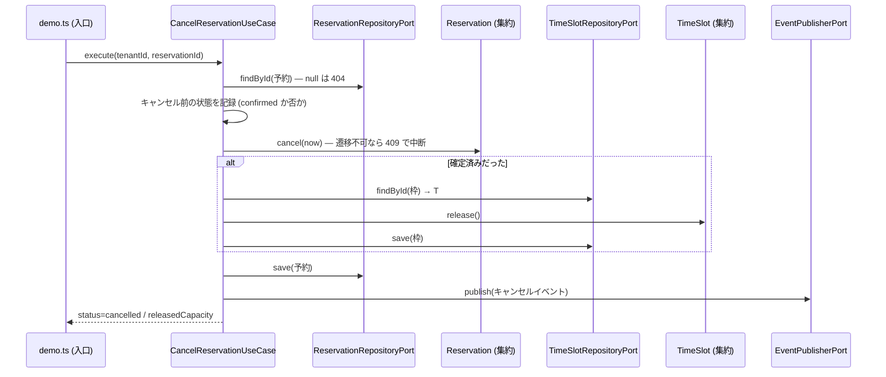

# 予約 CLI サンプルのシーケンス仕様

> **TL;DR**: 作成・確定・キャンセルの 3 ユースケースを、use case → 集約 → port の順に追える形で示す。
> - 1 ユースケース = 1 シーケンス図。レイヤを lifeline に出す
> - 保存の境界と、失敗時にどこまで戻すかを図に明示する

## 関連

| 区分 | 文書 | 対応 ID |
|---|---|---|
| 上流 (depends_on) | [クラス図](../domain/03-booking.md) / [機能一覧](../../basic/01-function-list.md) | class 名 / FN-001〜007 |
| 下流 | [モジュール仕様](../modules/01-booking.md) / [テスト仕様](../../test/specs/01-booking.md) | MOD-001 / TST-201〜213 |

## 1. ユースケース一覧

| ID | ユースケース | 対応 FN | 主集約 | 保存の境界 |
|---|---|---|---|---|
| SEQ-001 | 予約を作成する | FN-001 | Reservation | 予約 1 件 |
| SEQ-002 | 予約を確定する | FN-006 | Reservation + TimeSlot | 枠 → 予約の順に 2 回 (トランザクションなし) |
| SEQ-003 | 予約をキャンセルする | FN-008 | Reservation + TimeSlot | 確定済みのときだけ枠 → 予約の 2 回 |

## 2. シーケンス図

### SEQ-001 予約を作成する

### SEQ-002 予約を確定する

### SEQ-003 予約をキャンセルする

## 3. 例外・補償

| ID | 失敗点 | 検出 | 戻す範囲 | 呼び出し側への表現 |
|---|---|---|---|---|
| SEQ-001 | 枠が存在しない | use case (取得結果が null) | 保存前なので戻す対象なし | 404 `TIME_SLOT_NOT_FOUND` |
| SEQ-002 | 枠が満席 | TimeSlot.reserve | 保存前なので戻す対象なし | 409 `TIME_SLOT_SOLD_OUT` |
| SEQ-002 | 予約が確定できない状態 | Reservation.confirm | 枠のオブジェクトは変更済みだが保存しない | 409 `RESERVATION_TRANSITION_FORBIDDEN` |
| SEQ-002 | 枠の保存後に予約の保存が失敗 | port の戻り値 | **戻せない** (トランザクションなし) | 保存先由来のコードをそのまま変換。RSK-101 |
| SEQ-003 | 枠が見つからない | use case | 予約はまだ保存していない | 404 `TIME_SLOT_NOT_FOUND` |

## 4. 発行イベントと購読

| ID | 発行イベント | 発行タイミング | 購読側 | 失敗時の再送 |
|---|---|---|---|---|
| SEQ-001 | booking.reservation.created | 予約の保存後 | 無し (収集のみ) | しない (失敗は呼び出し元へ返す) |
| SEQ-002 | booking.reservation.confirmed | 枠と予約の保存後 | 同上 | 同上 |
| SEQ-003 | booking.reservation.cancelled | 予約の保存後 | 同上 | 同上 |

## 5. 外部サービス呼び出し

外部サービスを呼ばない。タイムアウト・リトライ・冪等キーの設計も持たない (ADR-0001)。
