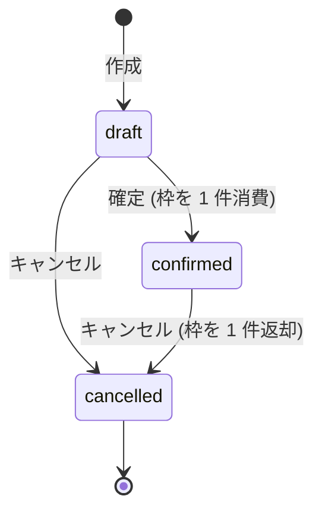

# 状態遷移 — 予約

> **TL;DR**: 予約は draft から confirmed かキャンセルへ進み、cancelled は終端。表に無い遷移は 409 で落ちる。
> - **状態は集約が持つ**。画面や API が勝手に状態を足さない
> - 表に無い遷移は**起こしてはいけない遷移**。実装は失敗を返し、状態を変えない

## 関連

| 区分 | 文書 | 対応 ID |
|---|---|---|
| 上流 (depends_on) | [集約マップ](../domain/02-aggregate-map.md) / [区分値定義](../../basic/05-code-definitions.md) | class 名 / CD-001 / CD-002 |
| 下流 | [シーケンス](../sequences/01-booking.md) / [テスト仕様](../../test/specs/01-booking.md) | SEQ-001〜003 / TST-202 / TST-214 |

## 1. 状態遷移図

## 2. 状態の定義

| ID | 状態 | 意味 | この状態で許す操作 | 終端か |
|---|---|---|---|---|
| STM-001 | draft | 作成済みで枠を消費していない | 確定・キャンセル | いいえ |
| STM-002 | confirmed | 枠を 1 件消費した | キャンセル | いいえ |
| STM-003 | cancelled | 取り消した | なし | はい |

枠の満席は予約の状態ではない。定員と予約済み件数から導出できる属性であり、状態として持たない。

## 3. 遷移表

<!--
  この表が遷移の正典。コード側の RESERVATION_TRANSITIONS と TST-214 が双方向で照合する。
  イベント列の括弧内は実装のメソッド名で、照合はこの識別子で行う。行を足したらコードも足す。
-->

| ID | 現状態 | イベント | 条件 (ガード) | 次状態 | 副作用 | 発行イベント |
|---|---|---|---|---|---|---|
| STM-101 | draft | 確定 (confirm) | 枠に残数がある | confirmed | 枠の予約済み件数を +1 | booking.reservation.confirmed |
| STM-102 | draft | キャンセル (cancel) | なし | cancelled | なし (枠を消費していない) | booking.reservation.cancelled |
| STM-103 | confirmed | キャンセル (cancel) | なし | cancelled | 枠の予約済み件数を -1 | booking.reservation.cancelled |

ガードの判定場所は実装で分かれる。残数の判定は `TimeSlot.reserve` が行い、遷移の可否は `Reservation` が行う。
どちらかが失敗した場合、確定の use case はどちらも保存しない (TST-210)。

## 4. 不正遷移の扱い

| ID | 起点 | 受けたイベント | 失敗の表現 | HTTP 相当 | 記録 |
|---|---|---|---|---|---|
| STM-201 | cancelled | 確定 (confirm) | DomainError `RESERVATION_TRANSITION_FORBIDDEN` | 409 | なし (CLI 出力のみ) |
| STM-202 | cancelled | キャンセル (cancel) | 同上 | 409 | 同上 |
| STM-203 | confirmed | 確定 (confirm) | 同上 | 409 | 同上 |

失敗時は状態を変えない。文言は[メッセージ定義](../../basic/06-messages.md) MSG-008 が正典。

## 5. タイムアウト・自動遷移

時間で動く遷移は無い。draft は期限切れにならず、枠を押さえないまま残る ([ADR-0002](../../../adr/0002-capacity-on-confirmation.md))。
仮押さえの期限切れを導入する場合は、起動主体 (ジョブか参照時の遅延評価) を決めてから本書に行を足す。
