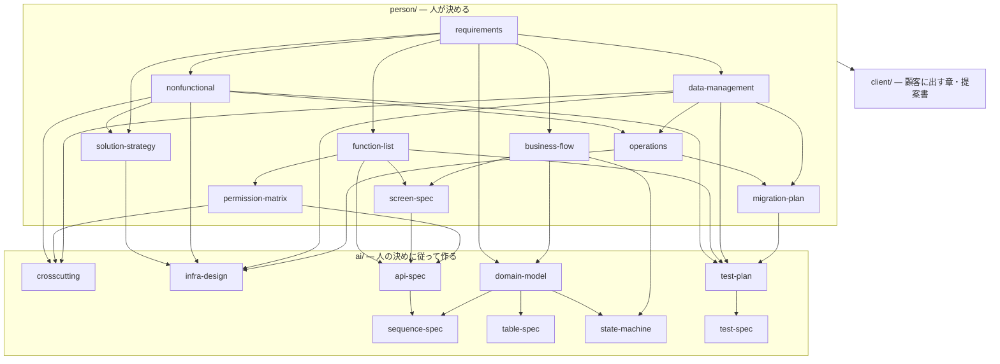

# 文書体系 — 設計書の種類・置き場所・型

> **When to use**: 設計書を書く前に読む。docs/ の第 1 階層は、確定させる人で 3 つ (`person`・`ai`・`client`)。`templates/docs/` は `docs/` と同じ階層なので、置きたい場所と同じパスの雛形をコピーし、`__context__` (まとまり)・`__year__` (年)・`__deliverable__` (提出物) を実際の名前に替える。置き場所と型は検査が見る。

## 関連

| 区分 | 文書 | 対応 ID |
|---|---|---|
| 上流 | [Igeta の設計思想](https://github.com/SakakitaniJunya/Igeta/blob/main/README.md#設計思想) | — |
| 下流 | `templates/docs/**` / 全設計書 | 全接頭辞 |
| 参考 | [設計書テンプレが参照した外部標準](https://github.com/SakakitaniJunya/Igeta/blob/main/docs/explanation/01-design-doc-standards.md) (MADR / spec-kit / EARS / Diátaxis / arc42 / C4 / OpenAPI) | — |

## 1. 3 つのフォルダ — 確定させる人で分ける

| フォルダ | 置くもの | 確定させる人 | 人が開くとき |
|---|---|---|---|
| `docs/person/` | 人の承認なしに変えてはいけない決まりと、その決定の記録 | 人 | 確定前に全部読む |
| `docs/ai/specs/` | 作り方の詳細 (詳細設計・実装タスク) | 評価する AI | 読む必要はない |
| `docs/ai/handbook/` | 作業の手引き (手順書・解説・障害の手順)。決まりは書かない | 評価する AI | その作業をするときに開く |
| `docs/client/` | 顧客に渡して合意するもの | 人と顧客 | 渡す前に全部読む |

**置き場所を決める問い (1 つだけ)**: 「AI がこれを勝手に変えたら、事業・お金・顧客との約束・使う人の体験・法令のどれかが変わるか」。変わるなら `person/`、変わらないなら `ai/`。人の決めた値は `person/` の行に 1 回だけ書き、`ai/` の文書はその ID を引いて従う (値を書き写さない)。

```text
AGENTS.md                         AI の入口。person/ を上流、ai/ を持ち場として指す
.github/CODEOWNERS                person/・client/ などの変更を承認する人
docs/
├── README.md / dependencies.md   生成索引 (手で書かない)。各フォルダの README.md も生成索引
├── person/                       人が確定前に全部読んで承認する
│   ├── requirements/             01-requirements.md (150 行を超えたら NN-<まとまり>.md へ分ける)
│   ├── design/
│   │   ├── shared/               全体共通。00-map.md と NN-<kind>.md (固定番号)
│   │   └── <まとまり>/            00-map.md と {flows,screens,features}/NN-<名前>.md
│   └── decisions/                01-decisions.md (決定台帳) と <年>/NNNN-<slug>.md (ADR)
├── ai/                           AI が書き、評価する AI が確定させる
│   ├── specs/
│   │   ├── shared/               全体共通。NN-<kind>.md (固定番号)
│   │   ├── <まとまり>/            contract.md と {api,tables,domain,sequences,state-machines,modules,jobs,tests}/NN-<名前>.md
│   │   └── tasks/                NN-<機能>.md
│   └── handbook/                 how-to/・explanation/・runbooks/ の NN-<slug>.md
└── client/                       顧客と合意する
    ├── delivery/<提出物名>/       章 NN-<章>.md・deliverable.json・由来の付属ファイル
    └── proposals/<年>/           NN-<slug>.md
```

## 2. kind の置き場所 (正本は Igeta の要件定義書 02 §7)

REQ-102 の正本は Igeta の要件定義書 02 §7。この節はその転記 (正本・この節・`src/core/Role.ts` の表は `TaxonomyGuideSync.test.ts` が突き合わせる)。`<c>` はまとまりの名前 (`shared` を含む)。
型の検査: ○ = 状態の列・決まりの表・行数 (100 行。requirements は 150 行) を検査し、(図) の kind は図も要る。図 = 図だけを検査。— = 検査しない。

| 確定させる人 | kind | 置き場所 | 型の検査 |
|---|---|---|---|
| person | map / context-map | `person/design/shared/00-map.md` / `person/design/<c>/00-map.md` | 図 |
| person | requirements | `person/requirements/01-requirements.md`・`person/requirements/NN-slug.md` | ○ |
| person | function-list / solution-strategy (図) / nonfunctional / permission-matrix / data-management / as-is-overview (図) / risks-tech-debt / operations / migration-plan | `person/design/shared/NN-*.md` (固定番号)。100 行を超えたら `person/design/<c>/NN-<kind>.md` にも置ける | ○ |
| person | business-flow (図) / screen-spec (図) / feature-brief | `person/design/<c>/{flows,screens,features}/NN-slug.md` | ○ / ○ / — |
| person | glossary | `person/design/shared/NN-glossary.md` | — |
| person | adr / decision-log | `person/decisions/<year>/NNNN-slug.md` / `person/decisions/01-decisions.md` | — |
| ai | crosscutting / code-definitions / messages / i18n / infra-design / secrets-management / external-integration / test-plan / domain-overview / aggregate-map | `ai/specs/shared/NN-*.md` (固定番号) | — |
| ai | context-contract | `ai/specs/<c>/contract.md` | — |
| ai | api-spec / table-spec / domain-model / sequence-spec / state-machine / module-spec / job / test-spec | `ai/specs/<c>/{api,tables,domain,sequences,state-machines,modules,jobs,tests}/NN-slug.md` | — |
| ai | tasks | `ai/specs/tasks/NN-slug.md` | — |
| ai | guide / explanation / runbook / implementation-order | `ai/handbook/{how-to,explanation,runbooks}/NN-slug.md` (implementation-order は `how-to/02-implementation-order.md`) | — |
| ai | document-taxonomy / human-review / provenance-workflow | 利用 repo には置かない。`AGENTS.md` と docs/README.md から、版に固定した Igeta の手引きを指す | — |
| client | delivery-chapter / proposal | `client/delivery/<提出物名>/` / `client/proposals/<year>/NN-slug.md` | — |

計 47 kind (person 18・ai 27・client 2) で、`ARC42_BY_KIND` の全件。`tutorial` (予約済み) は 47 の外で、登録するときは `ai/handbook/` に置く。

| 決まり | 内容 |
|---|---|
| 置ける場所 | 上の表のパスと、生成索引 (docs/ 直下の 2 本、各フォルダの README.md) だけ |
| 15 本の対象外 | `person/decisions/<year>/`・`client/proposals/<year>/`・`client/delivery/<提出物名>/` |
| `person/design/<c>/` と `ai/specs/<c>/` の下が 15 本を超えた | まとまりを分ける合図。下位フォルダは足さない |
| `person/design/shared/` の固定の文書が 100 行を超えた | 行を、属するまとまりの `person/design/<c>/NN-<kind>.md` へ移す (行の移動の扱いは ADR-0006 決定 7) |
| `person/requirements/01-requirements.md` が 150 行を超えた | まとまりごとに `person/requirements/NN-<c>.md` へ分ける (同上) |
| `ai/specs/tasks/`・`ai/handbook/` の 3 フォルダが 15 本を超えた | まとまりの下位フォルダ (`shared` を含む) へ全部移す。`shared` が 15 本を超えたら違反のまま |

## 3. 名前の付け方

| 何 | 決まり |
|---|---|
| 固定番号 | `person/design/shared/` は 00 が地図、01〜10 が `NN-<kind>.md` (01 機能一覧・02 解決戦略・03 非機能要件・04 権限マトリクス・05 データの扱い・06 現行構成・07 リスク・08 運用・09 移行・10 用語集)。`ai/specs/shared/` は 01〜10 (06・07 は雛形の無い secrets-management・external-integration の番号) |
| まとまり | フォルダ名が `context` (kebab-case)。frontmatter の `context` と同じ名前。無記入は `shared`。主題 (デプロイなど) には使わない |
| 年 | ADR・提案書は書いた年 (西暦 4 桁) のフォルダ。手順書・解説は年で分けない |
| 提出物 | `client/delivery/<提出物名>/` に `deliverable.json` と章を置く。名前は提出物ごと |
| 連番 | ファイル名先頭の `NN-` は同じフォルダの中の読む順。検査は連番を種類の判定に使わない。ADR は 4 桁 |
| 索引 | 各フォルダの `README.md` と `docs/dependencies.md` は `igeta docs-graph` が作る。手で書かない |
| frontmatter | `id` は文書の間で一意の kebab-case (連番を除いたファイル名と揃える)。`status` は、要件・設計・地図・機能ブリーフが draft・review・fixed・superseded、ADR が proposed・accepted・amended・superseded・rejected、提案書が draft・submitted・accepted・rejected。fixed の要件・機能ブリーフは `OPEN-nnn` を参照できない (未決の関門)。`depends_on` は上流の id (最上流の要件は、ヒアリング記録を `external:<名前>` で書く)。`context` は、まとまりのフォルダ (`<c>/`) の下の文書で必須で、フォルダ名と同じ名前 (`shared/` の下は無記入か `shared`)。食い違えば違反 |
| 行数 | `line_limit` は雛形の値。読み切れない量になったら、地図は図を削って詳細への入口を増やし、機能ブリーフは機能を分割する |

## 4. person の文書の型

確定する前に人が全部読む文書は、次の順に書く。作り方の詳細と `ai/` の ID は書かない。

1. **結論**: `> **TL;DR**:` から 3 行まで。ID は書かない
2. **図**: 図が要る 16 kind は、kind ごとに許す図種の Mermaid を TL;DR の次の節に 1 枚以上 (正本は要件 02 §8。adr・feature-brief は要らない)
3. **決まりの表**: 行頭が自分の ID の行は、最後の列が `状態`。値は `決定`・`仮` (AI が置いた値。人の承認待ち)・`未決`・`廃` (使わなくなった ID。消さず、番号を再利用しない)
4. **決めてほしいこと**: `| 問い | 対象 ID | 選択肢 | 決まらないと止まること |`
5. **関連**: 上流は文書。下流の欄は `(生成索引が出す)` と書き、`ai/`・`client/` の文書を指さない

`person/`・`client/` の文書には HTML コメントを書かない。書き手に要る指示は、この手引きの §7 にある。生成器が管理する区間 (`AUTOGEN` の dir-index・adr-index・tentative-index) だけは、コメントの形のまま置く。型の検査が ○ でない kind (地図・用語集・機能ブリーフ・ADR・決定台帳) は、表の「型の検査」の区分どおり。地図・まとまりの地図・機能ブリーフ・用語集は「決めてほしいこと」を任意の節として持ち、ADR と決定台帳はそれぞれの形のまま。

## 5. kind の内容・ID 接頭辞・arc42 の章・上限

背骨は arc42 の 12 章。章はフォルダではなく frontmatter `arc42:` が持つ。`ai/` の上限は雛形の `line_limit` で、無い kind は目安 (200 行)。

| kind | 何を書くか | arc42 | ID | 上限 |
|---|---|---|---|---|
| `map` | 何を作るか・誰が使うか・主要フロー (図)・やらないこと・詳細への入口 | — | — | 150 |
| `context-map` | まとまり 1 つの概要・含む機能・隣のまとまりの約束への入口 | — | — | 150 |
| `requirements` | 業務要件・機能要件 (EARS)・制約・前提・スコープ外。全設計書の上流 | §1 | REQ | 150 |
| `function-list` | 機能の一覧と、要件・画面との対応 | §1 | FN | 100 |
| `solution-strategy` | 技術選定・分割方針・費用の上限・使う外部サービス・組織的な決定 (任意)・構成の図 (C4 L1・L2) | §4 | SS | 100 |
| `nonfunctional` | 性能・可用性・セキュリティ・監視の閾値・対応する言語など、人が決める水準 | §10 | NFR | 100 |
| `permission-matrix` | ロール・ロール × 機能・データ範囲 | §8 | PRM | 100 |
| `data-management` | 持つデータの区分・個人情報・保持期間・越境・削除の求め・環境ごとの扱い | §8 | DM | 100 |
| `as-is-overview` | 稼働中の構成の図 (C4 L1・L2) と外部システム | §3 | ARC | 100 |
| `risks-tech-debt` | リスクと技術的負債 (台帳の正本は課題管理) | §11 | RSK | 100 |
| `operations` | 運用の方針 (連絡・定期作業・復旧の目標) | §7 | OPS | 100 |
| `migration-plan` | 移行とリリースの段階・リリースしてよい条件・切戻しの条件 | §7 | MIG | 100 |
| `business-flow` | 業務の流れ (図)・アクター・例外・時間軸 | §6 | BF | 100 |
| `screen-spec` | 画面の一覧・遷移 (図)・空とエラーの見え方・権限による表示 | §5 | SCR | 100 |
| `feature-brief` | 機能 1 つの WHAT/WHY・ストーリー・対象外・関わる REQ ID | §1 | — | 150 |
| `glossary` | 業務用語 | §12 | — | — |
| `adr` | 重要な決定と根拠 (MADR)。append-only | §9 | — | — |
| `decision-log` | 決めたこと (DEC) と未決のこと (OPEN) の台帳 | — | DEC / OPEN | — |
| `crosscutting` | 認証・エラー形式・ログ・冪等性・テナント隔離・レイヤの依存の向き・品質目標の達成手段など、全構成要素に効く方式 | §8 | XC | 200 |
| `code-definitions` | 区分値の格納値と対応。表示名は glossary | §8 | CD | 200 |
| `messages` | エラー文言・通知の文言カタログ。宛先・タイミングは business-flow | §8 | MSG | 200 |
| `i18n` | 文言カタログ・ロケール依存の振る舞い・翻訳の流れ。対応する言語は nonfunctional | §8 | I18N | 200 |
| `infra-design` | 配置・ネットワーク・権限境界の図、設定値、Secret、環境分離、バックアップと監視の設定、稼働中の資源 | §7 | INF | 200 |
| `secrets-management` | 鍵・認証情報の保管と入れ替えの手順 (雛形なし) | §8 | — | 200 |
| `external-integration` | 外部サービスとの接続の技術仕様 (雛形なし) | §3 | — | 200 |
| `test-plan` | テストの種類・環境・合格基準・品質ゲート・品質目標の測り方 | §10 | TSP | 200 |
| `domain-overview` | コンテキストマップ・図の規約 | §5 | — | 200 |
| `aggregate-map` | 集約の境界と責務 | §5 | — | 200 |
| `context-contract` | 他のまとまりに見せてよいもの (API・イベント・データ・用語) だけ | — | — | 150 |
| `api-spec` | API の一覧・認証・エラー・冪等性・外部 IF | §5 | API | 200 |
| `table-spec` | テーブル・列 (生成)・制約・インデックス | §5 | TBL | 200 |
| `domain-model` | クラス図 (実装と照合)・クラスとファイルの対応・用語集の語との対応 | §5 | class 名 | 200 |
| `sequence-spec` | ユースケースごとのシーケンスと失敗時の扱い | §6 | SEQ | 200 |
| `state-machine` | 集約の状態遷移表 | §6 | STM | 200 |
| `module-spec` | module の公開面・依存・差し替え可能な port | §5 | MOD | 200 |
| `job` | バッチ・定期ジョブの冪等性・失敗時の通知と再実行 | §6 | JOB | 200 |
| `test-spec` | 機能ごとのテストケース | §10 | TST | 200 |
| `tasks` | 機能ごとの実装タスク分解 (spec-kit の行形式) | — | T (`T001`) | 100 |
| `guide` | how-to。手順を 100 行以内で | — | — | 100 |
| `explanation` | 決定の材料になる調査・背景 | — | — | 200 |
| `runbook` | 障害・運用シナリオごとの手順。1 手順 1 コマンド | — | RUN | 100 |
| `implementation-order` | 実装順序と各ステップの DoD。着手順の表だけプロジェクトで埋める | — | — | 100 |
| `document-taxonomy` / `human-review` / `provenance-workflow` | Igeta の手引き 3 本 (この文書など)。利用 repo には写さない | — | — | — |
| `delivery-chapter` | 顧客に提出する章 1 本 | — | — | — |
| `proposal` | 顧客に出す提案書。accepted → ADR へ | — | — | 200 |

## 6. 依存の向き

`depends_on` は上流 → 下流。上流を直したら、下流を全部見直す。`ai` は `person` に従い (`ai` → `person`)、`client` は `person`・`ai` に従う。`person` は `ai`・`client` を指さない。`ai/specs/` の文書は、`depends_on` を辿ると `person/` に届く。



図に無い `glossary` / `as-is-overview` / `adr` / `decision-log` / `map` / `guide` / `explanation` / `runbook` は、特定の上流を持たない独立の文書。`map`・`decision-log` は人の入口で、`depends_on` ではなく本文リンク (地図から要件定義への「詳細への入口」) と ID 参照 (`DEC-nnn`・`OPEN-nnn`) でつながる。検査 (`igeta template-check --require-human-review`) はこのリンクと参照の有無を見る。詳しくは人間レビュー層の手引き (`03-human-review.md`)。

## 7. 書き方の指示 (person・client の雛形から移した)

| kind | 指示 |
|---|---|
| `map` | ここだけ読めば「何を作り、誰が使い、どう動くか」が分かるようにする。要件の全文・受入条件・実装の詳細は書かず、「詳細への入口」からリンクする。「何を作るか」は 2〜3 文 (業務課題と解き方だけ。技術選定は書かない)。主要フローの図は 1 枚で、分岐は 2〜3 個まで (それ以上は入口へ逃がす)。「やらないこと」は、言わないと入ってくるものを名指しする。`requirements` の全文書を「詳細への入口」に列挙する (検査が見る) |
| `context-map` | 全体の地図の次に読む。要件の全文・受入条件・隣のまとまりの内部実装は書かない。含む機能には、関わる `feature-brief` のリンクを全部列挙する (検査が見る)。隣のまとまりへは `context-contract` (約束の 1 枚) だけを列挙し、内部の文書へ直接リンクしない |
| `requirements` | 上流・下流を各 1 行以上 (「なし (最上流)」は可)。業務要件は「誰が何のために」(システム要件ではなく業務の目的)。機能要件は EARS で、「<トリガ>のとき、システムは<応答>しなければならない」に固定する (パターン: Ubiquitous 常時 / Event 事象 / State 状態 / Unwanted 異常 / Optional 機能任意)。「〜できる」「〜を考慮する」は検証できないので書かない。制約は法令・既存システム・予算・納期。前提は「崩れたら設計をやり直す」ものだけで、崩れたときのコストを添える。スコープ外は「いつ判断するか」まで書く |
| `function-list` | 機能の粒度は画面の 1 操作 = 1 機能。「対応 REQ」が空の行を作らない (空 = 要件の漏れ)。要件 → 機能と機能 → 要件の両方向で確かめる |
| `solution-strategy` | 1 行 1 決定、理由は 1 行。比較表は ADR に書く。ここに無い構造を実装で増やさない (増やすなら本書と ADR を先に直す)。費用は月額の上限を実数で書く。無料枠に頼るなら、枠を超えたときの額も書く |
| `nonfunctional` | 数値で書く (「高速」「使いやすい」は書かない)。測り方は `test-plan` に書く。閾値は「誰に・何分以内に知らせるか」まで決める |
| `permission-matrix` | 記号は R 参照・C 作成・U 更新・D 削除・— 不可。空欄を残さない。権限は操作だけでなくデータ範囲 (自テナント・自分の予約) とセットで決める。他の文書は本書の ID を引き、同じ権限を再掲しない |
| `data-management` | 区分ごとに、個人情報か・保持期間・越境・削除の求めへの対応・環境ごとの扱いを 1 行で決める。期間と国は数値と名前で書く (「適切に」は書かない) |
| `as-is-overview` | いま動いているものだけを書く (計画中は `solution-strategy`)。C4 の L1 と L2 は別の図にする (L1 は利用者と外部システムだけ)。外部システムは通信相手を全部列挙する |
| `risks-tech-debt` | 確率と影響は 高・中・低 の 3 段階。早期兆候は、顕在化する前に観測できるもの (無ければ「無し」)。負債は意図して先送りしたものだけ (知らずに積んだものは欠陥なので直す)。「対応しない」と決めたものは受容として書く。期日・担当・進捗は課題管理ツールが正で、本書に写さない |
| `operations` | 方針を書く。手順は稼働後に `ai/handbook/runbooks/` へ切り出す。監視は「閾値 → 通知先」まで決める |
| `migration-plan` | 切戻しの条件を、数値で先に決める。データ移行は件数の一致ではなく、業務が回ることで確かめる |
| `business-flow` | 例外系を正常系より先に決める (「起きたらどうする」が決まっていない例外は設計されていない)。システム外の人手の作業も図に含める。図はアクター単位のレーンで、システムの境界を `subgraph` で示す |
| `screen-spec` | 全画面に空とエラーの見え方を決める (ローディングの形はコードが決める)。ロールごとの可否は `permission-matrix` の ID を引き、画面固有の表示制御だけ書く |
| `feature-brief` | 正本 (要件・設計) は変えない。WHAT/WHY とユーザーストーリーだけを書き、要件文と受入条件は書かない (二重になる)。優先度は P1 (無いと成立しない)・P2 (無いと不便)・P3 (無くても回る)。「単独で試せる」は、そのストーリーだけを実装して確かめられるか。関わる REQ は `<doc-id>/REQ-nnn` の形で列挙するだけ |
| `glossary` | この案件で意味がぶれる語だけを書く。同義語を増やさない。先方との会話でも本書の語を使う |
| `adr` | 重要・高コストな決定を、複数案から基準に沿って 1 つ選んだものだけ。Status に日付・決めた人・決定 ID を書き、変えるときは旧い内容を履歴に残す。Context は 5 行以内。Decision Drivers は判断軸 (ここに無い理由で決めたなら軸の漏れ)。却下した選択肢は 1 案 2 行以内で、採用案より長くしない。Consequences は良い方向と代償を対で。Confirmation は守られていることの確かめ方 (手段が無ければ「未整備」と書く)。再検討トリガは観測できる条件で。関連は箇条書きでもよい |
| `decision-log` | 決定は 1 決定 1 行で、日付・決めた人・原文の引用・決定・影響する文書を空欄にしない。未決は 1 論点 1 行で、論点と「仮置き値」を空欄にしない。決定の中身 (背景・検討) は ADR か要件に書く。他の文書が「CEO が決定」などと書くなら `DEC-nnn` を、「仮置き」と書くなら `OPEN-nnn` を、ここに実在させる (検査が見る)。「仮置き」の一覧は `igeta docs-graph --write` が生成する |
| `delivery-chapter` | `igeta export` が束ねる章 1 本。`deliverable.json` の `chapters` の順に束ね、本文 (`#` 見出しの次から) がそのまま PDF になる。社内 ID (`DEC-`・`REQ-` など) を本文に残すと `forbid` が見つけて export を止める。```` ```mermaid ```` は図として描画される。節を書いたら `igeta provenance-capture` で付属ファイルに由来を記録する (`04-provenance-workflow.md`) |
| `proposal` | 背景と課題は相手の言葉で書く (こちらの都合を課題にしない)。調査結果は一次情報だけで、出典の URL と確認日を添える (「〜らしい」は書かない)。推奨案は相手の判断基準 (費用・期間・リスク) で説明する。崩れたら金額・期間が変わる前提を明示する |

arc42 の章ごとの意味と外部標準は、[設計書テンプレが参照した外部標準](https://github.com/SakakitaniJunya/Igeta/blob/main/docs/explanation/01-design-doc-standards.md) にある。

## 8. Igeta の手引きの置き場所

この手引きと、人間レビュー層の手引き (`03-human-review.md`)・由来の手順 (`04-provenance-workflow.md`) は、Igeta の版ごとに決まる説明書なので、利用 repo の `docs/` に写さない。`AGENTS.md` と `docs/README.md` から、インストールした版のものを指す: `node_modules/igeta/templates/docs/ai/handbook/how-to/`。実装順序の手引き (`02-implementation-order.md`) は、プロジェクトが着手順を埋める文書なので、利用 repo の `docs/ai/handbook/how-to/` に置く。
