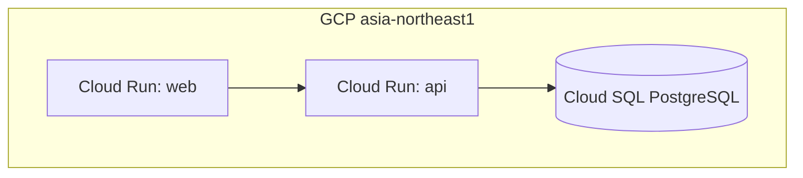
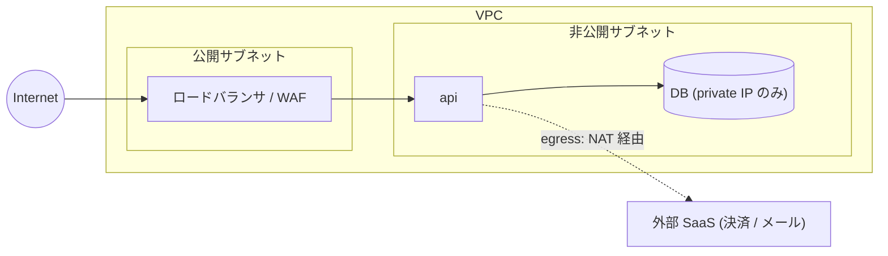
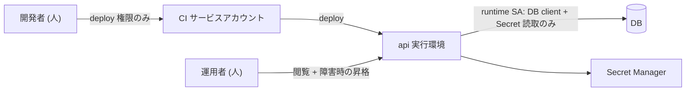

<!--
  arc42 §7 Deployment View (配置ビュー) — arc42 公式の Content / Motivation / Form より訳出
  何を書く章か: 実行環境 (地理・環境・機器・ネットワーク経路) と、ソフトウェア構成要素のそこへの割り当て。
    開発 / テスト / 本番など環境が複数あるなら、関係するものはすべて書く。
  なぜ必要か: ソフトウェアはハードウェア無しには動かず、インフラは横断概念 (§8) にも影響するため。
  書かない方がよいもの: 配置の説明に不要なインフラ詳細。構成要素の配置を示すのに必要な範囲で足りる。
  出典: https://arc42.org/overview/ / https://docs.arc42.org/section-7/
-->

# インフラ設計

> **TL;DR**: <配置を 1 文で>
> - 設定値は**コマンドに貼れる粒度**で書く (フラグ名と値)。「適切に設定する」は不可
> - 費用は `person/` の解決戦略の「費用の上限」に収める。利用者・外部システムの図 (C4 L1) とコンテナの図 (C4 L2) も解決戦略が持ち、本書は配置・経路・権限の図だけを持つ

## 関連

| 区分 | 文書 | 対応 ID |
|---|---|---|
| 上流 (depends_on) | [解決戦略](../../../person/design/shared/02-solution-strategy.md) / [非機能要件](../../../person/design/shared/03-nonfunctional.md) / [データの扱い](../../../person/design/shared/05-data-management.md) / [運用設計](../../../person/design/shared/08-operations.md) | SS-* / NFR-* / DM-* / OPS-* |
| 下流 | 手順書 (`ai/handbook/runbooks/`) / ジョブ仕様 (`ai/specs/<まとまり>/jobs/`) | RUN-* / JOB-* |

## 1. 構成図

### 1.1 配置図 (Deployment)

<!-- 実行環境・リージョン・接続経路まで描く。利用者・外部システムとコンテナの論理構成は解決戦略の図。クラス図 (C4 L4) は ai/specs/<まとまり>/domain/ -->

<!--
  他クラウドの記入例 (subgraph 名をプロバイダ + リージョンにし、マネージドサービス名をそのまま書く):
  AWS:   subgraph aws["AWS ap-northeast-1"]  alb["ALB"] --> ecs["ECS Fargate: api"] --> rds[("RDS PostgreSQL")]
  Azure: subgraph az["Azure Japan East"]     fd["Front Door"] --> aca["Container Apps: api"] --> pg[("Azure DB for PostgreSQL")]
  図に描くのは「構成要素がどこで動くか」まで。設定値は §2 に分ける (図に数字を書かない)
-->

### 1.2 ネットワーク構成図

<!-- VPC / サブネット / 公開・非公開の境界 / 外部からの経路。「何が外に出ていないか」が読める図にする -->

| ID | 境界 | 通す通信 | 遮断する通信 | 実現手段 |
|---|---|---|---|---|
| INF-401 | Internet → LB | 443 のみ | それ以外 | |
| INF-402 | api → DB | private IP / 5432 | public IP | VPC connector / private service access |
| INF-403 | api → 外部 SaaS | 443 (固定 IP が要るなら NAT) | | |

### 1.3 IAM・権限境界図

<!-- 「誰 (人 / サービスアカウント) が何にどの権限で触れるか」。最小権限になっていることを図で確認する。業務上のロールと権限は権限マトリクスが決める -->

| ID | 主体 | 種別 | 付与ロール / 権限 | 付与しない権限 | 根拠 |
|---|---|---|---|---|---|
| INF-501 | api 実行 SA | サービスアカウント | DB client / Secret accessor | project editor | 最小権限 |
| INF-502 | CI SA | サービスアカウント | deploy / image push | DB 直接接続 | |
| INF-503 | 開発者 | 人 | 閲覧 + 開発環境の deploy | 本番 DB 接続 | |

### 1.4 データの経路と暗号化

<!-- 保持期間・越境・個人情報の扱いは書かず、データの扱いの ID を引く。ここは経路と暗号化だけ -->

| ID | データの区分 | 発生元 → 保管先 | 経路の暗号化 | 保管の暗号化 | 従う決まり (DM) |
|---|---|---|---|---|---|
| INF-601 | 氏名・連絡先 | 利用者 → DB | TLS | at rest | DM-001 |
| INF-602 | 決済情報 | 利用者 → 決済 SaaS | TLS | — | DM-002 |

### 1.5 環境別の差分

<!-- 本番と同じ図を環境ごとに描き直さない。本番を正とし、差分だけを表にする。環境ごとに使うデータは、データの扱いが決める -->

| ID | 項目 | prod | stg | dev |
|---|---|---|---|---|
| INF-701 | インスタンス数 (min / max) | | | |
| INF-702 | DB | 専用 / HA | 専用 / 単一 | 共有 / 単一 |
| INF-703 | 外部 SaaS | 本番キー | サンドボックス | サンドボックス |
| INF-704 | 公開範囲 | Internet | IP 制限 / 認証 | 開発者のみ |

## 2. サービス設定値

<!-- 設定は、解決戦略の費用の上限に収まる範囲で決める -->

| ID | リソース | 設定 | 値 | 根拠 |
|---|---|---|---|---|
| INF-001 | Cloud Run api | min-instances / max-instances / cpu-boost | 1 / <明示> / 有効 | コールドスタート二段の回避 |

## 3. Secret / 環境変数

<!-- 鍵・認証情報の入れ替えの周期は、非機能要件の行を引く -->

| ID | 名前 | 保管先 | 参照方法 | 従う決まり (NFR の入れ替え) |
|---|---|---|---|---|
| INF-101 | DATABASE_URL | Secret Manager | Cloud Run 環境変数注入 | NFR-202 |

## 4. 環境分離

| ID | 環境 | プロジェクト/インスタンス | アクセス制限 | 従う決まり (DM の環境ごとの扱い) |
|---|---|---|---|---|
| INF-201 | prod | | | DM-501 |
| INF-202 | stg | | | DM-502 |

## 5. ネットワーク・接続経路 (任意)

| ID | 経路 | 方式 | 制限 |
|---|---|---|---|

## 6. バックアップと監視の設定 (任意)

<!-- バックアップの保持と復旧の目標は、データの扱い・運用設計が決める。監視の閾値は非機能要件が決める。ここは、それを実現する設定 -->

| ID | 対象 | バックアップの方式・頻度 | 監視の設定 | 従う決まり (DM・OPS・NFR) |
|---|---|---|---|---|
| INF-801 | | | | DM-202 / OPS-001 / NFR-301 |

## 7. 稼働中の資源の一覧 (任意)

<!-- いま動いているものだけ。実測日を書けないものは載せない。計画中のものは載せない -->

| ID | 構成要素 | 実体 (URL / リソース名) | 実測日 |
|---|---|---|---|
| INF-901 | | | |
