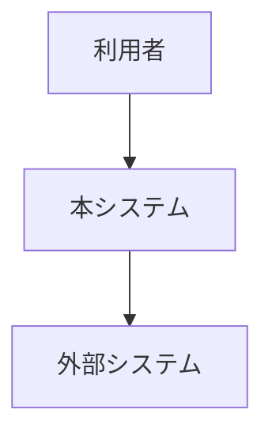
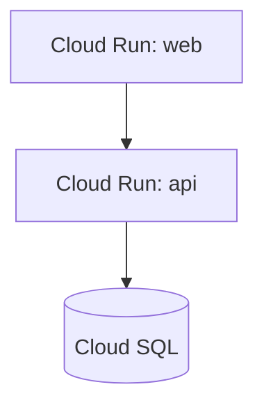

<!--
  arc42 §3 Context and Scope (コンテキストと範囲) — arc42 公式の Contents / Motivation / Form より訳出
  何を書く章か: システムの境界と、通信相手 (利用者・隣接システム) の全列挙。すなわち外部インターフェース。
    必要なら業務コンテキスト (やり取りするデータ) と技術コンテキスト (経路・プロトコル) を分けて書く。
  なぜ必要か: 外部との境界はシステムで最も壊れやすい部分で、ここを取り違えると設計全体が狂う。
  書かない方がよいもの: 内部構造 (→ §5)。ここではシステムを 1 つの黒箱として扱う。
  出典: https://arc42.org/overview/ / https://docs.arc42.org/section-3/
-->

# システム構成 (AS-IS)

> **TL;DR**: <いま動いている構成を 1 文で>
> - 本書は **AS-IS 専用**。まだ動いていない構成は `design/` に書く
> - 実測日を各節に書く。書けないものは載せない

## 関連

| 区分 | 文書 | 対応 ID |
|---|---|---|
| 上流 (depends_on) | <この構成を決めた ADR> | — |
| 下流 | <運用手順 / Runbook> | OPS-* |

## 1. 稼働中の構成

<!-- ARC-nnn は「いま動いている構成要素」に振る。計画中のものに振らない -->

| ID | 構成要素 | 実体 (URL / リソース名) | 実測日 |
|---|---|---|---|
| ARC-001 | | | |

## 2. 構成図

<!-- C4 model (https://c4model.com/)。L1 と L2 を必ず分ける。1 枚に混ぜると縮尺が壊れる -->

### 2.1 System Context (C4 L1)

<!-- 利用者と外部システムだけ。内部の箱を描かない -->

### 2.2 Container (C4 L2)

<!-- デプロイ単位 (web / api / db / job) と通信経路 -->

## 3. 外部システムと契約

<!--
  **必須**。arc42 §3 Context and Scope の中核。通信相手を「全部」列挙する (公式は "Specification of *all*
  communication partners" と書いている)。業務データのやり取り (何を渡し何を受け取るか) と、
  技術経路 (プロトコル / 認証 / 契約書の所在) を 1 行にまとめる。
-->

| ID | 相手 | 種別 (利用者 / 外部システム) | 渡すもの | 受け取るもの | 経路・認証 | 契約の所在 |
|---|---|---|---|---|---|---|
| ARC-101 | | | | | | |

## 4. TO-BE との差分 (任意)
