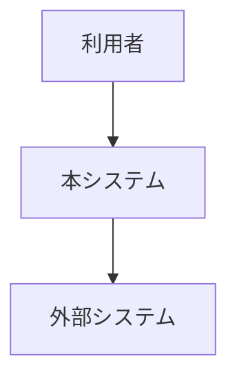
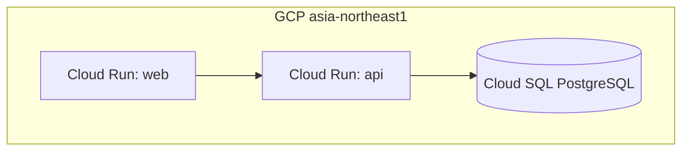

<!--
  arc42 §7 Deployment View (配置ビュー) — arc42 公式の Content / Motivation / Form より訳出
  何を書く章か: 実行環境 (地理・環境・機器・ネットワーク経路) と、ソフトウェア構成要素のそこへの割り当て。
    開発 / テスト / 本番など環境が複数あるなら、関係するものはすべて書く。
  なぜ必要か: ソフトウェアはハードウェア無しには動かず、インフラは横断概念 (§8) にも影響するため。
  書かない方がよいもの: 配置の説明に不要なインフラ詳細。構成要素の配置を示すのに必要な範囲で足りる。
  出典: https://arc42.org/overview/ / https://docs.arc42.org/section-7/
-->

# インフラ設計

> **TL;DR**: <構成を 1 文で>
> - 設定値は**コマンドに貼れる粒度**で書く (フラグ名と値)。「適切に設定する」は不可
> - 費用は月額実数で出す。無料枠に依存する記述は枠を超えた時の額も併記する

## 関連

| 区分 | 文書 | 対応 ID |
|---|---|---|
| 上流 (depends_on) | [非機能要件](./03-nonfunctional.md) | NFR-* |
| 下流 | [運用設計](../ops/01-operations.md) / [移行・リリース計画](../ops/02-migration-plan.md) | OPS-* / MIG-* |

## 1. 構成図

<!-- C4 model (https://c4model.com/)。L1 と L2 を分け、本書の主図は **Deployment 図 (C4)** -->

### 1.1 System Context (C4 L1)

### 1.2 Container / Deployment 図 (C4 L2)

<!-- 実行環境・リージョン・接続経路まで描く。クラス図 (C4 L4) は design/detail/domain/ -->

## 2. サービス設定値

| ID | リソース | 設定 | 値 | 根拠 |
|---|---|---|---|---|
| INF-001 | Cloud Run api | min-instances / max-instances / cpu-boost | 1 / <明示> / 有効 | コールドスタート二段の回避 |

## 3. Secret / 環境変数

| ID | 名前 | 保管先 | 参照方法 | ローテーション |
|---|---|---|---|---|
| INF-101 | DATABASE_URL | Secret Manager | Cloud Run 環境変数注入 | |

## 4. 環境分離

| ID | 環境 | プロジェクト/インスタンス | データ | アクセス制限 |
|---|---|---|---|---|
| INF-201 | prod | | 本番 | |
| INF-202 | stg | | 匿名化 | |

## 5. 費用

| ID | 項目 | 月額 | 算出根拠 | 変動要因 |
|---|---|---|---|---|
| INF-301 | | ¥ | | |

## 6. ネットワーク・接続経路 (任意)

| ID | 経路 | 方式 | 制限 |
|---|---|---|---|
