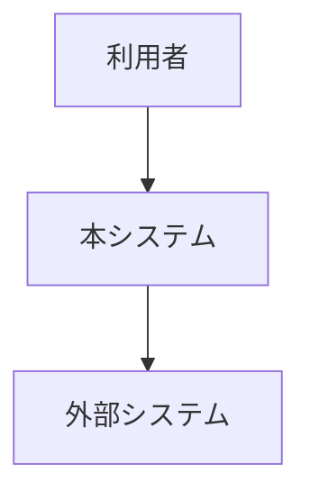
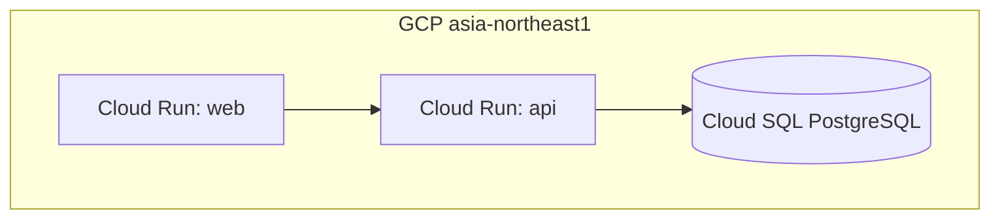
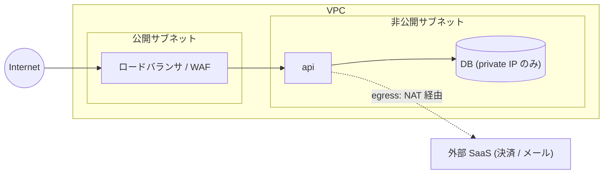
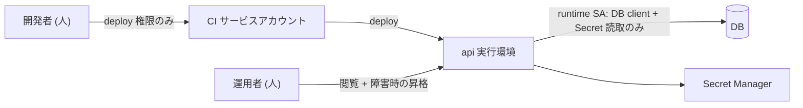
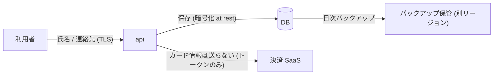

<!--
  arc42 §7 Deployment View (配置ビュー) — arc42 公式の Content / Motivation / Form より訳出
  何を書く章か: 実行環境 (地理・環境・機器・ネットワーク経路) と、ソフトウェア構成要素のそこへの割り当て。
    開発 / テスト / 本番など環境が複数あるなら、関係するものはすべて書く。
  なぜ必要か: ソフトウェアはハードウェア無しには動かず、インフラは横断概念 (§8) にも影響するため。
  書かない方がよいもの: 配置の説明に不要なインフラ詳細。構成要素の配置を示すのに必要な範囲で足りる。
  出典: https://arc42.org/overview/ / https://docs.arc42.org/section-7/
-->

# インフラ設計

> **TL;DR**: <構成を 1 文で>
> - 設定値は**コマンドに貼れる粒度**で書く (フラグ名と値)。「適切に設定する」は不可
> - 費用は月額実数で出す。無料枠に依存する記述は枠を超えた時の額も併記する

## 関連

| 区分 | 文書 | 対応 ID |
|---|---|---|
| 上流 (depends_on) | [非機能要件](./03-nonfunctional.md) | NFR-* |
| 下流 | [運用設計](../ops/01-operations.md) / [移行・リリース計画](../ops/02-migration-plan.md) | OPS-* / MIG-* |

## 1. 構成図

<!-- C4 model (https://c4model.com/)。L1 と L2 を分け、本書の主図は **Deployment 図 (C4)** -->

### 1.1 System Context (C4 L1)

### 1.2 Container / Deployment 図 (C4 L2)

<!-- 実行環境・リージョン・接続経路まで描く。クラス図 (C4 L4) は design/detail/domain/ -->

<!--
  他クラウドの記入例 (subgraph 名をプロバイダ + リージョンにし、マネージドサービス名をそのまま書く):
  AWS:   subgraph aws["AWS ap-northeast-1"]  alb["ALB"] --> ecs["ECS Fargate: api"] --> rds[("RDS PostgreSQL")]
  Azure: subgraph az["Azure Japan East"]     fd["Front Door"] --> aca["Container Apps: api"] --> pg[("Azure DB for PostgreSQL")]
  図に描くのは「構成要素がどこで動くか」まで。設定値は §2、費用は §5 に分ける (図に数字を書かない)
-->

### 1.3 ネットワーク構成図

<!-- VPC / サブネット / 公開・非公開の境界 / 外部からの経路。「何が外に出ていないか」が読める図にする -->

| ID | 境界 | 通す通信 | 遮断する通信 | 実現手段 |
|---|---|---|---|---|
| INF-401 | Internet → LB | 443 のみ | それ以外 | |
| INF-402 | api → DB | private IP / 5432 | public IP | VPC connector / private service access |
| INF-403 | api → 外部 SaaS | 443 (固定 IP が要るなら NAT) | | |

### 1.4 IAM・権限境界図

<!-- 「誰 (人 / サービスアカウント) が何にどの権限で触れるか」。最小権限になっていることを図で確認する -->

| ID | 主体 | 種別 | 付与ロール / 権限 | 付与しない権限 | 根拠 |
|---|---|---|---|---|---|
| INF-501 | api 実行 SA | サービスアカウント | DB client / Secret accessor | project editor | 最小権限 |
| INF-502 | CI SA | サービスアカウント | deploy / image push | DB 直接接続 | |
| INF-503 | 開発者 | 人 | 閲覧 + 開発環境の deploy | 本番 DB 接続 | |

### 1.5 データフロー図

<!-- 個人情報・決済情報が「どこに置かれ、どこを通るか」。保持場所と暗号化を 1 行ずつ。監査・法令対応の根拠になる -->

| ID | データ | 発生元 → 保管先 | 経路の暗号化 | 保管の暗号化 | 保持期間 | 越境 |
|---|---|---|---|---|---|---|
| INF-601 | 氏名・連絡先 | 利用者 → DB | TLS | at rest | | 国内のみ |
| INF-602 | 決済情報 | 利用者 → 決済 SaaS (自システムに保存しない) | TLS | — | — | |
| INF-603 | バックアップ | DB → 保管先 | | | 30 日 | |

### 1.6 環境別の差分

<!-- 本番と同じ図を環境ごとに描き直さない。本番を正とし、差分だけを表にする -->

| ID | 項目 | prod | stg | dev |
|---|---|---|---|---|
| INF-701 | インスタンス数 (min / max) | | | |
| INF-702 | DB | 専用 / HA | 専用 / 単一 | 共有 / 単一 |
| INF-703 | 外部 SaaS | 本番キー | サンドボックス | サンドボックス |
| INF-704 | データ | 本番 | 匿名化した複製 | ダミー |
| INF-705 | 公開範囲 | Internet | IP 制限 / 認証 | 開発者のみ |

## 2. サービス設定値

| ID | リソース | 設定 | 値 | 根拠 |
|---|---|---|---|---|
| INF-001 | Cloud Run api | min-instances / max-instances / cpu-boost | 1 / <明示> / 有効 | コールドスタート二段の回避 |

## 3. Secret / 環境変数

| ID | 名前 | 保管先 | 参照方法 | ローテーション |
|---|---|---|---|---|
| INF-101 | DATABASE_URL | Secret Manager | Cloud Run 環境変数注入 | |

## 4. 環境分離

| ID | 環境 | プロジェクト/インスタンス | データ | アクセス制限 |
|---|---|---|---|---|
| INF-201 | prod | | 本番 | |
| INF-202 | stg | | 匿名化 | |

## 5. 費用

| ID | 項目 | 月額 | 算出根拠 | 変動要因 |
|---|---|---|---|---|
| INF-301 | | ¥ | | |

## 6. ネットワーク・接続経路 (任意)

| ID | 経路 | 方式 | 制限 |
|---|---|---|---|
