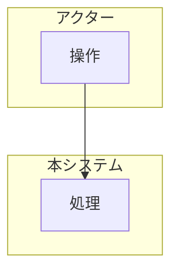

<!--
  arc42 §6 Runtime View (実行時ビュー) — arc42 公式の Contents / Motivation / Form より訳出
  何を書く章か: 構成要素が実行時にどう振る舞い協調するかを、シナリオで示す。重要なユースケース、外部 IF とのやり取り、
    起動・停止などの運用、異常系。表記は手順の箇条書き・シーケンス図・状態機械など何でもよい。
  なぜ必要か: 静的な構造図 (§5) を読めない・読まない関係者にも振る舞いを伝えられる。
  書かない方がよいもの: シナリオの網羅。選定基準は「アーキテクチャ上の重要性」であって件数ではない。
  出典: https://arc42.org/overview/ / https://docs.arc42.org/section-6/
-->

# 業務フロー

> **TL;DR**: <対象業務を 1 文で>
> - 正常系より **例外系を先に確定**させる (例外がフローの形を決める)
> - システム外の人手作業も図に含める (境界を曖昧にしない)

## 関連

| 区分 | 文書 | 対応 ID |
|---|---|---|
| 上流 (depends_on) | [要件定義書](../../../product/01-requirements.md) / [機能一覧](../01-function-list.md) | REQ-* / FN-* |
| 下流 | [画面設計](../screens/) / [シーケンス](../../detail/sequences/) | SCR-* / SEQ-* |

## 1. アクターと責務

| アクター | 種別 (人/システム/外部) | 責務 | この業務での権限 |
|---|---|---|---|

## 2. 業務フロー図

<!-- swimlane はアクター単位。システム境界を subgraph で明示する -->

## 3. フロー詳細

| ID | ステップ | 実行者 | 入力 | 出力 | 対応 FN | 対応 SCR |
|---|---|---|---|---|---|---|
| BF-001 | | | | | FN-001 | SCR-001 |

## 4. 例外系

<!-- 「起きたらどうする」を決めていない例外は設計されていないのと同じ -->

| ID | 例外事象 | 検知方法 | 業務上の扱い | システムの扱い | 通知先 |
|---|---|---|---|---|---|
| BF-101 | | | | | |

## 5. 時間軸のある処理 (任意)

| ID | トリガ | 起動方式 (cron/イベント) | 冪等性 | 失敗時 |
|---|---|---|---|---|
