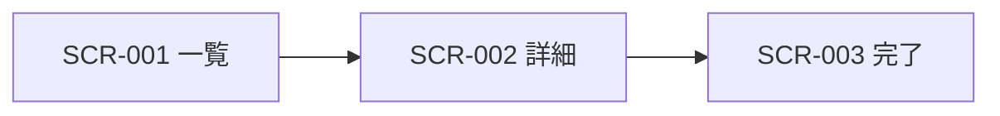

<!--
  arc42 §5 Building Block View (構成要素) — arc42 公式の Content / Motivation / Form より訳出
  何を書く章か: システムの静的な分解 (モジュール / コンポーネント / クラス / データ構造) と依存関係。家でいう間取り図。
    L1 = 全体の白箱 + 直下要素の黒箱、L2 = 選んだ要素の内側、と階層で掘る。
  なぜ必要か: 実装詳細を晒さずに構造を共有し、ソースコードの見通しを保つため。arc42 で唯一「必須」の章。
  書かない方がよいもの: 実行時の振る舞い (→ §6) と配置・インフラ (→ §7)。網羅より階層を優先する。
  出典: https://arc42.org/overview/ / https://docs.arc42.org/section-5/
-->

# 画面一覧・画面設計

> **TL;DR**: <対象画面群を 1 文で>
> - 全画面に **空 / ローディング / エラーの 3 状態**を定義する。ハッピーパスのみは未完成 (原則: 画面は 3 状態)
> - 文言は message catalog のキーで書く。JSX 直書きの日本語は禁止

## 関連

| 区分 | 文書 | 対応 ID |
|---|---|---|
| 上流 (depends_on) | [機能一覧](../01-function-list.md) / [業務フロー](../flows/) | FN-* / BF-* |
| 下流 | [API 仕様](../api/) / [テスト仕様](../../test/specs/) | API-* / TST-* |

## 1. 画面一覧

| ID | 画面名 | URL | 利用者 | 対応 FN | 認証 | 段階 |
|---|---|---|---|---|---|---|
| SCR-001 | | /booking | 利用者 | FN-001 | 不要 | Stage 1 |

## 2. 画面遷移図

## 3. 画面項目定義

<!-- 1 画面 1 表。入力チェックは API 側の検証と一致させる (二重定義しない) -->

### SCR-001 <画面名>

| 項目 | 種別 | 必須 | 入力チェック | 初期値 | 文言キー | 対応 API |
|---|---|---|---|---|---|---|

## 4. 3 状態の定義

| 画面 ID | 空状態 (表示文言 / CTA) | ローディング (skeleton の形) | エラー (文言 / 再試行) |
|---|---|---|---|
| SCR-001 | | | |

## 5. 権限と表示制御

<!--
  ロール × 操作の定義は [権限マトリクス](../07-permission-matrix.md) が正典。ここでは**画面固有の表示制御だけ**を書く
  (どの要素を隠すか / 無効化するか)。ロールごとの可否をここに再掲しない — 2 か所に書くと必ずずれる。
-->

| 画面 ID | 参照する PRM | 画面固有の表示制御 | 越境時の応答 |
|---|---|---|---|
| SCR-001 | PRM-001 | 権限が無い操作のボタンは表示しない (無効化ではない) | 403 |

## 6. レスポンシブ・アクセシビリティ (任意)

| 画面 ID | ブレークポイント方針 | キーボード操作 | コントラスト |
|---|---|---|---|
