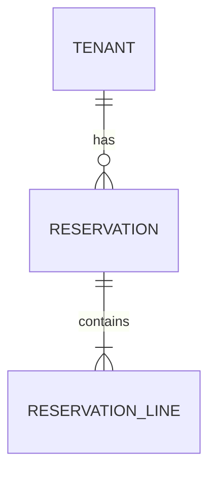

<!--
  arc42 §5 Building Block View (構成要素) — arc42 公式の Contents / Motivation / Form より訳出
  何を書く章か: システムの静的な分解 (モジュール / クラス / データ構造) と依存関係。家でいう間取り図にあたる。
  なぜ必要か: 実装詳細を晒さずに構造を共有し、ソースコードの見通しを保つため。arc42 で唯一「必須」の章。
  書かない方がよいもの: 実行時の振る舞い (→ §6) と配置・インフラ (→ §7)。テーブル定義は §5 のうち永続データ構造の階層。
  出典: https://arc42.org/overview/ / https://docs.arc42.org/section-5/
-->

# テーブル定義

> **TL;DR**: <対象テーブル群を 1 文で>
> - 不変条件は**アプリでなく DB 制約**で守る (一意・外部キー・CHECK・EXCLUDE)
> - テナント隔離は全業務テーブルの `tenant_id` + RLS。`WHERE` の付け忘れに依存しない

## 関連

| 区分 | 文書 | 対応 ID |
|---|---|---|
| 上流 (depends_on) | [ドメインクラス図](../../detail/domain/) / [API 仕様](../api/) | class 名 / API-* |
| 下流 | [移行・リリース計画](../../ops/02-migration-plan.md) / Prisma schema | MIG-* |

## 1. ER 図

<!-- **手書き禁止**。生成元は schema.prisma + prisma-erd-generator。手で描くと必ず実体とずれる -->

<!-- AUTOGEN:prisma-erd:start — generated from schema.prisma, do not edit by hand -->

<!-- AUTOGEN:prisma-erd:end -->

## 2. テーブル一覧

| ID | 物理名 | 論理名 | 対応集約 (CLS) | 想定件数/年 | 保持期間 |
|---|---|---|---|---|---|
| TBL-001 | reservations | 予約 | CLS: Reservation | 10^4 | 無期限 |

## 3. 列定義

<!-- **手書き禁止**。生成元は schema.prisma (prisma migrate 後の実体) -->

<!-- AUTOGEN:prisma-columns:start — generated from schema.prisma, do not edit by hand -->

### TBL-001 reservations

| 列 | 型 | NULL | 既定 | 説明 | 制約 |
|---|---|---|---|---|---|
| id | varchar(64) | NO | | 予約 ID | PK |
| tenant_id | varchar(64) | NO | | テナント | RLS 対象 |

<!-- AUTOGEN:prisma-columns:end -->

## 4. 制約 (RLS / EXCLUDE / CHECK)

<!-- **ここは手書き**。Prisma schema で表現できない制約は raw SQL migration に書き、その設計根拠を残す -->

| ID | 対象 | 種別 | 定義 | 違反時の SQLSTATE | アプリ側の翻訳先 |
|---|---|---|---|---|---|
| TBL-001 | room_bookings | EXCLUDE USING GIST | (tenant_id =, room_id =, period &&) | 23P01 | SlotAlreadyTaken |
| TBL-001 | 全業務表 | RLS | tenant_id = current_setting('app.tenant_id') | — | 0 行 (fail-closed) |

## 5. インデックス

<!-- **目的クエリ列は手書き**。生成器は index の存在しか書けず、「何のための index か」を持たない -->

| ID | テーブル | 列 | 種別 | 目的クエリ | 単調増加列を含むか |
|---|---|---|---|---|---|

## 6. 参照整合性と削除方針 (任意)

| ID | 親 | 子 | ON DELETE | 論理削除の有無 |
|---|---|---|---|---|

<!--
  以降は「1 コンテキスト分のテーブル定義」では通常不要で、リポジトリ全体の物理モデルを
  1 枚で持つ文書 (例: tables/data-model.md) のときだけ使う任意節。
  旧 kind `data-model` の専用テンプレを廃止して本テンプレへ統合した (2026-09-16)。
-->

## 7. 中核 DDL 抜粋 (任意)

<!-- Prisma schema で表現できない DDL (EXCLUDE / tstzrange / partial index) のみ貼る。全文は貼らない -->

## 8. 主要トランザクション (任意)

<!-- 節名は対象に合わせて specialize してよい (例: 予約確定トランザクション) -->

| 手順 | 操作 | ロック範囲 | 失敗時 |
|---|---|---|---|

## 9. 主要クエリ (任意)

<!-- 目的 → SQL → 使う index。index 一覧 (§5) と対応させる -->

## 10. マイグレーション運用 (任意)

| 論点 | 決め |
|---|---|

## 11. 接続・バックアップ (任意)

| 論点 | 決め |
|---|---|

## 12. 容量試算とスケール段階 (任意)

| 対象 | 試算 | 根拠 | 次の段階に移る条件 |
|---|---|---|---|
