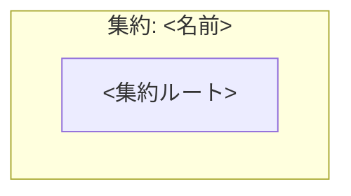

<!--
  arc42 §5 Building Block View (構成要素) — arc42 公式の Content / Motivation / Form より訳出
  何を書く章か: システムの静的な分解 (モジュール / コンポーネント / クラス / データ構造) と依存関係。家でいう間取り図。
    L1 = 全体の白箱 + 直下要素の黒箱、L2 = 選んだ要素の内側、と階層で掘る。
  なぜ必要か: 実装詳細を晒さずに構造を共有し、ソースコードの見通しを保つため。arc42 で唯一「必須」の章。
  書かない方がよいもの: 実行時の振る舞い (→ §6) と配置・インフラ (→ §7)。網羅より階層を優先する。
  出典: https://arc42.org/overview/ / https://docs.arc42.org/section-5/
-->

# 集約マップ

> **TL;DR**: <集約をどこで切ったかを 1 文で>
> - 集約をまたぐ参照は **id 参照のみ**。実体参照を張らない
> - 1 トランザクションで守るのは **1 集約**。またぐ整合は domain event で結ぶ

## 関連

| 区分 | 文書 | 対応 ID |
|---|---|---|
| 上流 (depends_on) | [ドメイン総論](./01-overview.md) | class 名 |
| 下流 | 各コンテキストのクラス図 | class 名 |

## 1. 集約と境界

<!-- 集約 = トランザクション境界。図には「何を同時に守るか」だけを描く -->

## 2. 集約の責務と不変条件

<!-- 「保持しないもの」を必ず書く。責務の裏返しが境界になる -->

| 集約 | 守る不変条件 | 保持しないもの |
|---|---|---|
