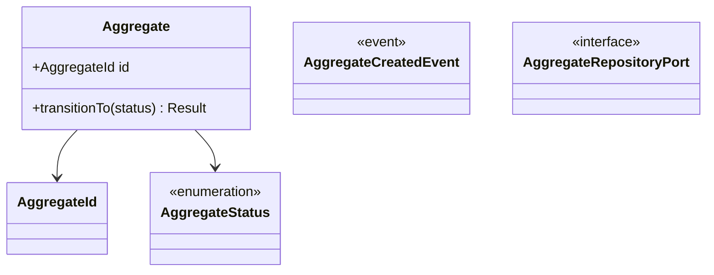

<!--
  arc42 §5 Building Block View (構成要素) — arc42 公式の Content / Motivation / Form より訳出
  何を書く章か: システムの静的な分解 (モジュール / コンポーネント / クラス / データ構造) と依存関係。家でいう間取り図。
    L1 = 全体の白箱 + 直下要素の黒箱、L2 = 選んだ要素の内側、と階層で掘る。
  なぜ必要か: 実装詳細を晒さずに構造を共有し、ソースコードの見通しを保つため。arc42 で唯一「必須」の章。
  書かない方がよいもの: 実行時の振る舞い (→ §6) と配置・インフラ (→ §7)。網羅より階層を優先する。
  出典: https://arc42.org/overview/ / https://docs.arc42.org/section-5/
-->

# <コンテキスト名> — <コンテキストの一言説明>

> **TL;DR**: <このコンテキストが持つものと持たないものを 1 文で>
> - <最重要の不変条件>
> - <持たないもの (他コンテキストの責務)>

## 関連

| 区分 | 文書 | 対応 ID |
|---|---|---|
| 上流 (depends_on) | [要件定義書](../../../product/requirements.md) | REQ-* |
| 下流 | [テーブル定義](../../basic/tables/) / [モジュール仕様](../modules/) | TBL-* / MOD-* |

## 1. クラス図

<!--
  CLS-nnn は振らない。**ID は class 名そのもの**。
  ここに書いた class 名は apps/api/src/modules/<context>/domain/** に
  export class|abstract class|interface|type として存在しなければ CI が落ちる (双方向)。
  port は <<interface>>、domain event は <<event>>、列挙は union type を <<enumeration>> で描く。
-->

## 2. 不変条件

<!-- 「誰が強制するか」と「違反したら何が起きるか」を必ず書く。書けない不変条件は守られない -->

| # | 不変条件 | 強制する主体 | 違反時 |
|---|---|---|---|

## 3. クラス ↔ ファイル対応表

<!-- 種別ごとに配置規則が決まる。クラスを足したら図とこの表の両方を更新する -->

| 種別 | 配置 (`<code_root>/` 相対) | クラス |
|---|---|---|
| aggregate root | `domain/<kebab>.ts` | |
| entity (集約内) | `domain/entities/<kebab>.ts` | |
| value object | `domain/value-objects/<kebab>.ts` | |
| enumeration (union type) | `domain/value-objects/<kebab>.ts` | |
| domain service | `domain/services/<kebab>.service.ts` | |
| port | `domain/ports/<kebab>.port.ts` | |
| domain event | `domain/events/<kebab>.event.ts` | |
| domain error | `domain/errors/<kebab>.error.ts` | |

`<kebab>` = class 名の kebab-case。**末尾の `Port` / `Service` は配置で表現済みなので除く** (`PaymentPort` → `ports/payment.port.ts`)。

## 4. 差し替え可能点

<!-- port ごとに「Stage 1 の既定」「差し替え候補」「呼び出し側の変更行数」を書く -->

## 5. 他コンテキストとの関係

| 相手 | 方向 | 連携様式 (Published Language / ACL / 共有カーネル) | 受け渡すもの |
|---|---|---|---|

## 6. 未決事項

| # | 論点 | 現在の扱い | 確定する条件 |
|---|---|---|---|
