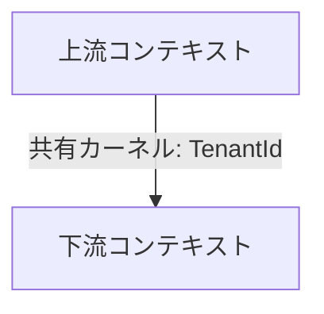

<!--
  arc42 §5 Building Block View (構成要素) — arc42 公式の Content / Motivation / Form より訳出
  何を書く章か: システムの静的な分解 (モジュール / コンポーネント / クラス / データ構造) と依存関係。家でいう間取り図。
    L1 = 全体の白箱 + 直下要素の黒箱、L2 = 選んだ要素の内側、と階層で掘る。
  なぜ必要か: 実装詳細を晒さずに構造を共有し、ソースコードの見通しを保つため。arc42 で唯一「必須」の章。
  書かない方がよいもの: 実行時の振る舞い (→ §6) と配置・インフラ (→ §7)。網羅より階層を優先する。
  出典: https://arc42.org/overview/ / https://docs.arc42.org/section-5/
-->

# ドメイン総論

> **TL;DR**: <コンテキスト分割の考え方を 1 文で>
> - <上流コンテキストと共有カーネル>
> - <未確定で分割が動きうる点>

## 関連

| 区分 | 文書 | 対応 ID |
|---|---|---|
| 上流 (depends_on) | [要件定義書](../../../product/requirements.md) | REQ-* |
| 下流 | 各コンテキストのクラス図 / [状態遷移](../state-machines/) / [テーブル定義](../../basic/tables/) | TBL-* |

## 1. コンテキストマップ

<!-- 矢印の元が上流 (提供側)、先が下流 (依存側)。連携様式 (PL / ACL / 共有カーネル) を辺に書く -->

## 2. 図の規約

<!-- 個別のクラス図が従う共通ルール。ここに書いたことは個別図で繰り返さない -->

## 3. 集約横断の論点 (任意)

## 4. 未確定分岐

<!-- 「どちらを選ぶと後から変更が高くつくか」を明記する。断定しない -->

| # | 論点 | 選択肢 | 変更コストが高い方向 | 確認先 |
|---|---|---|---|---|

## 5. ヒアリング項目への追加提案 (任意)
