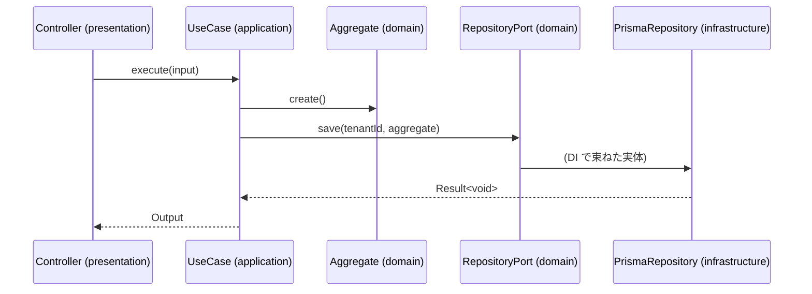

<!--
  arc42 §6 Runtime View (実行時ビュー) — arc42 公式の Contents / Motivation / Form より訳出
  何を書く章か: 構成要素が実行時にどう振る舞い協調するかを、シナリオで示す。重要なユースケース、外部 IF とのやり取り、
    起動・停止などの運用、異常系。表記は手順の箇条書き・シーケンス図・状態機械など何でもよい。
  なぜ必要か: 静的な構造図 (§5) を読めない・読まない関係者にも振る舞いを伝えられる。
  書かない方がよいもの: シナリオの網羅。選定基準は「アーキテクチャ上の重要性」であって件数ではない。
  出典: https://arc42.org/overview/ / https://docs.arc42.org/section-6/
-->

# シーケンス仕様

> **TL;DR**: <対象ユースケース群を 1 文で>
> - 1 ユースケース = 1 シーケンス図。**レイヤ (controller → use case → aggregate → port) を lifeline に出す**
> - トランザクション境界と、失敗時にどこまで戻すかを図に明示する

## 関連

| 区分 | 文書 | 対応 ID |
|---|---|---|
| 上流 (depends_on) | [API 仕様](../../basic/api/) / [ドメインクラス図](../domain/) | API-* / CLS: * |
| 下流 | [モジュール仕様](../modules/) / [テスト仕様](../../test/specs/) | MOD-* / TST-* |

## 1. ユースケース一覧

| ID | ユースケース | 対応 API | 対応 FN | 主集約 | トランザクション境界 |
|---|---|---|---|---|---|
| SEQ-001 | 予約を作成する | API-001 | FN-001 | Reservation | use case 1 件 |

## 2. シーケンス図

### SEQ-001 <ユースケース名>

## 3. 例外・補償

| ID | 失敗点 | 検出 | ロールバック範囲 | 呼び出し側への表現 |
|---|---|---|---|---|
| SEQ-001 | 枠の衝突 (23P01) | adapter | トランザクション全体 | 409 SLOT_ALREADY_TAKEN |

## 4. 発行イベントと購読

| ID | 発行イベント | 発行タイミング (コミット前/後) | 購読側 | 失敗時の再送 |
|---|---|---|---|---|

## 5. 外部サービス呼び出し (任意)

| ID | 相手 | タイムアウト | リトライ | 冪等キー |
|---|---|---|---|---|
