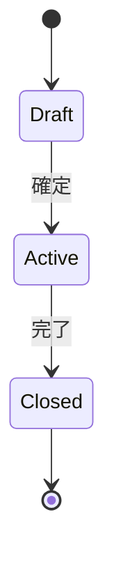

<!--
  arc42 §6 Runtime View (実行時ビュー) — arc42 公式の Contents / Motivation / Form より訳出
  何を書く章か: 構成要素が実行時にどう振る舞い、どう協調するかをシナリオで示す。重要なユースケース、
    外部インターフェースとのやりとり、起動・停止などの運用、異常系。状態機械は公式に認められた表記の 1 つ。
  なぜ必要か: 静的な構造図 (§5) を読めない関係者にも振る舞いを伝えるため。
  書かない方がよいもの: シナリオの網羅。基準は「アーキテクチャ上の重要性」であって件数ではない。
  出典: https://arc42.org/overview/ / https://docs.arc42.org/section-6/
-->

# 状態遷移 — <集約名>

> **TL;DR**: <この集約が取る状態と、状態を変える事象を 1 文で>
> - **状態は集約が持つ**。画面や API が勝手に状態を足さない
> - 表に無い遷移は**起こしてはいけない遷移**。実装は例外で落とす (原則: サイレント縮退禁止)

## 関連

| 区分 | 文書 | 対応 ID |
|---|---|---|
| 上流 (depends_on) | [集約マップ](../domain/02-aggregate-map.md) / [業務フロー](../../basic/flows/) | class 名 / BF-* |
| 下流 | [シーケンス](../sequences/) / [テスト仕様](../../test/specs/) | SEQ-* / TST-* |

## 1. 状態遷移図

## 2. 状態の定義

<!-- 「導出できる属性」を状態にしない (例: 遅延 = 期限超過 ∧ 未完了 は属性であって状態ではない) -->

| ID | 状態 | 意味 | この状態で許す操作 | 終端か |
|---|---|---|---|---|
| STM-001 | Draft | | | いいえ |

## 3. 遷移表

| ID | 現状態 | イベント | 条件 (ガード) | 次状態 | 副作用 | 発行イベント |
|---|---|---|---|---|---|---|
| STM-101 | Draft | 確定 | | Active | | |

## 4. 不正遷移の扱い

<!-- 「起こらないはず」で済ませない。何を投げ、API が何を返し、ログに何を残すかを決める -->

| ID | 起点 | 受けたイベント | 例外 | HTTP | 記録 |
|---|---|---|---|---|---|
| STM-201 | Closed | 確定 | InvalidStateTransition | 409 | 監査ログ |

## 5. タイムアウト・自動遷移 (任意)

<!-- 時間で動く遷移は誰が動かすか (ジョブ / 参照時の遅延評価) まで書かないと実装されない -->

| ID | 遷移 | 起動主体 | 周期 | 冪等か |
|---|---|---|---|---|
