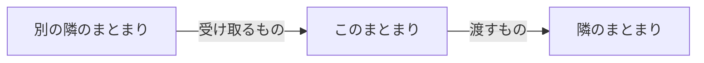

# まとまりの地図 — <まとまり名>

> **TL;DR**: <このまとまりが何を持つかを 1 文で>
> - <一番大事な業務価値>

## 1. まとまりの図

## 2. 概要

<このまとまりが何を持ち、何を持たないかを 2〜3 文で>

## 3. 含む機能

| 機能 | feature-brief | 対応 REQ 範囲 |
|---|---|---|
| | | |

## 4. 隣接まとまりへの入口

| 隣接まとまり | まとまりの地図 |
|---|---|
| | |

## 決めてほしいこと (任意)

| 問い | 対象 ID | 選択肢 | 決まらないと止まること |
|---|---|---|---|
| <決めてほしいことを 1 文で> | | <A / B> | <止まる設計・作業> |

## 関連

| 区分 | 文書 | 対応 ID |
|---|---|---|
| 上流 (depends_on) | [全体の地図](../shared/00-map.md) | — |
| 下流 | (生成索引が出す) | — |
