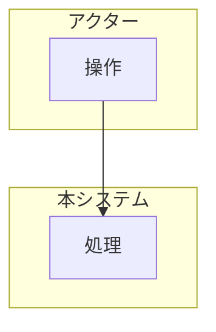

# 業務フロー

> **TL;DR**: <対象業務を 1 文で>
> - 例外を正常系より先に決める (例外がフローの形を決める)
> - システム外の人手の作業も図に含める

## 1. 業務フロー図

## 2. アクターと責務

| アクター | 種別 (人 / システム / 外部) | 責務 | この業務での権限 (PRM) |
|---|---|---|---|
| | | | |

## 3. フロー詳細

| ID | ステップ | 実行者 | 通知 (宛先・タイミング・手段) | 対応 FN | 対応 SCR | 状態 |
|---|---|---|---|---|---|---|
| BF-001 | | | | FN-001 | SCR-001 | 仮 |

## 4. 例外系

| ID | 例外の事象 | 業務上の扱い | 通知 (宛先・タイミング・手段) | 状態 |
|---|---|---|---|---|
| BF-101 | | | | 仮 |

## 5. 時間で動く業務 (任意)

| ID | きっかけ | 業務上の決まり (期限・回数) | 失敗したときの業務上の扱い | 状態 |
|---|---|---|---|---|
| BF-201 | | | | 仮 |

## 6. 段階ごとに許す操作 (任意)

| ID | 業務上の段階 | 許す操作 | 許さない操作 | 状態 |
|---|---|---|---|---|
| BF-301 | | | | 仮 |

## 7. 利用者への約束 (任意)

| ID | 約束の内容 (規約・キャンセル規定・料金の表示・同意の文) | 約束の文 (1 文) | 状態 |
|---|---|---|---|
| BF-401 | | | 仮 |

## 決めてほしいこと

| 問い | 対象 ID | 選択肢 | 決まらないと止まること |
|---|---|---|---|
| <決めてほしいことを 1 文で> | BF-101 | <A / B> | <止まる設計・作業> |

## 関連

| 区分 | 文書 | 対応 ID |
|---|---|---|
| 上流 (depends_on) | [要件定義書](../../../requirements/01-requirements.md) / [機能一覧](../../shared/01-function-list.md) | REQ-* / FN-* |
| 下流 | (生成索引が出す) | — |
