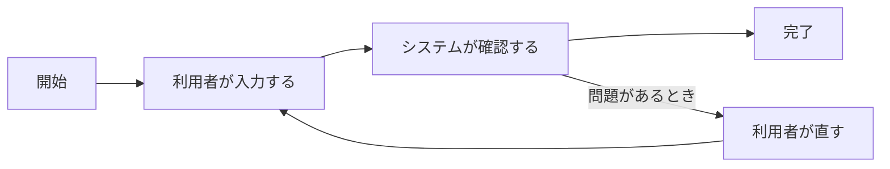

# 地図 — 何を作るか・誰が使うか・主要フロー

> **TL;DR**: <この案件が何をする仕組みかを 1 文で>
> - <一番大事な業務価値>
> - <一番大事な制約>

## 1. 主要フロー

## 2. 何を作るか

<業務課題と、それをどう解決するかを 2〜3 文で>

## 3. 誰が使うか

| 役割 | 何のために使うか |
|---|---|
| | |

## 4. やらないこと

- <スコープ外にしたこと>

## 5. 詳細への入口

| 知りたいこと | 文書 |
|---|---|
| 要件の全文・受入条件 | [要件定義書](../../requirements/01-requirements.md) |
| 決定した / 未決の論点 | [決定台帳](../../decisions/01-decisions.md) |

## 決めてほしいこと (任意)

| 問い | 対象 ID | 選択肢 | 決まらないと止まること |
|---|---|---|---|
| <決めてほしいことを 1 文で> | | <A / B> | <止まる設計・作業> |

## 関連

| 区分 | 文書 | 対応 ID |
|---|---|---|
| 上流 (depends_on) | なし (人の入口。最上流) | — |
| 下流 | (生成索引が出す) | — |
