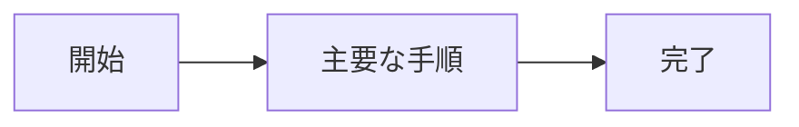

<!--
  読み手: CEO / PM / レビューする人。ここだけ読めば「何を作り、誰が使い、どう動くか」が分かる。
  書かないもの: 要件の全文・受入条件・実装の詳細。それらは下の「詳細への入口」からリンクする先に書く。
  検査: kind: requirements の全文書がこの文書からリンクされていること (igeta template-check --require-human-review)。
-->

# 地図 — 何を作るか・誰が使うか・主要フロー

> **TL;DR**: <この案件が何をする仕組みかを 1 文で>
> - <一番大事な業務価値>
> - <一番大事な制約>

## 関連

| 区分 | 文書 | 対応 ID |
|---|---|---|
| 上流 (depends_on) | なし (人間の入口。最上流) | — |
| 下流 | [決定台帳](../../decisions/01-decisions.md) / 全 kind: requirements 文書 | — |

## 1. 何を作るか

<!-- 2〜3 文。業務課題と、それをどう解決するかだけ。技術選定はここに書かない -->

## 2. 誰が使うか

<!-- 役割ごとに 1 行。「誰が」「何のために」使うか -->

| 役割 | 何のために使うか |
|---|---|
| | |

## 3. 主要フロー

<!-- Mermaid 1 枚。分岐は最大 2〜3 個まで。それ以上に分岐するなら詳細への入口へ逃がす -->

## 4. やらないこと

<!-- 言わないと入ってくるものを名指しする -->

- <スコープ外にしたこと>

## 5. 詳細への入口

<!-- kind: requirements の全文書を必ずここに列挙する (地図の網羅性を検査で見る) -->

| 知りたいこと | 文書 |
|---|---|
| 要件の全文・受入条件 | [要件定義書](../../requirements/01-requirements.md) |
| 決定した/未決の論点 | [決定台帳](../../decisions/01-decisions.md) |
