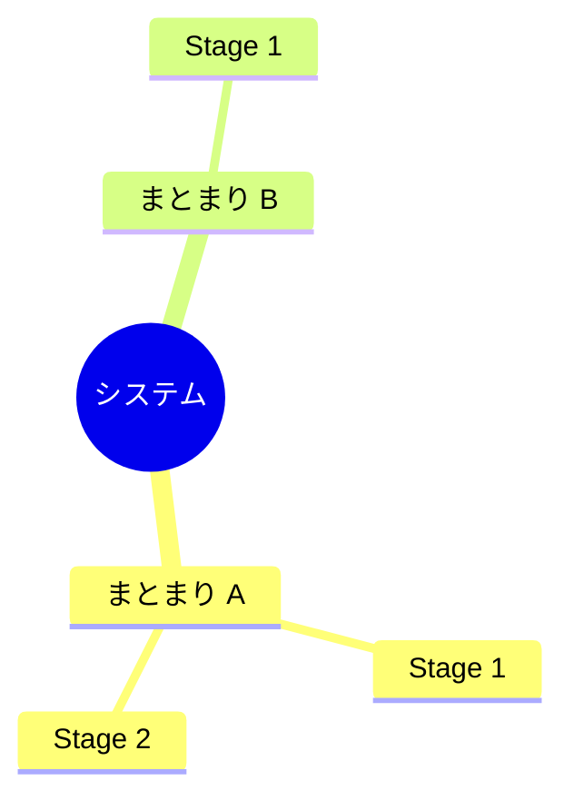

# 機能一覧

> **TL;DR**: <この一覧が網羅する範囲を 1 文で>
> - 機能の粒度は、画面の 1 操作 = 1 機能
> - 要件 (REQ) に紐づかない機能は作らない

## 1. 機能の全体像

## 2. 機能一覧

| ID | 機能名 | 概要 | アクター | 対応 REQ | 対応 SCR | まとまり | 段階 | 状態 |
|---|---|---|---|---|---|---|---|---|
| FN-001 | | | スタッフ | REQ-101 | SCR-001 | reservation | Stage 1 | 仮 |

## 3. カバレッジ確認

| 確認 | 結果 |
|---|---|
| FN を持たない機能要件 REQ | なし / <列挙> |
| REQ に紐づかない FN | なし / <列挙> |

## 決めてほしいこと

| 問い | 対象 ID | 選択肢 | 決まらないと止まること |
|---|---|---|---|
| <決めてほしいことを 1 文で> | FN-001 | <A / B> | <止まる設計・作業> |

## 関連

| 区分 | 文書 | 対応 ID |
|---|---|---|
| 上流 (depends_on) | [要件定義書](../../requirements/01-requirements.md) | REQ-* |
| 下流 | (生成索引が出す) | — |
