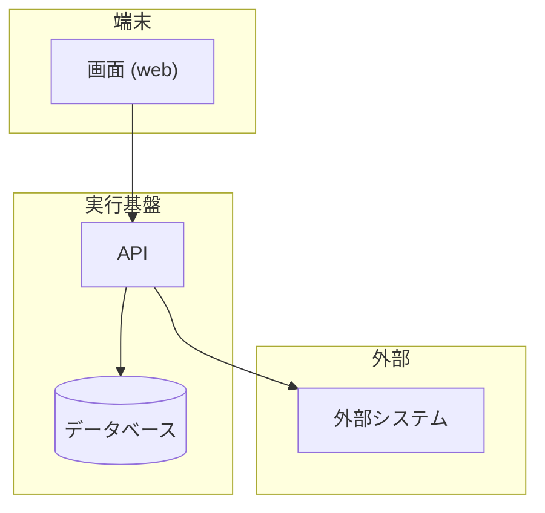

# 解決戦略

> **TL;DR**: <この案件のアーキテクチャを 1 文で>
> - 決定の根拠は ADR。本書は、人が決めた選定・分割・費用の上限の一覧
> - ここに書いていない構造を実装で増やさない。増やすなら本書と ADR を先に直す

## 1. 構成の図

## 2. 技術選定の要約

| ID | 領域 | 採用 | 理由 (1 行) | 決定元 ADR | 状態 |
|---|---|---|---|---|---|
| SS-001 | 言語 / ランタイム | | | | 仮 |
| SS-002 | バックエンド framework | | | | 仮 |
| SS-003 | フロントエンド | | | | 仮 |
| SS-004 | 永続層 | | | | 仮 |
| SS-005 | 実行基盤 | | | | 仮 |

## 3. 分割方針

| ID | 論点 | 決め | 破ってはいけない線 | 状態 |
|---|---|---|---|---|
| SS-101 | デプロイ単位 | | | 仮 |
| SS-102 | コンテキスト境界 | | | 仮 |

## 4. 費用の上限

| ID | 項目 | 月額の上限 | 算出の前提 | 超えるときの扱い | 状態 |
|---|---|---|---|---|---|
| SS-201 | | ¥ | | | 仮 |

## 5. 使う外部サービス

| ID | 外部サービス | 用途 | 渡すもの | 決定元 ADR | 状態 |
|---|---|---|---|---|---|
| SS-301 | | | | | 仮 |

## 6. 組織的な決定 (任意)

| ID | 論点 (開発の進め方・外部委託・運用の担い手) | 決め | 状態 |
|---|---|---|---|
| SS-401 | | | 仮 |

## 決めてほしいこと

| 問い | 対象 ID | 選択肢 | 決まらないと止まること |
|---|---|---|---|
| <決めてほしいことを 1 文で> | SS-102 | <A / B> | <止まる設計・作業> |

## 関連

| 区分 | 文書 | 対応 ID |
|---|---|---|
| 上流 (depends_on) | [要件定義書](../../requirements/01-requirements.md) / [非機能要件](./03-nonfunctional.md) | REQ-* / NFR-* |
| 下流 | (生成索引が出す) | — |
