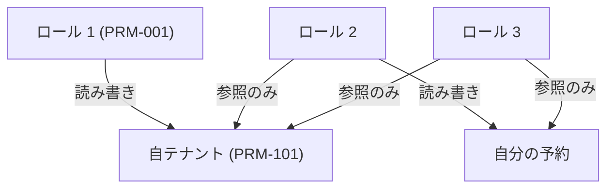

# 権限マトリクス

> **TL;DR**: <誰がどの機能を使えるかの 1 枚表>
> - 他の文書は本書の ID を引く。同じ権限を別の文書に書かない
> - 権限は操作だけでなく、データ範囲 (自テナント・自分の予約) とセットで決める

## 1. ロールとデータ範囲の図

## 2. ロール定義

| ID | ロール | 主体 | 状態 |
|---|---|---|---|
| PRM-001 | | | 仮 |

## 3. データ範囲の定義

| ID | 範囲名 | 適用条件 | 状態 |
|---|---|---|---|
| PRM-101 | 自テナント | | 仮 |

## 4. ロール × 機能

記号: R 参照 / C 作成 / U 更新 / D 削除 / — 不可

| ID | FN | 機能 | <ロール 1> | <ロール 2> | <ロール 3> | データ範囲 | 状態 |
|---|---|---|---|---|---|---|---|
| PRM-201 | FN-001 | | | | | PRM-101 | 仮 |

## 決めてほしいこと

| 問い | 対象 ID | 選択肢 | 決まらないと止まること |
|---|---|---|---|
| <決めてほしいことを 1 文で> | PRM-201 | <A / B> | <止まる設計・作業> |

## 関連

| 区分 | 文書 | 対応 ID |
|---|---|---|
| 上流 (depends_on) | [機能一覧](./01-function-list.md) | FN-* |
| 下流 | (生成索引が出す) | — |
