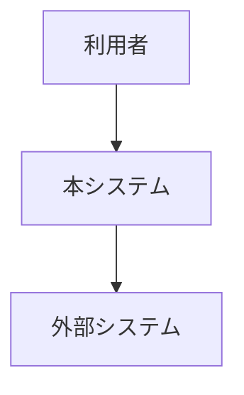
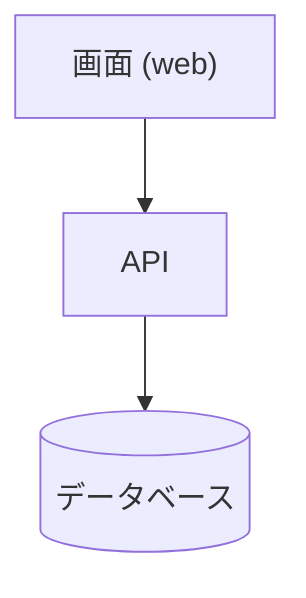

# システム構成 (AS-IS)

> **TL;DR**: <いま動いている構成を 1 文で>
> - 本書は AS-IS 専用。まだ動いていない構成は解決戦略に書く
> - 実測の日付を書けないものは載せない

## 1. 構成の図 (実測日: YYYY-MM-DD)

### 1.1 利用者と外部システム (C4 L1)

### 1.2 コンテナ (C4 L2)

## 2. 外部システムと契約

| ID | 相手 | 種別 (利用者 / 外部システム) | 渡すもの | 受け取るもの | 契約の所在 | 状態 |
|---|---|---|---|---|---|---|
| ARC-101 | | | | | | 仮 |

## 3. TO-BE との差分 (任意)

| ID | AS-IS | TO-BE | 状態 |
|---|---|---|---|
| ARC-201 | | | 仮 |

## 決めてほしいこと

| 問い | 対象 ID | 選択肢 | 決まらないと止まること |
|---|---|---|---|
| <決めてほしいことを 1 文で> | ARC-101 | <A / B> | <止まる設計・作業> |

## 関連

| 区分 | 文書 | 対応 ID |
|---|---|---|
| 上流 (depends_on) | <この構成を決めた ADR> | — |
| 下流 | (生成索引が出す) | — |
