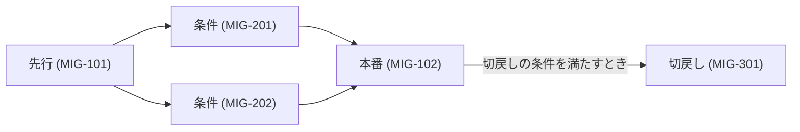

# 移行・リリース計画

> **TL;DR**: <いつ何を切り替えるかを 1 文で>
> - 切戻しの条件を先に決める。決めていない移行は進めない
> - データ移行は、件数の一致ではなく、業務が回ることで確かめる

## 1. 切り替えの図

## 2. 移行対象

| ID | 対象データ | 現行の所在 | 件数 | 変換の要否 | 欠損時の扱い | 状態 |
|---|---|---|---|---|---|---|
| MIG-001 | 既存予約 | | | | | 仮 |

## 3. リリース段階

| ID | 段階 | 範囲 | 期間 | 完了条件 | 状態 |
|---|---|---|---|---|---|
| MIG-101 | 先行 | 内部のみ | | 主要な導線が通る | 仮 |
| MIG-102 | 本番 | 全利用者 | | 監視の閾値内で 72 時間 | 仮 |

## 4. リリースしてよい条件

| ID | 条件 | 確かめる人 | 状態 |
|---|---|---|---|
| MIG-201 | 全層のテストが通っている | | 仮 |
| MIG-202 | 他のテナントのデータに触れないことを確かめた | | 仮 |

## 5. 切戻し

| ID | 切戻しの条件 (数値で) | 切戻しの期限 | データの扱い | 状態 |
|---|---|---|---|---|
| MIG-301 | 5xx 率 1% 超が 10 分続く | 5 分以内 | 追記のみで破棄しない | 仮 |

## 6. 関係者と連絡

| ID | 役割 | 担当 | 連絡のタイミング | 状態 |
|---|---|---|---|---|
| MIG-401 | | | | 仮 |

## 7. 並行稼働 (任意)

| ID | 対象 | 期間 | 二重入力の避け方 | 状態 |
|---|---|---|---|---|
| MIG-501 | | | | 仮 |

## 決めてほしいこと

| 問い | 対象 ID | 選択肢 | 決まらないと止まること |
|---|---|---|---|
| <決めてほしいことを 1 文で> | MIG-301 | <A / B> | <止まる設計・作業> |

## 関連

| 区分 | 文書 | 対応 ID |
|---|---|---|
| 上流 (depends_on) | [運用設計](./08-operations.md) / [データの扱い](./05-data-management.md) | OPS-* / DM-* |
| 下流 | (生成索引が出す) | — |
