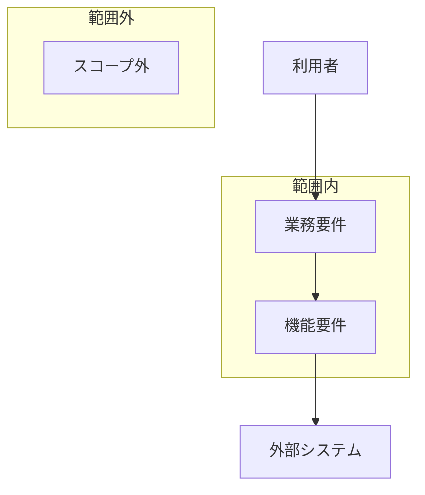

# 要件定義書

> **TL;DR**: <この案件で何を満たせば完成かを 1 文で>
> - <最重要の業務要件>
> - <最重要の制約と、明示的にやらないこと>

## 1. 範囲の図

## 2. 業務要件

| ID | 業務要件 | 現状の課題 | 受入基準 (満たしたと判定できる観測可能な事実) | 出典 | 状態 |
|---|---|---|---|---|---|
| REQ-001 | | | | | 仮 |

## 3. 機能要件

| ID | パターン | 要件文 | 対応業務 (REQ-0xx) | 受け入れ条件 | 状態 |
|---|---|---|---|---|---|
| REQ-101 | Event | 利用者が空き枠を選んで確定したとき、システムは予約を作成しなければならない | REQ-001 | <観測可能な条件> | 仮 |
| REQ-102 | Unwanted | 同じ会議室で時間帯が重なる予約を受けた場合、システムは別の時間帯を選ぶよう案内しなければならない | REQ-001 | <観測可能な条件> | 仮 |

## 4. 制約

| ID | 制約 | 根拠 | 影響範囲 | 状態 |
|---|---|---|---|---|
| REQ-201 | | | | 仮 |

## 5. 前提

| ID | 前提 | 未確認 / 確認済 | 崩れた場合の影響 | 状態 |
|---|---|---|---|---|
| REQ-301 | | 未確認 | | 仮 |

## 6. スコープ外

| ID | スコープ外の内容 | 理由 | 再検討する条件 | 状態 |
|---|---|---|---|---|
| REQ-401 | | | | 仮 |

## 決めてほしいこと

| 問い | 対象 ID | 選択肢 | 決まらないと止まること |
|---|---|---|---|
| <決めてほしいことを 1 文で> | REQ-301 | <A / B> | <止まる設計・作業> |

## 関連

| 区分 | 文書 | 対応 ID |
|---|---|---|
| 上流 (depends_on) | なし (最上流。一次情報はヒアリング記録) | — |
| 下流 | (生成索引が出す) | — |
